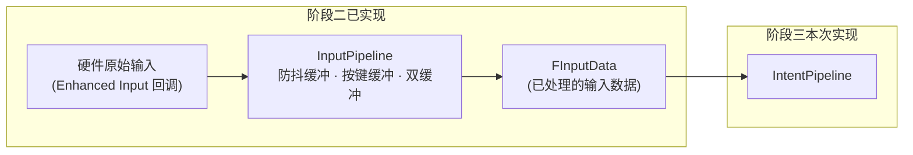
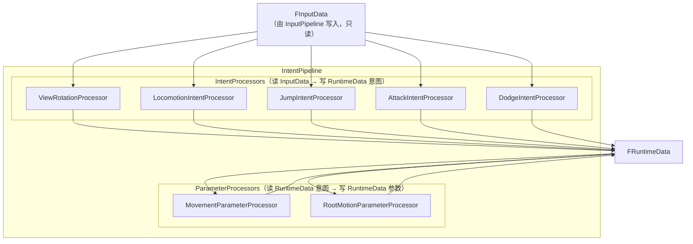
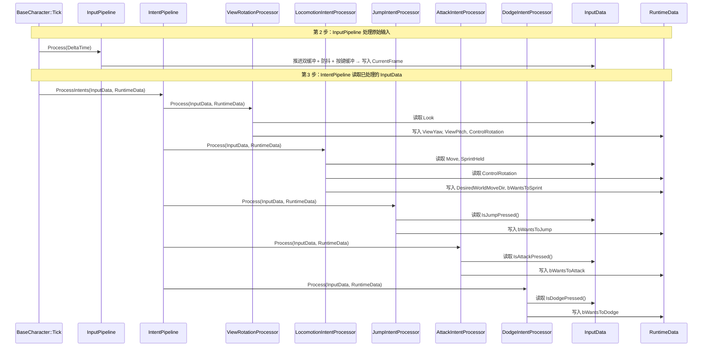
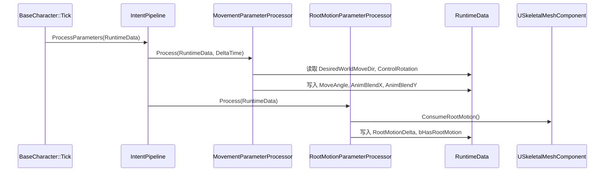

# 设计文档：Intent Pipeline（意图管线）

## 概述

意图管线是 GGYGO 管线架构的第三阶段，负责将 InputPipeline 已处理好的 InputData 翻译为 RuntimeData 中的语义化意图和动画参数。

完整的数据流为：
1. PlayerCharacter 的 Enhanced Input 回调将硬件原始输入写入 InputPipeline
2. InputPipeline（阶段二，已实现）每帧对原始输入进行防抖缓冲、动作按键缓冲、双缓冲推进，输出处理后的 InputData
3. IntentPipeline（本阶段）读取 InputData → 写入 RuntimeData 的意图和参数

意图管线分为两个子阶段：IntentProcessors（读 InputData → 写 RuntimeData 意图）和 ParameterProcessors（读 RuntimeData 意图 → 写 RuntimeData 参数），严格遵循单向数据流和单一写入者原则。

每个 Processor 是独立的纯 C++ 类，通过统一接口 `IIntentProcessor` / `IParameterProcessor` 接入管线。IntentPipeline 持有所有处理器实例，在 BaseCharacter::Tick 的第 3、4 步按序执行（紧跟在 InputPipeline 之后）。ViewRotationProcessor 和 RootMotionParameterProcessor 需要访问 ACharacter 指针（用于 ControlRotation 和 ConsumeRootMotion），通过 Init 阶段注入依赖，运行时只读/写 RuntimeData。

## 架构

### 完整数据流（含上游 InputPipeline）



### IntentPipeline 内部架构




## 时序图

### ProcessIntents 流程（InputPipeline 已在前一步完成处理）



### ProcessParameters 流程



## 上游依赖：InputPipeline 数据契约

IntentPipeline 的所有 IntentProcessor 读取的 InputData 是由 InputPipeline（阶段二，已实现）处理后的数据，不是硬件原始输入。

### InputPipeline 的处理流程（每帧 Tick 第 2 步）

```
PlayerCharacter Enhanced Input 回调
  ├─ OnMoveInput()     → InputPipeline.SetMoveInput()
  ├─ OnMoveCompleted() → InputPipeline.ClearMoveInput()
  ├─ OnLookInput()     → InputPipeline.SetLookInput()
  ├─ OnJumpInput()     → InputPipeline.SetJumpPressed()
  ├─ OnAttackInput()   → InputPipeline.SetAttackPressed()
  └─ OnDodgeInput()    → InputPipeline.SetDodgePressed()

InputPipeline.Process(DeltaTime)
  ├─ 1. 推进双缓冲: LastFrame = CurrentFrame
  ├─ 2. 移动防抖: 松手后 50ms 内保持方向，避免抖动
  ├─ 3. 视角输入: 直接写入（不需要防抖）
  ├─ 4. 持续按住状态: bSprintHeld, bJumpHeld 等
  ├─ 5. 动作按键缓冲: 按下时设 150ms 计时器，每帧递减
  └─ 6. 清零瞬时输入: Look/Jump/Attack/Dodge 下帧重新从回调写入
```

### IntentPipeline 读取的 InputData 字段

| InputData 字段 | 写入者 | 读取者（IntentProcessor） | 说明 |
|---|---|---|---|
| CurrentFrame.Look | InputPipeline | ViewRotationProcessor | 已处理的视角增量 |
| CurrentFrame.Move | InputPipeline | LocomotionIntentProcessor | 防抖后的移动向量 |
| CurrentFrame.bSprintHeld | InputPipeline | LocomotionIntentProcessor | 冲刺持续按住状态 |
| CurrentFrame.IsJumpPressed() | InputPipeline | JumpIntentProcessor | 缓冲窗口内有效（150ms） |
| CurrentFrame.IsAttackPressed() | InputPipeline | AttackIntentProcessor | 缓冲窗口内有效（150ms） |
| CurrentFrame.IsDodgePressed() | InputPipeline | DodgeIntentProcessor | 缓冲窗口内有效（150ms） |

关键约束：
- IntentPipeline 必须在 InputPipeline.Process() 之后执行（Tick 时序保证）
- IntentProcessors 只读 InputData，不写入（InputPipeline 是唯一写入者）
- 动作按键的缓冲计时器由 InputPipeline 维护，IntentProcessor 只通过 IsXxxPressed() 查询

## 组件和接口

### IIntentProcessor 接口

意图处理器的统一接口。读取 InputData，写入 RuntimeData 的意图字段。

```cpp
/**
 * @brief 意图处理器接口
 * 读取 InputData → 写入 RuntimeData 意图
 */
class IIntentProcessor
{
public:
    virtual ~IIntentProcessor() = default;

    /**
     * 每帧处理意图
     * @param Input  输入数据（只读）
     * @param Data   运行时黑板（写入意图字段）
     */
    virtual void Process(const FInputData& Input, FRuntimeData& Data) = 0;
};
```

职责：
- 定义意图处理器的统一调用协议
- 所有意图处理器必须实现此接口
- Process 内只允许读 InputData、写 RuntimeData 的意图/移动/视角字段

### IParameterProcessor 接口

参数处理器的统一接口。读取 RuntimeData 意图，写入 RuntimeData 动画参数。

```cpp
/**
 * @brief 参数处理器接口
 * 读取 RuntimeData 意图 → 写入 RuntimeData 动画参数
 */
class IParameterProcessor
{
public:
    virtual ~IParameterProcessor() = default;

    /**
     * 每帧处理参数
     * @param Data      运行时黑板（读意图、写参数）
     * @param DeltaTime 帧间隔
     */
    virtual void Process(FRuntimeData& Data, float DeltaTime) = 0;
};
```

职责：
- 定义参数处理器的统一调用协议
- Process 内只允许读 RuntimeData 意图字段、写 RuntimeData 参数字段


### 组件 1：ViewRotationProcessor

用途：将鼠标/右摇杆增量转换为视角旋转，写入 ControlRotation。

```cpp
/**
 * @brief 视角旋转处理器
 * 鼠标增量 → 累加 ViewYaw/ViewPitch → 写入 ControlRotation
 * 需要 ACharacter 指针来调用 AddControllerYawInput/PitchInput
 */
class FViewRotationProcessor : public IIntentProcessor
{
public:
    /** 初始化，注入角色指针 */
    void Init(ACharacter* InOwner);

    virtual void Process(const FInputData& Input, FRuntimeData& Data) override;

private:
    ACharacter* Owner = nullptr;
};
```

职责：
- 读取 InputData.CurrentFrame.Look（鼠标增量）
- 调用 Owner->AddControllerYawInput / AddControllerPitchInput
- 从 Owner->GetControlRotation() 读取结果写入 RuntimeData.ControlRotation
- 写入 RuntimeData.ViewYaw / ViewPitch

### 组件 2：LocomotionIntentProcessor

用途：将移动输入转换为世界空间移动方向和速度档位。

```cpp
/**
 * @brief 移动意图处理器
 * 摇杆/WASD → 世界空间方向 DesiredWorldMoveDir + 速度档位
 */
class FLocomotionIntentProcessor : public IIntentProcessor
{
public:
    virtual void Process(const FInputData& Input, FRuntimeData& Data) override;
};
```

职责：
- 读取 InputData.CurrentFrame.Move（2D 输入向量）
- 读取 RuntimeData.ControlRotation（由 ViewRotationProcessor 先写入）
- 将输入从摄像机空间转换为世界空间方向
- 写入 RuntimeData.DesiredWorldMoveDir
- 读取 InputData.CurrentFrame.bSprintHeld → 写入 RuntimeData.bWantsToSprint

### 组件 3：JumpIntentProcessor

用途：将跳跃输入翻译为跳跃意图。

```cpp
/**
 * @brief 跳跃意图处理器
 * 跳跃键缓冲 → bWantsToJump
 */
class FJumpIntentProcessor : public IIntentProcessor
{
public:
    virtual void Process(const FInputData& Input, FRuntimeData& Data) override;
};
```

职责：
- 读取 InputData.CurrentFrame.IsJumpPressed()
- 写入 RuntimeData.bWantsToJump = true

### 组件 4：AttackIntentProcessor

用途：将攻击输入翻译为攻击意图。

```cpp
/**
 * @brief 攻击意图处理器
 * 攻击键缓冲 → bWantsToAttack
 */
class FAttackIntentProcessor : public IIntentProcessor
{
public:
    virtual void Process(const FInputData& Input, FRuntimeData& Data) override;
};
```

职责：
- 读取 InputData.CurrentFrame.IsAttackPressed()
- 写入 RuntimeData.bWantsToAttack = true

### 组件 5：DodgeIntentProcessor

用途：将闪避输入翻译为闪避意图。

```cpp
/**
 * @brief 闪避意图处理器
 * 闪避键缓冲 → bWantsToDodge
 */
class FDodgeIntentProcessor : public IIntentProcessor
{
public:
    virtual void Process(const FInputData& Input, FRuntimeData& Data) override;
};
```

职责：
- 读取 InputData.CurrentFrame.IsDodgePressed()
- 写入 RuntimeData.bWantsToDodge = true


### 组件 6：MovementParameterProcessor

用途：将移动意图转换为动画混合参数。

```cpp
/**
 * @brief 移动参数处理器
 * DesiredWorldMoveDir → 本地角度 MoveAngle → SmoothDamp → AnimBlendX/Y
 */
class FMovementParameterProcessor : public IParameterProcessor
{
public:
    virtual void Process(FRuntimeData& Data, float DeltaTime) override;

private:
    /** 平滑插值速度（SmoothDamp 用） */
    float SmoothSpeed = 8.0f;

    /** 当前平滑后的混合值 */
    float SmoothedBlendX = 0.f;
    float SmoothedBlendY = 0.f;
};
```

职责：
- 读取 RuntimeData.DesiredWorldMoveDir 和 RuntimeData.ControlRotation
- 计算角色本地空间的移动角度 MoveAngle
- 将角度分解为 X/Y 分量，经 SmoothDamp 平滑后写入 AnimBlendX/Y
- 无输入时平滑归零

### 组件 7：RootMotionParameterProcessor

用途：从骨骼网格体提取 Root Motion 数据。

```cpp
/**
 * @brief Root Motion 参数处理器
 * ConsumeRootMotion() → RootMotionDelta + bHasRootMotion
 * 需要 USkeletalMeshComponent 指针
 */
class FRootMotionParameterProcessor : public IParameterProcessor
{
public:
    /** 初始化，注入骨骼网格体指针 */
    void Init(USkeletalMeshComponent* InMesh);

    virtual void Process(FRuntimeData& Data, float DeltaTime) override;

private:
    USkeletalMeshComponent* Mesh = nullptr;
};
```

职责：
- 调用 Mesh->ConsumeRootMotion() 提取当前帧 Root Motion 数据
- 将位移转换为世界空间向量
- 写入 RuntimeData.RootMotionDelta
- 写入 RuntimeData.bHasRootMotion（有数据时为 true）

### 组件 8：FIntentPipeline

用途：持有所有处理器，提供统一的执行入口。

```cpp
/**
 * @brief 意图管线
 * 持有所有 IntentProcessor 和 ParameterProcessor
 * 在 BaseCharacter::Tick 中按序调用
 */
class FIntentPipeline
{
public:
    /**
     * 初始化所有处理器
     * @param InOwner 角色指针（ViewRotationProcessor 需要）
     * @param InMesh  骨骼网格体（RootMotionParameterProcessor 需要）
     */
    void Init(ACharacter* InOwner, USkeletalMeshComponent* InMesh);

    /**
     * 执行所有意图处理器
     * 在 Tick 第 3 步调用
     */
    void ProcessIntents(const FInputData& Input, FRuntimeData& Data);

    /**
     * 执行所有参数处理器
     * 在 Tick 第 4 步调用
     */
    void ProcessParameters(FRuntimeData& Data, float DeltaTime);

private:
    /** 意图处理器列表（按执行顺序） */
    TArray<TUniquePtr<IIntentProcessor>> IntentProcessors;

    /** 参数处理器列表（按执行顺序） */
    TArray<TUniquePtr<IParameterProcessor>> ParameterProcessors;
};
```

职责：
- Init 时创建所有处理器实例并注入依赖
- ProcessIntents 按顺序遍历 IntentProcessors 调用 Process
- ProcessParameters 按顺序遍历 ParameterProcessors 调用 Process
- 处理器执行顺序固定：ViewRotation → Locomotion → Jump → Attack → Dodge → MovementParam → RootMotionParam

## 数据模型

### RuntimeData 写入权限表（意图管线相关字段）

| 字段 | 唯一写入者 | 类型 | 帧末清零 |
|------|-----------|------|---------|
| ViewYaw | ViewRotationProcessor | float | 否 |
| ViewPitch | ViewRotationProcessor | float | 否 |
| ControlRotation | ViewRotationProcessor | FRotator | 否 |
| DesiredWorldMoveDir | LocomotionIntentProcessor | FVector | 否（每帧重算） |
| bWantsToJump | JumpIntentProcessor | bool | 是 |
| bWantsToAttack | AttackIntentProcessor | bool | 是 |
| bWantsToDodge | DodgeIntentProcessor | bool | 是 |
| bWantsToSprint | LocomotionIntentProcessor | bool | 是 |
| MoveAngle | MovementParameterProcessor | float | 否 |
| AnimBlendX | MovementParameterProcessor | float | 否 |
| AnimBlendY | MovementParameterProcessor | float | 否 |
| RootMotionDelta | RootMotionParameterProcessor | FVector | 否（每帧重算） |
| bHasRootMotion | RootMotionParameterProcessor | bool | 否（每帧重算） |

验证规则：
- 每个字段只有一个处理器写入
- 帧级意图（bWantsTo*）在 ResetFrameIntents() 中清零
- DesiredWorldMoveDir 和 RootMotionDelta 每帧由处理器重新计算，不需要清零


## 关键函数的形式化规约

### ViewRotationProcessor::Process()

```cpp
void FViewRotationProcessor::Process(const FInputData& Input, FRuntimeData& Data)
{
    if (!Owner) return;

    const FVector2D& Look = Input.CurrentFrame.Look;

    // 将鼠标增量应用到控制器旋转
    Owner->AddControllerYawInput(Look.X);
    Owner->AddControllerPitchInput(Look.Y);

    // 从控制器读取最终旋转（经过 Clamp 后的值）
    FRotator ControlRot = Owner->GetControlRotation();
    Data.ControlRotation = ControlRot;
    Data.ViewYaw = ControlRot.Yaw;
    Data.ViewPitch = ControlRot.Pitch;
}
```

前置条件：
- `Owner` 非空（Init 时注入）
- `Input.CurrentFrame.Look` 已由 InputPipeline 写入

后置条件：
- `Data.ControlRotation` 反映最新的控制器旋转
- `Data.ViewYaw` == `Data.ControlRotation.Yaw`
- `Data.ViewPitch` == `Data.ControlRotation.Pitch`
- Pitch 被 PlayerCameraManager 的 ViewPitchMin/Max 限制

循环不变量：无循环

### LocomotionIntentProcessor::Process()

```cpp
void FLocomotionIntentProcessor::Process(const FInputData& Input, FRuntimeData& Data)
{
    const FVector2D& MoveInput = Input.CurrentFrame.Move;

    if (MoveInput.IsNearlyZero())
    {
        Data.DesiredWorldMoveDir = FVector::ZeroVector;
        return;
    }

    // 从 ControlRotation 提取水平朝向（ViewRotationProcessor 已写入）
    FRotator YawRot(0.f, Data.ControlRotation.Yaw, 0.f);
    FVector Forward = FRotationMatrix(YawRot).GetUnitAxis(EAxis::X);
    FVector Right = FRotationMatrix(YawRot).GetUnitAxis(EAxis::Y);

    // 输入空间 → 世界空间
    FVector WorldDir = (Forward * MoveInput.Y + Right * MoveInput.X);
    WorldDir.Z = 0.f;
    Data.DesiredWorldMoveDir = WorldDir.GetSafeNormal();

    // 速度档位
    Data.bWantsToSprint = Input.CurrentFrame.bSprintHeld;
}
```

前置条件：
- `Data.ControlRotation` 已由 ViewRotationProcessor 写入（执行顺序保证）
- `Input.CurrentFrame.Move` 已由 InputPipeline 写入

后置条件：
- 若 `MoveInput.IsNearlyZero()`：`Data.DesiredWorldMoveDir == FVector::ZeroVector`
- 否则：`Data.DesiredWorldMoveDir` 是单位向量且 Z == 0
- `Data.DesiredWorldMoveDir` 方向与 ControlRotation.Yaw + MoveInput 方向一致
- `Data.bWantsToSprint` == `Input.CurrentFrame.bSprintHeld`

循环不变量：无循环

### JumpIntentProcessor::Process()

```cpp
void FJumpIntentProcessor::Process(const FInputData& Input, FRuntimeData& Data)
{
    if (Input.CurrentFrame.IsJumpPressed())
    {
        Data.bWantsToJump = true;
    }
}
```

前置条件：
- `Input.CurrentFrame.JumpBufferTimer` 已由 InputPipeline 维护

后置条件：
- 若 `IsJumpPressed()` 为 true：`Data.bWantsToJump == true`
- 若 `IsJumpPressed()` 为 false：`Data.bWantsToJump` 保持不变（由 ResetFrameIntents 在帧末清零）

循环不变量：无循环

### AttackIntentProcessor::Process()

```cpp
void FAttackIntentProcessor::Process(const FInputData& Input, FRuntimeData& Data)
{
    if (Input.CurrentFrame.IsAttackPressed())
    {
        Data.bWantsToAttack = true;
    }
}
```

前置条件：
- `Input.CurrentFrame.AttackBufferTimer` 已由 InputPipeline 维护

后置条件：
- 若 `IsAttackPressed()` 为 true：`Data.bWantsToAttack == true`
- 否则：`Data.bWantsToAttack` 保持不变

循环不变量：无循环

### DodgeIntentProcessor::Process()

```cpp
void FDodgeIntentProcessor::Process(const FInputData& Input, FRuntimeData& Data)
{
    if (Input.CurrentFrame.IsDodgePressed())
    {
        Data.bWantsToDodge = true;
    }
}
```

前置条件：
- `Input.CurrentFrame.DodgeBufferTimer` 已由 InputPipeline 维护

后置条件：
- 若 `IsDodgePressed()` 为 true：`Data.bWantsToDodge == true`
- 否则：`Data.bWantsToDodge` 保持不变

循环不变量：无循环


### MovementParameterProcessor::Process()

```cpp
void FMovementParameterProcessor::Process(FRuntimeData& Data, float DeltaTime)
{
    float TargetX = 0.f;
    float TargetY = 0.f;

    if (!Data.DesiredWorldMoveDir.IsNearlyZero())
    {
        // 计算角色本地空间的移动角度
        FRotator CharRot(0.f, Data.ControlRotation.Yaw, 0.f);
        FVector LocalDir = CharRot.UnrotateVector(Data.DesiredWorldMoveDir);

        // 分解为 X（左右）和 Y（前后）分量
        TargetX = LocalDir.Y;  // 左右
        TargetY = LocalDir.X;  // 前后

        // 计算角度（-180 ~ 180）
        Data.MoveAngle = FMath::Atan2(LocalDir.Y, LocalDir.X) * (180.f / PI);
    }
    else
    {
        Data.MoveAngle = 0.f;
    }

    // SmoothDamp 平滑插值
    SmoothedBlendX = FMath::FInterpTo(SmoothedBlendX, TargetX, DeltaTime, SmoothSpeed);
    SmoothedBlendY = FMath::FInterpTo(SmoothedBlendY, TargetY, DeltaTime, SmoothSpeed);

    Data.AnimBlendX = SmoothedBlendX;
    Data.AnimBlendY = SmoothedBlendY;
}
```

前置条件：
- `Data.DesiredWorldMoveDir` 已由 LocomotionIntentProcessor 写入
- `Data.ControlRotation` 已由 ViewRotationProcessor 写入
- `DeltaTime > 0`

后置条件：
- `Data.MoveAngle` 在 [-180, 180] 范围内
- 若无移动输入：`Data.MoveAngle == 0`，AnimBlendX/Y 平滑趋向 0
- 若有移动输入：AnimBlendX/Y 平滑趋向目标值
- `|Data.AnimBlendX| <= 1.0` 且 `|Data.AnimBlendY| <= 1.0`（稳态时）

循环不变量：无循环（使用 FInterpTo 逐帧平滑）

### RootMotionParameterProcessor::Process()

```cpp
void FRootMotionParameterProcessor::Process(FRuntimeData& Data, float DeltaTime)
{
    if (!Mesh) 
    {
        Data.bHasRootMotion = false;
        Data.RootMotionDelta = FVector::ZeroVector;
        return;
    }

    FRootMotionMovementParams RootMotion = Mesh->ConsumeRootMotion();

    if (RootMotion.bHasRootMotion)
    {
        // 转换到世界空间
        FTransform MeshTransform = Mesh->GetComponentTransform();
        Data.RootMotionDelta = MeshTransform.TransformVector(
            RootMotion.GetRootMotionTransform().GetTranslation());
        Data.bHasRootMotion = true;
    }
    else
    {
        Data.RootMotionDelta = FVector::ZeroVector;
        Data.bHasRootMotion = false;
    }
}
```

前置条件：
- `Mesh` 非空（Init 时注入）
- UE 引擎已计算当前帧的 Root Motion 数据

后置条件：
- 调用 ConsumeRootMotion() 后，引擎内部的 Root Motion 数据被清空（不会重复消费）
- 若有 Root Motion：`Data.bHasRootMotion == true`，`Data.RootMotionDelta` 为世界空间位移向量
- 若无 Root Motion：`Data.bHasRootMotion == false`，`Data.RootMotionDelta == FVector::ZeroVector`

循环不变量：无循环

### IntentPipeline::Init()

```cpp
void FIntentPipeline::Init(ACharacter* InOwner, USkeletalMeshComponent* InMesh)
{
    // 创建意图处理器（顺序固定）
    auto ViewRotProc = MakeUnique<FViewRotationProcessor>();
    ViewRotProc->Init(InOwner);
    IntentProcessors.Add(MoveTemp(ViewRotProc));

    IntentProcessors.Add(MakeUnique<FLocomotionIntentProcessor>());
    IntentProcessors.Add(MakeUnique<FJumpIntentProcessor>());
    IntentProcessors.Add(MakeUnique<FAttackIntentProcessor>());
    IntentProcessors.Add(MakeUnique<FDodgeIntentProcessor>());

    // 创建参数处理器（顺序固定）
    ParameterProcessors.Add(MakeUnique<FMovementParameterProcessor>());

    auto RootMotionProc = MakeUnique<FRootMotionParameterProcessor>();
    RootMotionProc->Init(InMesh);
    ParameterProcessors.Add(MoveTemp(RootMotionProc));
}
```

前置条件：
- `InOwner` 非空
- `InMesh` 非空
- Init 只调用一次（在 BeginPlay 中）

后置条件：
- `IntentProcessors` 包含 5 个处理器，顺序为 ViewRotation → Locomotion → Jump → Attack → Dodge
- `ParameterProcessors` 包含 2 个处理器，顺序为 MovementParam → RootMotionParam
- ViewRotationProcessor 持有有效的 Owner 指针
- RootMotionParameterProcessor 持有有效的 Mesh 指针

循环不变量：无循环

### IntentPipeline::ProcessIntents() / ProcessParameters()

```cpp
void FIntentPipeline::ProcessIntents(const FInputData& Input, FRuntimeData& Data)
{
    for (const auto& Processor : IntentProcessors)
    {
        Processor->Process(Input, Data);
    }
}

void FIntentPipeline::ProcessParameters(FRuntimeData& Data, float DeltaTime)
{
    for (const auto& Processor : ParameterProcessors)
    {
        Processor->Process(Data, DeltaTime);
    }
}
```

前置条件：
- Init 已调用
- IntentProcessors / ParameterProcessors 非空

后置条件：
- 所有处理器按注册顺序执行一次
- RuntimeData 中对应字段已更新

循环不变量：
- 对于 ProcessIntents：已执行的处理器写入的字段可被后续处理器读取（如 ViewRotation 写入 ControlRotation 后 Locomotion 可读取）
- 对于 ProcessParameters：已执行的参数处理器写入的字段可被后续参数处理器读取


## 示例用法

### BaseCharacter 集成

```cpp
// BaseCharacter.h 新增
#include "Pipeline/IntentPipeline.h"

// protected:
TUniquePtr<FIntentPipeline> IntentPipeline;

// BaseCharacter.cpp
ABaseCharacter::ABaseCharacter()
{
    // ... 已有代码 ...
    IntentPipeline = MakeUnique<FIntentPipeline>();
}

void ABaseCharacter::BeginPlay()
{
    Super::BeginPlay();
    // ... 已有代码 ...
    IntentPipeline->Init(this, GetMesh());
}

void ABaseCharacter::Tick(float DeltaTime)
{
    Super::Tick(DeltaTime);

    // 1. ArbiterPipeline（未来）

    // 2. 输入管线（阶段二已实现）
    //    处理原始输入：防抖缓冲、按键缓冲、双缓冲推进
    //    输出：InputData.CurrentFrame（已处理的输入数据）
    InputPipeline->Process(DeltaTime);

    // 3. 意图处理（本阶段）
    //    读取 InputData（已处理） → 写入 RuntimeData 意图
    IntentPipeline->ProcessIntents(*InputData, *RuntimeData);

    // 4. 参数处理（本阶段）
    //    读取 RuntimeData 意图 → 写入 RuntimeData 动画参数
    IntentPipeline->ProcessParameters(*RuntimeData, DeltaTime);

    // 5. StateMachine（未来）
    // 6. MotionDriver（未来）

    // 旧版移动（临时兼容）
    RootMotionProc->Process(DeltaTime);

    // 帧末清零
    RuntimeData->ResetFrameIntents();
}
```

### 调试验证

```cpp
// 在 Tick 中添加调试输出
#if !UE_BUILD_SHIPPING
if (GEngine)
{
    GEngine->AddOnScreenDebugMessage(10, 0.f, FColor::Green,
        FString::Printf(TEXT("MoveDir: %s"),
            *RuntimeData->DesiredWorldMoveDir.ToString()));
    GEngine->AddOnScreenDebugMessage(11, 0.f, FColor::Yellow,
        FString::Printf(TEXT("Blend: X=%.2f Y=%.2f Angle=%.1f"),
            RuntimeData->AnimBlendX, RuntimeData->AnimBlendY,
            RuntimeData->MoveAngle));
    GEngine->AddOnScreenDebugMessage(12, 0.f, FColor::Cyan,
        FString::Printf(TEXT("Intents: Jump=%d Attack=%d Dodge=%d Sprint=%d"),
            RuntimeData->bWantsToJump, RuntimeData->bWantsToAttack,
            RuntimeData->bWantsToDodge, RuntimeData->bWantsToSprint));
    GEngine->AddOnScreenDebugMessage(13, 0.f, FColor::Red,
        FString::Printf(TEXT("RootMotion: %d Delta=%s"),
            RuntimeData->bHasRootMotion,
            *RuntimeData->RootMotionDelta.ToString()));
}
#endif
```

## Correctness Properties

*A property is a characteristic or behavior that should hold true across all valid executions of a system-essentially, a formal statement about what the system should do. Properties serve as the bridge between human-readable specifications and machine-verifiable correctness guarantees.*

### Property 1: 方向归一化不变量

*For any* 非零 Move 输入向量和任意 ControlRotation.Yaw 值，LocomotionIntentProcessor 输出的 DesiredWorldMoveDir 应为单位向量（长度 ≈ 1.0）且 Z 分量为零。当 Move 输入接近零时，DesiredWorldMoveDir 应为零向量。

**Validates: Requirements 3.1, 3.2, 3.3**

### Property 2: 动作意图映射

*For any* InputData 状态，当 IsJumpPressed()/IsAttackPressed()/IsDodgePressed() 返回 true 时，对应的 RuntimeData.bWantsToJump/bWantsToAttack/bWantsToDodge 应被设为 true。

**Validates: Requirements 4.1, 4.3, 4.5**

### Property 3: 动作意图保持

*For any* InputData 状态，当 IsJumpPressed()/IsAttackPressed()/IsDodgePressed() 返回 false 时，对应的 RuntimeData.bWantsToJump/bWantsToAttack/bWantsToDodge 应保持调用前的值不变。

**Validates: Requirements 4.2, 4.4, 4.6**

### Property 4: 移动角度范围不变量

*For any* RuntimeData.DesiredWorldMoveDir 和 RuntimeData.ControlRotation 的组合，MovementParameterProcessor 计算的 MoveAngle 应始终在 [-180, 180] 范围内。当 DesiredWorldMoveDir 为零向量时，MoveAngle 应为 0。

**Validates: Requirements 5.1, 5.2, 5.3**

### Property 5: AnimBlend 平滑收敛

*For any* 初始 AnimBlendX/Y 值和正的 DeltaTime，连续多帧调用 MovementParameterProcessor 后：无输入时 AnimBlendX/Y 应单调趋向零；有输入时应单调趋向目标值。

**Validates: Requirements 5.4, 5.5, 5.6**

### Property 6: InputData 不可变性

*For any* InputData 状态，调用所有 IntentProcessor 的 Process 方法后，InputData 的所有字段应与调用前完全相同。

**Validates: Requirement 8.2**

### Property 7: 帧级意图清零

*For any* RuntimeData 状态（bWantsToJump/bWantsToAttack/bWantsToDodge/bWantsToSprint 为任意值），调用 ResetFrameIntents() 后，所有帧级意图字段应为 false。

**Validates: Requirement 8.4**

### Property 8: 冲刺意图透传

*For any* InputData.CurrentFrame.bSprintHeld 的值，LocomotionIntentProcessor 处理后 RuntimeData.bWantsToSprint 应等于 InputData.CurrentFrame.bSprintHeld。

**Validates: Requirement 3.4**

## 错误处理

### 场景 1：Owner 指针为空（ViewRotationProcessor）

条件：Init 未调用或 Owner 被销毁
响应：Process 开头检查 `if (!Owner) return;`，跳过视角处理
恢复：ControlRotation 保持上一帧的值，不影响其他处理器

### 场景 2：Mesh 指针为空（RootMotionParameterProcessor）

条件：Init 未调用或 Mesh 被销毁
响应：Process 开头检查 `if (!Mesh) return;`，写入 bHasRootMotion = false
恢复：MotionDriver 将使用输入驱动模式而非 Root Motion 模式

### 场景 3：InputData 为空

条件：BaseCharacter 未正确初始化
响应：IntentPipeline::ProcessIntents 不应被调用（由 BaseCharacter 保证）
恢复：BaseCharacter::Tick 中在调用前检查 InputData 和 RuntimeData 有效性

### 场景 4：处理器执行顺序错误

条件：IntentProcessors 数组顺序被意外修改
响应：LocomotionIntentProcessor 读到过期的 ControlRotation
恢复：Init 中硬编码顺序，不提供运行时重排接口

## 测试策略

### 单元测试方法

- 每个处理器可独立测试：构造 FInputData 和 FRuntimeData，调用 Process，验证输出字段
- ViewRotationProcessor 需要 Mock ACharacter（或使用 UE 自动化测试框架创建测试角色）
- RootMotionParameterProcessor 需要 Mock USkeletalMeshComponent

关键测试用例：
1. LocomotionIntentProcessor：输入 (0,1) + Yaw=0 → DesiredWorldMoveDir ≈ (1,0,0)
2. LocomotionIntentProcessor：输入 (1,0) + Yaw=0 → DesiredWorldMoveDir ≈ (0,1,0)
3. LocomotionIntentProcessor：输入 (0,0) → DesiredWorldMoveDir == ZeroVector
4. JumpIntentProcessor：JumpBufferTimer > 0 → bWantsToJump == true
5. JumpIntentProcessor：JumpBufferTimer == 0 → bWantsToJump 不变
6. MovementParameterProcessor：连续多帧无输入 → AnimBlendX/Y 趋向 0

### 属性测试方法

属性测试库：UE Automation Test Framework

属性测试：
1. 对任意 MoveInput 和 Yaw，DesiredWorldMoveDir 要么是零向量要么是单位向量
2. 对任意 MoveInput，DesiredWorldMoveDir.Z == 0
3. 对任意 DeltaTime > 0，AnimBlendX/Y 的绝对值不超过 1.0 + epsilon
4. 对任意输入序列，ResetFrameIntents 后所有 bWantsTo* 字段为 false

### 集成测试方法

- 在 BaseCharacter::Tick 中验证完整管线流程
- 模拟输入序列（按 W → 松开 → 按攻击 → 按闪避），验证 RuntimeData 状态变化
- 验证临时兼容代码与新管线并行运行不冲突

## 性能考量

- 所有处理器每帧执行一次，总计 7 个 Process 调用，开销极低
- 无堆分配（处理器在 Init 时一次性创建）
- FInterpTo 是简单的线性插值，无性能问题
- ConsumeRootMotion() 只读取已计算的数据，不触发额外计算
- 调试输出用 `#if !UE_BUILD_SHIPPING` 包裹，发布版零开销

## 安全考量

- 所有处理器是纯 C++ 类，不暴露给蓝图，无法被外部修改
- 指针依赖（Owner、Mesh）在 Init 时注入，运行时不可变
- RuntimeData 字段的写入权限由架构约定保证（非编译期强制），需通过代码审查维护

## 依赖

- FInputData（阶段一已实现）
- FRuntimeData（阶段一已实现）
- FInputPipeline（阶段二已实现）
- ACharacter（UE5 引擎类，ViewRotationProcessor 依赖）
- USkeletalMeshComponent（UE5 引擎类，RootMotionParameterProcessor 依赖）
- FRootMotionMovementParams（UE5 引擎结构体）

## 文件结构

```
Source/GGYGO/
├── Public/
│   └── Pipeline/
│       ├── IntentPipeline.h              意图管线主类
│       ├── IIntentProcessor.h            意图处理器接口
│       ├── IParameterProcessor.h         参数处理器接口
│       ├── Intents/
│       │   ├── ViewRotationProcessor.h       视角旋转处理器
│       │   ├── LocomotionIntentProcessor.h   移动意图处理器
│       │   ├── JumpIntentProcessor.h         跳跃意图处理器
│       │   ├── AttackIntentProcessor.h       攻击意图处理器
│       │   └── DodgeIntentProcessor.h        闪避意图处理器
│       └── Parameters/
│           ├── MovementParameterProcessor.h  移动参数处理器
│           └── RootMotionParameterProcessor.h Root Motion 参数处理器
├── Private/
│   └── Pipeline/
│       ├── IntentPipeline.cpp
│       ├── Intents/
│       │   ├── ViewRotationProcessor.cpp
│       │   ├── LocomotionIntentProcessor.cpp
│       │   ├── JumpIntentProcessor.cpp
│       │   ├── AttackIntentProcessor.cpp
│       │   └── DodgeIntentProcessor.cpp
│       └── Parameters/
│           ├── MovementParameterProcessor.cpp
│           └── RootMotionParameterProcessor.cpp
```
