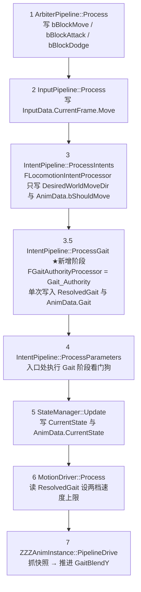
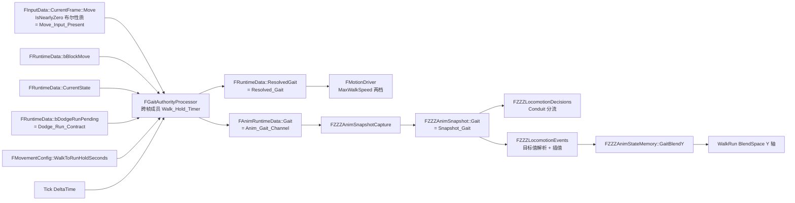

# Design Document

## Overview

本设计把步态解析权收归逻辑侧的单一决策者 `Gait_Authority`，并把动画层收缩为纯步态消费者。

### 目标

1. 建立唯一步态决策者：`FRuntimeData::ResolvedGait` 与 `FAnimRuntimeData::Gait` 在 `Source/GGYGO/**` 范围内只有一个写入方（Requirement 1、Requirement 2）。
2. 步态规则收敛为三条：默认起步为 `Walk`；`Walk` 连续保持达到阈值升 `Run`；闪避契约成立时直接进 `Run`（Requirement 3、Requirement 4、Requirement 7）。
3. 取值域收敛为 `Walk` / `Run`，`Sprint` 从步态链路移除（Requirement 1、Requirement 14）。
4. 步态解析与速度彻底解耦，消除「步态 → 动画 → 速度 → 步态」的跨帧隐式环路（Requirement 8）。
5. 动画层只保留 `GaitBlendY` 的插值表现与 `Conduit` 分流，不再自持步态与计时（Requirement 10、Requirement 11、Requirement 12、Requirement 13）。

### 非目标

- 不做 root motion 提取链路改造，`FRootMotionParameterProcessor::Process` 保持恒零实现（Requirement 16.1、16.2、16.3）。
- 不做闪避系统本体，本设计只提供 `Dodge_Run_Contract` 的字段与读取方，写入方留给后续 spec（Requirement 7.7、Requirement 16.6）。
- 不引入转向规则、`TurnBack` 拓扑改造、输入缓冲改造、`Sprint` 的替代机制（Requirement 16.9）。
- 不新增 `ECharacterStateType::Dodging`，不提供 `State::Dodging` / `Ability::Dodge` 的写入方（Requirement 16.4、16.5）。
- 不包含编译与自动化测试的执行步骤，静态结论按 Requirement 17.3 表述为「静态检查通过，编译待本地验证」。

## 现状与问题

以下为已静态核实的代码现状（读取范围限定 `Source/GGYGO/**`）。

### 问题 1：双轨步态

| 轨道 | 位置 | 规则 |
| --- | --- | --- |
| 逻辑轨 | `FLocomotionIntentProcessor::Process` | 四级优先级：`bForceWalkHeld` → `Walk`；`bSprintHeld` → `Sprint`；`CurrentSpeed >= 旧 RuntimeData 速度阈值镜像的 Walk 档` → `Run`；摇杆幅度 `>= 0.5` → `Run`，否则 `Walk` |
| 动画轨 | `FZZZLocomotionEvents::AdvanceMovingGait` | 自持 `FZZZAnimStateMemory::MovingGait` 与 `WalkHoldSeconds`，用 `ZZZLocomotionRules::ShouldWalkUpgradeToRun` 做 5 秒升级 |

两套规则并存，`FZZZAnimSnapshot::Gait` 与 `FZZZAnimStateMemory::MovingGait` 在 Moving 期间可以不一致，`Moving_Walk_To_Run_ByHold()` 只看动画轨。

### 问题 2：跨帧隐式环路

`FLocomotionIntentProcessor` 位于 Tick 第 3 步，读取 `FRuntimeData::CurrentSpeed`；而 `CurrentSpeed` 由 Tick 第 6 步的 `FMotionDriver::UpdateRuntimeData` 写入。因此逻辑轨读到的恒为上一帧速度，构成隐式跨帧环路。同时 `FMotionDriver::Process` 又按 `ResolvedGait` 设 `MaxWalkSpeed`，闭合成「步态 → 速度上限 → 实际速度 → 下一帧步态」。

### 问题 3：Sprint 无有效触发路径

`FLocomotionIntentProcessor` 在 `bSprintHeld` 时置 `Sprint`，并按上升沿写 `AnimData.bSprintTrigger`；`UZZZAnimInstance::RefreshDecisionContext` 锁存为 `StateMemory.bSprintTriggerPending`，再由 `Conduit_To_Moving_Sprint()` 分流、`ConsumeSprintTrigger()` 消费。整条链路的语义是「按住 Shift 直接进 Sprint」，与本功能确立的三条步态规则冲突，且 `Sprint` 档没有对应的动画与速度设计。

### 问题 4：死代码现状

`FRootMotionParameterProcessor::Process` 已被摘空为恒 `AnimSpeed = 0`、`bHasRootMotion = false`。由此 `FMotionDriver::Process` 的 `bHasRootMotion` 分支不可达，`ProcessLocomotion` 内 `CappedSpeed > 0` 分支也不可达，实际只走 `AddMovementInput` 路径。本 spec 按 Requirement 16.1 至 16.3 保持这部分现状不动，仅记录事实，避免后续 spec 误判。

## Architecture

### 改造后的帧内时序



关键时序结论：

- 第 3.5 步早于第 6 步，`FMotionDriver` 同帧读到本帧步态，无跨帧滞后（Requirement 2.7）。
- 第 3.5 步早于第 7 步，`Snapshot_Gait` 等于同帧 `Resolved_Gait`（Requirement 2.8、Requirement 1.4）。
- 第 5 步晚于第 3.5 步，因此 `Gait_Authority` 本帧读到的 `CurrentState` 是上一帧末的取值，构成一帧观察延迟。该延迟为已知取舍，见「决策 1」。

### 步态数据流



链路上每个字段恰有一个写入方：`Gait_Authority` 写 `Resolved_Gait` 与 `Anim_Gait_Channel`（Requirement 2.1）；`FZZZAnimSnapshotCapture` 写 `Snapshot_Gait`（Requirement 13.4）；`FZZZLocomotionEvents` 写 `GaitBlendY`（Requirement 10.6）。

## 关键设计决策

### 决策 1：`Gait_Authority` 的落点与帧间隔供给方式

**约束事实**（已静态核实）

- `IIntentProcessor::Process(const FInputData&, FRuntimeData&)` 不含 `DeltaTime`。
- `IParameterProcessor::Process(FRuntimeData&, float DeltaTime)` 含 `DeltaTime`，但不含 `FInputData`。
- Requirement 8.2 要求 `Gait_Authority` 使用 `FInputData::CurrentFrame::Move` 的 `IsNearlyZero()` 布尔性质，因此它必须能访问 `FInputData`。
- Requirement 9.1 要求它每帧拿到帧间隔。
- 结论：任一现成接口都只能满足两项输入之一，落点问题实质是「同时拿到 `FInputData` 与 `DeltaTime`」。

**候选方案对比**

| 维度 | 候选 A：解析留在 `FLocomotionIntentProcessor`，参数阶段另设处理器推进计时 | 候选 B：整体移到参数阶段处理器 | 候选 C：为 `IIntentProcessor` 补 `DeltaTime` | 选定方案 D：`FIntentPipeline` 增设具名步态阶段 |
| --- | --- | --- | --- | --- |
| Requirement 2.7（早于 `FMotionDriver`） | 满足（第 3 与第 4 步） | 满足（第 4 步） | 满足（第 3 步） | 满足（第 3.5 步） |
| Requirement 2.8（早于 `PipelineDrive`） | 满足 | 满足 | 满足 | 满足 |
| Requirement 1.5（每帧至多一次写入 `Resolved_Gait`） | **违反**：第 3 步写基线步态、第 4 步升级再写一次 | 满足 | 满足 | 满足 |
| Requirement 2.1（唯一写入方） | **违反**：拆成两个类两个编译单元 | 满足 | 满足 | 满足 |
| Requirement 2.5（两处判定同编译单元） | **违反** | 满足 | 满足 | 满足 |
| Requirement 8.2（读 `FInputData`） | 满足 | 需要额外通路：改 `FIntentPipeline::Init` 签名或新增 `ABaseCharacter::GetInputData()` | 满足 | 满足（阶段函数直接接收 `const FInputData&`） |
| Requirement 9.1（拿到帧间隔） | 满足 | 满足 | 满足（接口新增参数） | 满足（阶段函数接收 `float DeltaTime`） |
| Requirement 9.5（`FIntentPipeline` 公开成员不删不改名） | 满足 | 若改 `Init` 签名则为「同名改签名」，边界模糊 | `ProcessIntents` 需改签名，边界模糊 | 满足（纯新增 `ProcessGait`，既有成员一字不改） |
| Requirement 16.6（`FDodgeIntentProcessor` 实现不变） | 满足 | 满足 | **受影响**：`FViewRotationProcessor`、`FAttackIntentProcessor`、`FDodgeIntentProcessor` 都要跟着改签名 | 满足 |
| Requirement 3.3（`CurrentState` 观察延迟） | 一帧 | 一帧 | 一帧 | 一帧（四方案相同，`StateManager` 在第 5 步） |
| 分层语义 | 计时与解析割裂 | 参数阶段处理器读输入，违反 `IParameterProcessor` 的既有职责注释 | 保持意图语义 | 保持意图语义，且阶段名自解释 |

**选定：方案 D**

`Gait_Authority` 落为独立类 `FGaitAuthorityProcessor`，由 `FIntentPipeline` 以具名成员持有（不进 `IntentProcessors` / `ParameterProcessors` 数组），通过新增的公开成员函数暴露：

```cpp
// FIntentPipeline 新增（纯新增，不动既有成员）
void ProcessGait(const FInputData& InputData, FRuntimeData& RuntimeData, float DeltaTime);
```

`ABaseCharacter::Tick` 在第 3 步之后、第 4 步之前调用它（第 3.5 步）。理由：

1. 唯一同时满足 Requirement 8.2 与 Requirement 9.1 且不动任何既有接口签名的方案（候选 B 与 C 都要动签名或新增 Actor 级访问器）。
2. Requirement 1.5、2.1、2.5 要求解析、计时、升级、闪避消费全在同一编译单元一次成型，方案 D 把它们收进 `GaitAuthorityProcessor.cpp` 一个 `Process` 调用内。
3. Requirement 9.5 与 16.6 得到严格满足，零回归面：既有四个意图处理器与两个参数处理器的签名、实现、注册顺序全部不变。
4. 代价：`ABaseCharacter::Tick` 多一次调度调用，`FIntentPipeline` 多一个公开成员函数。`ABaseCharacter` 仍然只调度，不出现对 `Resolved_Gait`、`Anim_Gait_Channel`、`Walk_Hold_Timer` 的任何赋值（Requirement 2.6）。

**已知取舍（显式记录）：`CurrentState` 的一帧观察延迟**

`FGYGOStateManager::Update` 在 Tick 第 5 步写 `CurrentState`，`Gait_Authority` 在第 3.5 步读，因此本帧读到的是上一帧末的状态取值。影响与判定：

- Requirement 3.3 的措辞是「`Gait_Authority` **首次观察到**该状态取值的那一逻辑帧」，延迟在需求语义内；起步首帧（`CurrentState` 仍为 `Idle`）与其后首个 `Moving` 帧的 `Resolved_Gait` 都是 `Walk`，判定成立。
- Requirement 5.5 使起步首帧 `Walk_Hold_Timer` 归零、不推进，与 Requirement 3.5「本次移动起始帧结束时 `Walk_Hold_Timer` 不大于 `0.1` 秒」一致。
- 副作用：`Walk` 计时的实际起点比方向输入出现晚一帧，即达到 `5.0` 秒阈值的墙钟时刻最多晚一帧（`≤ 0.1` 秒）。Requirement 17.5 的判定基准是 `Walk_Hold_Timer` 的累计值而非墙钟时长，故不影响验证用例。
- 结论：接受该延迟，不为消除它调整管线顺序（把 `StateManager` 提前会改变仲裁与状态机的既有时序契约，超出本 spec 范围）。

### 决策 2：`Walk_Hold_Timer` 与优先级链的实现结构

`Walk_Hold_Timer` 作为 `FGaitAuthorityProcessor` 的私有跨帧成员 `float WalkHoldTimer`，存放在逻辑侧、不进 `FRuntimeData`、不参与 `ResetFrameIntents()`（Requirement 5.9、5.10）。

**帧内固定求值顺序**（Requirement 5.11）

```
Process(InputData, RuntimeData, DeltaTime)
  ①  采样本帧判定输入：bMoveInputPresent / bBlockMove / bMovingState 与三条边沿
  ②  ResolveFrameDelta        帧间隔钳制与有效性判定        Req 9.2 / 9.3
  ③  ResolveFrameGait         基线步态优先级链 + 闪避契约消费  Req 3.9 / 6 / 7
  ④  UpdateWalkHoldTimer      先归零判定，再推进             Req 5.1 ~ 5.8 / 5.12
  ⑤  ShouldUpgradeToRun       读推进后的计时判升级           Req 4.1 ~ 4.3 / 4.10
  ⑥  单次写入 ResolvedGait 与 AnimData.Gait                  Req 1.4 / 1.5 / 2.7 / 2.8
  ⑦  更新边沿基线成员                                       Req 3.7
```

步骤 ③ 到 ⑤ 全程只操作局部变量 `FrameGait`，直到步骤 ⑥ 才落盘，从而保证「每帧至多写入一次 `Resolved_Gait`」（Requirement 1.5）与「同帧多次读取取值相同」。

**优先级链**（Requirement 3.9、6.3、6.8、7.4、7.5）

```
1. bBlockMove 为真                        → Gait_None，不产生任何 Walk 写入        Req 3.6 / 6.7
2. Move_Input_Present 为假                → Gait_None，并把 bDodgeRunPending 置假  Req 6.3 / 7.5
3. bDodgeRunPending 为真                  → Run，并把 bDodgeRunPending 置假        Req 7.4
4. 上一帧为 Run 且未发生「离开 Moving」边沿 → Run（Run 不回落）                     Req 6.1 / 6.2 / 6.5
5. 其余                                   → Walk（唯一起始步态）                   Req 3.1 / 3.2 / 3.3 / 3.8
```

第 4 条采用**边沿**而非电平判定：`bLeftMovingState = (PreviousCurrentState == Moving && CurrentState != Moving)`。理由：Requirement 6.6 的触发条件本身是「由 `Logic_Moving_State` 变为其他状态」这一边沿；若改成电平判定（要求 `CurrentState == Moving` 才保持 `Run`），闪避契约在 `CurrentState` 尚未切到 `Moving` 的那一帧会被打回 `Walk`，与 Requirement 6.8 把闪避列为 6.4 / 6.6 显式例外的意图相悖。

**归零条件集合**（任一成立即归零一次并跳过推进，Requirement 5.12）

| 序号 | 条件 | 需求 |
| --- | --- | --- |
| Z1 | `Move_Input_Present` 为假 | 5.3 |
| Z2 | `bBlockMove` 为真 | 5.4 |
| Z3 | `CurrentState` 不为 `Logic_Moving_State` | 5.5 |
| Z4 | 本帧 `FrameGait` 为 `Run` | 5.6 |
| Z5 | `Move_Input_Present` 假→真边沿 | 3.5 |
| Z6 | `bBlockMove` 真→假边沿 | 3.8 |

Z5 与 Z6 是必需的补充：Z1 至 Z4 都是电平条件，若某帧方向输入重新出现而 `CurrentState` 恰好仍停留在 `Moving`（输入短暂中断而状态机未回落），仅靠电平条件不会归零，会把上一次移动的累计量带入本次移动，违反 Requirement 3.5 与 3.8。

**升级判定**（Requirement 4.1、4.2、4.3、4.10）

```cpp
FrameGait == Walk && bMoveInputPresent && !bBlockMove
    && WalkHoldTimer >= ResolveEffectiveThreshold()
```

阈值在此处每帧重新求值（Requirement 4.10）。升级成立时把 `FrameGait` 置 `Run` 并把 `WalkHoldTimer` 归零（Requirement 4.2）。升级帧的归零与步骤 ④ 的归零互斥（升级帧 Z1 至 Z6 全不成立），故单帧对计时器的写入仍是「至多一次归零 + 至多一次推进」（Requirement 5.2）。

### 决策 3：动画层规则层的收缩后形态

`ZZZLocomotionRules` 收缩为：

| 保留 | 移除 |
| --- | --- |
| `ResolveGaitBlendTarget`、`ResolveGaitBlendInterpSpeed`、`DefaultGaitBlendInterpSpeed`、`MaxGaitBlendInterpSpeed`、`MaxClampedDelta`、`GaitBlendSnapTolerance` | `ShouldWalkUpgradeToRun`、`IsValidMovingGait`、`ResolveWalkToRunThreshold`、`DefaultWalkToRunHoldSeconds`、`MaxWalkToRunHoldSeconds`、`MaxWalkHoldSeconds` |

（Requirement 10.4）

**入参语义变更**：`ResolveGaitBlendTarget` 的入参由 `MovingGait` 改为 `Snapshot_Gait`（Requirement 10.5）。

```cpp
/** 由 Snapshot_Gait 推导 GaitBlendY 目标值：Run 为 1.0，其余取值为 0.0。 */
float ResolveGaitBlendTarget(EMovementGait InSnapshotGait)
{
    return InSnapshotGait == EMovementGait::Run ? 1.0f : 0.0f;
}
```

**`IsValidMovingGait` 移除后的容错承载**（Requirement 1.6）

分成「容错」与「诊断」两件事分别落位：

1. **容错**由 `ResolveGaitBlendTarget` 的**正向 `Run` 判定**天然承载：只有 `Run` 映射到 `1.0`，`Walk`、`Gait_None` 与任何非法取值都落到 `0.0`，即「按 `Walk` 参与后续判定」。不需要任何取值域校验函数，也不写回 `Snapshot_Gait`（Requirement 1.6 要求源值不被改写；`Snap` 在 `FZZZAnimWriteContext` 中本就是 `const FZZZAnimSnapshot*`，改写在类型层面即不可能）。
2. **诊断**由 `FZZZLocomotionEvents` 的私有辅助函数承载，带驻留级节流标记：

```cpp
/** Snapshot_Gait 落在 {None, Walk, Run} 之外时输出至多一条诊断，不改写源值。 */
void FZZZLocomotionEvents::ReportInvalidSnapshotGaitIfNeeded();
```

`Sprint` 移除后 `EMovementGait` 只剩三个取值，越域只可能来自内存损坏或非法强转，因此该检查定位为廉价护栏而非常规路径。

### 决策 4：`FZZZLocomotionEvents` 的上下文与职责

**上下文仍需三个指针**：`Snap` 提供 `Snapshot_Gait` 与 `Snapshot_CurrentState`，`Tuning` 提供 `GaitBlendInterpSpeed`（Requirement 11.7 保留该配置在动画层），`Memory` 只提供 `GaitBlendY`。`FZZZAnimWriteContext` / `FZZZAnimReadContext` 的结构、`IsValid()` 与 `ToRead()` 全部不变。

**函数改名**：`AdvanceMovingGait` 已不再推进步态，只推进 `GaitBlendY`，改名为：

```cpp
/** 每帧推进 GaitBlendY 向 Snapshot_Gait 对应目标值收敛。 */
void AdvanceGaitBlend(float DeltaSeconds);
```

调用点影响：唯一调用点是 `UZZZAnimInstance::RefreshDecisionContext` 中的 `LocomotionEvents.AdvanceMovingGait(DeltaSeconds)`，改为 `LocomotionEvents.AdvanceGaitBlend(DeltaSeconds)`。该函数不是 `UFUNCTION`，蓝图侧无引用，改名不产生资产改动。

**上一帧目标值的跨帧成员**（Requirement 11.2）

```cpp
/** 上一帧解析出的 GaitBlendY 目标值；Snapshot_Gait 为 Gait_None 时沿用它继续收敛。 */
float LastGaitBlendTarget = 0.0f;
```

初值 `0.0f`（等于 `Walk` 目标值，与 `GaitBlendY` 的初值一致）。它是 `FZZZLocomotionEvents` 的私有成员，不进 `FZZZAnimStateMemory`：`FZZZAnimStateMemory` 按 Requirement 10.1、13.1、14.4 最终只保留 `GaitBlendY`，且 AnimGraph 不需要读取目标值。

**Requirement 11.9 与 11.2 同帧适用时的优先关系**

明确：**Requirement 11.9（状态维度）优先于 Requirement 11.2（步态维度）**。

判定实现为「快照状态优先」：当 `!Context.Snap` 或 `Context.Snap->CurrentState != ECharacterStateType::Moving`（覆盖 `NotMoving`、`Conduit`、`EnterMove`、`None` 以及快照缺失）时，直接把 `GaitBlendY` 与 `LastGaitBlendTarget` 一并置 `0.0` 并结束本帧，不进入目标值解析与插值。理由：

1. `CurrentState` 非 `Moving` 表示角色不在移动状态，`WalkRun` BlendSpace 的 Y 轴必须复位，否则下一次起步首帧会带着上一次的 `Run` 混合量（Requirement 11.9）。
2. 同时把 `LastGaitBlendTarget` 归零，使 Requirement 11.2 的「沿用上一帧目标值」在下一次处于 `Moving` 时从 `Walk` 目标起算，与 Requirement 3「Walk 是唯一起始步态」一致。
3. 该规则顺带覆盖 `EnterMove` 驻留期的 `GaitBlendY` 为 `0.0`，与 Requirement 12.8 的入口初始化一致，不产生冲突写入。

**`CurrentSubState` 的去留**：`WalkHoldSeconds` 移除后 `CurrentSubState` 失去唯一读取方，成为只写成员。按 Requirement 10.7 保持 `EZZZAnimMovingSubState` 取值集合与语义不变，本设计保留 `MarkMovingSubStateEntered` 与 `CurrentSubState`（AnimBP 的 `Locomotion_OnEnter_MovingSubState` 仍可绑定），仅在注释中标注它当前只作为子状态记录、无判定读取方。

### 决策 5：Conduit 分流的判定函数形态

分流依据由 `bSprintTriggerPending` 改为「本帧 `Snapshot_Gait` 是否为 `Run`」（Requirement 12.2）。

```cpp
// FZZZLocomotionDecisions

/** Conduit → Moving：本帧步态已是 Run，走直接进入路径。 */
bool Conduit_To_Moving_Direct() const
{
    return Context.Snap && Context.Snap->Gait == EMovementGait::Run;   // Req 12.3
}

/** Conduit → EnterMove：本帧步态不是 Run，走起步路径（同时作为上下文缺失时的默认分支）。 */
bool Conduit_To_EnterMove() const
{
    return !Context.Snap || Context.Snap->Gait != EMovementGait::Run;  // Req 12.4 / 12.5
}
```

**互补性证明**（Requirement 12.5）：设 `P = (Context.Snap != nullptr && Context.Snap->Gait == Run)`。`Conduit_To_Moving_Direct()` 返回 `P`，`Conduit_To_EnterMove()` 返回 `!P`（`!Snap || Gait != Run` 与 `!(Snap && Gait == Run)` 逻辑等价）。因此同一帧恰有一条为真，且上下文缺失时确定性地落到起步路径。这一点是相对现状的修复：现状两条判定都带 `Context.Memory &&` 前缀，`Memory` 为空时两条同时为假，存在无出口帧。

两条判定均为 `const`、只读 `FZZZAnimSnapshot`、不触碰 `FZZZAnimStateMemory`（Requirement 12.6）。

**`UZZZAnimInstance` 转发函数名变更**

| 变更 | 旧 | 新 |
| --- | --- | --- |
| 改名 | `Locomotion_Conduit_To_Moving_Sprint()` | `Locomotion_Conduit_To_Moving_Direct()` |
| 名称保留、语义变更 | `Locomotion_Conduit_To_EnterMove()`（依据 `bSprintTriggerPending`） | `Locomotion_Conduit_To_EnterMove()`（依据 `Snapshot_Gait != Run`） |
| 移除 | `Locomotion_Moving_Walk_To_Run_ByHold()` | — |
| 移除 | `ConsumeSprintTrigger()` | — |

蓝图侧需手动重新绑定的完整清单见「蓝图侧手动改动清单」。

## Components and Interfaces

### 新增：`FGaitAuthorityProcessor`（Gait_Authority）

- 头文件：`Source/GGYGO/Public/Pipeline/Gait/GaitAuthorityProcessor.h`
- 实现：`Source/GGYGO/Private/Pipeline/Gait/GaitAuthorityProcessor.cpp`
- 不实现 `IIntentProcessor` / `IParameterProcessor`：两个接口都无法同时传入 `FInputData` 与 `DeltaTime`，且它由 `FIntentPipeline` 以具名成员持有，不需要多态。

```cpp
class ACharacter;
class ABaseCharacter;
class FInputData;
struct FRuntimeData;

/**
 * 步态决策者（Gait_Authority）。
 *
 * FRuntimeData::ResolvedGait 与 FAnimRuntimeData::Gait 的唯一写入方。
 * 判定输入只有四项：Move_Input_Present、CurrentState、bBlockMove、bDodgeRunPending。
 * 不读取任何速度类字段。
 */
class FGaitAuthorityProcessor
{
public:
    /** 缓存 Owner，用于每帧读取 FMovementConfig::WalkToRunHoldSeconds。 */
    void Init(ACharacter* InOwner);

    /** 每帧解析步态：帧间隔解析 → 基线步态 → 计时归零与推进 → 升级 → 单次写入。 */
    void Process(const FInputData& InputData, FRuntimeData& RuntimeData, float DeltaTime);

private:
    /** 解析本次生效阈值：非法回退 5.0，超上界钳到 60.0，合法区间取原值。 */
    float ResolveEffectiveThreshold();

    /** 帧间隔钳制到 [0, 0.1]；负值或非有限返回 false 并输出节流诊断。 */
    bool ResolveFrameDelta(float InDeltaTime, float& OutClampedDelta);

    /** 基线步态优先级链；必要时消费 Dodge_Run_Contract（唯一置假处）。 */
    EMovementGait ResolveFrameGait(
        FRuntimeData& RuntimeData,
        bool bMoveInputPresent,
        bool bLeftMovingState);

    /** 先执行至多一次归零，再执行至多一次推进。 */
    void UpdateWalkHoldTimer(
        EMovementGait FrameGait,
        bool bMoveInputPresent,
        bool bBlockMove,
        bool bMovingState,
        bool bMoveInputRising,
        bool bBlockReleased,
        float ClampedDelta,
        bool bDeltaValid);

    /** Walk 保持达到生效阈值时的升级判定。 */
    bool ShouldUpgradeToRun(
        EMovementGait FrameGait,
        bool bMoveInputPresent,
        bool bBlockMove);

    /** 所属角色（读取 UCharConfigData::MovementConfig 用）。 */
    TWeakObjectPtr<ABaseCharacter> Owner;

    /** Walk_Hold_Timer：跨帧计时，恒落在 [0, 3600]。 */
    float WalkHoldTimer = 0.0f;

    /** 上一帧判定基线（Requirement 3.7 定义的首帧基线即为这些初值）。 */
    EMovementGait PreviousResolvedGait = EMovementGait::None;
    bool bPreviousMoveInputPresent = false;
    bool bPreviousBlockMove = false;
    ECharacterStateType PreviousCurrentState = ECharacterStateType::Idle;

    /** 诊断节流标记：条件恢复正常时复位，避免每帧刷屏。 */
    bool bInvalidDeltaReported = false;
    bool bThresholdFallbackReported = false;
    bool bThresholdClampReported = false;
    bool bMissingOwnerReported = false;

    /** 阈值常量（逻辑侧自持，不复用动画层规则层常量）。 */
    static constexpr float DefaultWalkToRunHoldSeconds = 5.0f;
    static constexpr float MaxWalkToRunHoldSeconds = 60.0f;
    static constexpr float MaxWalkHoldSeconds = 3600.0f;
    static constexpr float MaxClampedDelta = 0.1f;
};
```

阈值上下界常量刻意在逻辑侧重新声明，不从 `ZZZLocomotionRules` 复用：Requirement 10.4 要求把 `DefaultWalkToRunHoldSeconds` / `MaxWalkToRunHoldSeconds` / `MaxWalkHoldSeconds` 从动画层规则层移除，逻辑侧不应对动画层头文件产生新的依赖方向。

### 新增：`LogGait` 日志类别

- `Source/GGYGO/Public/Pipeline/Gait/GaitLog.h`：`DECLARE_LOG_CATEGORY_EXTERN(LogGait, Log, All);`
- `Source/GGYGO/Private/Pipeline/Gait/GaitLog.cpp`：`DEFINE_LOG_CATEGORY(LogGait);`

与 `LogZZZAnim` 同构：只声明一次、只定义一次，便于统一控制 verbosity。Requirement 2.9、4.7、4.8、9.3 的诊断全部走 `LogGait`；现状 `FLocomotionIntentProcessor` 中的 `[GAIT]` `LogTemp` 日志随步态逻辑一并移除（Requirement 8.5）。

### 修改：`FIntentPipeline`

```cpp
class FIntentPipeline
{
public:
    void Init(ACharacter* InOwner, USkeletalMeshComponent* InMesh);          // 签名不变
    void ProcessIntents(const FInputData& InputData, FRuntimeData& RuntimeData); // 签名不变
    void ProcessParameters(FRuntimeData& RuntimeData, float DeltaTime);      // 签名不变

    /** ★新增：步态阶段（Tick 第 3.5 步），Gait_Authority 的唯一执行入口。 */
    void ProcessGait(const FInputData& InputData, FRuntimeData& RuntimeData, float DeltaTime);

private:
    TArray<TUniquePtr<IIntentProcessor>> IntentProcessors;      // 不变
    TArray<TUniquePtr<IParameterProcessor>> ParameterProcessors; // 不变

    /** ★新增：步态决策者。 */
    FGaitAuthorityProcessor GaitAuthority;

    /** ★新增：Gait 阶段看门狗，记录最近一次 ProcessGait 执行的帧号。 */
    uint64 LastGaitFrameCounter = 0;

    /** ★新增：看门狗诊断节流标记。 */
    bool bGaitStageMissReported = false;
};
```

`Init` 内新增 `GaitAuthority.Init(InOwner)`；既有处理器的创建与注册顺序一字不动（Requirement 9.5）。

`ProcessGait` 委派给 `GaitAuthority.Process(...)` 并记录 `LastGaitFrameCounter = GFrameCounter`。

`ProcessParameters` 入口处执行看门狗（Requirement 2.9）：若 `LastGaitFrameCounter != GFrameCounter`，输出一条节流诊断。由于 `Resolved_Gait`、`Anim_Gait_Channel` 与 `WalkHoldTimer` 在管线中没有其他写入方，未执行帧上三者自然保持上一帧取值，无需补偿写入。

### 修改：`FLocomotionIntentProcessor`

职责收缩为「输入方向 → 世界空间方向」与 `AnimData.bShouldMove` 同步：

- 移除私有成员 `PreviousGait`（上升沿检测随 `bSprintTrigger` 一并作废）。
- 移除对 `RuntimeData.ResolvedGait`、`RuntimeData.AnimData.Gait`、`RuntimeData.AnimData.bSprintTrigger` 的全部赋值（Requirement 2.1）。
- 移除四级步态优先级与 `[GAIT]` 日志（Requirement 8.5）。
- 保留：`DesiredWorldMoveDir` 的计算与清零、`AnimData.bShouldMove` 的写入。
- 文件头注释整体重写，删除 `Sprint`、`CurrentSpeed`、摇杆幅度预测相关描述。

### 修改：`FMotionDriver`（Requirement 15）

- `Init`：从 `CharacterConfig->MovementConfig.WalkSpeed` 与 `.RunSpeed` 初始化私有缓存 `WalkSpeedCap` 与 `RunSpeedCap`；不再通过 `FRuntimeData` 阈值镜像同步速度上限。`DefaultMaxWalkSpeed` 缓存与 `SetRootMotionMode(ERootMotionMode::IgnoreRootMotion)` 保持不变（Requirement 15.6）。
- `Process`：按 `bBlockMove` 与 `ResolvedGait` 两档设置 `MaxWalkSpeed`。

```cpp
if (RuntimeData.bBlockMove)
{
    Movement->MaxWalkSpeed = 0.f;                                    // Req 15.3
}
else
{
    Movement->MaxWalkSpeed = RuntimeData.ResolvedGait == EMovementGait::Walk
        ? WalkSpeedCap
        : RunSpeedCap;                                               // Req 15.1
}
```

- `ProcessLocomotion`：`SpeedCap` 同样使用 `WalkSpeedCap` / `RunSpeedCap` 两档（Requirement 15.2）。
- `bHasRootMotion` 分支、`ProcessRootMotionMovement`、`AddMovementInput` 路径、`UpdateRuntimeData` 全部不变（Requirement 15.4、15.5、16.3）。

### 修改：动画层

| 类型 | 变更 |
| --- | --- |
| `FZZZAnimSnapshotCapture` | 移除 `OutSnap.bSprintTrigger = AnimData.bSprintTrigger;`；`OutSnap.Gait = AnimData.Gait;` 保持为 `Snapshot_Gait` 的唯一写入语句（Requirement 13.4、14.3） |
| `FZZZLocomotionDecisions` | `NotMoving_To_Conduit()` 不变（Requirement 12.9）；`Conduit_To_EnterMove()` 改判定；`Conduit_To_Moving_Sprint()` → `Conduit_To_Moving_Direct()`；移除 `Moving_Walk_To_Run_ByHold()`（Requirement 10.3、14.5） |
| `FZZZLocomotionEvents` | 清理旧 Sprint 事件与动画状态入口记忆链路；`AdvanceMovingGait` → `AdvanceGaitBlend`；`AdvanceGaitBlendY` 改为接收目标值参数；加 `LastGaitBlendTarget`、`ResolveTargetFromSnapshot`、`ReportInvalidSnapshotGaitIfNeeded`、`bInvalidSnapshotGaitReported`；`EnterMoving` 按快照步态初始化，`AdvanceGaitBlend` 按快照状态门控 |
| `UZZZAnimInstance` | `RefreshDecisionContext` 移除 `bSprintTrigger` 锁存段，改调 `AdvanceGaitBlend`；移除旧状态入口记忆转发与 Sprint 相关 `UFUNCTION`；新增 `Locomotion_Conduit_To_Moving_Direct`，并按快照步态/状态更新动画层 |

`FZZZLocomotionEvents` 的关键实现骨架：

```cpp
void FZZZLocomotionEvents::AdvanceGaitBlend(float DeltaSeconds)
{
    if (!Context.Snap || !Context.Memory) { return; }

    // Requirement 11.9 优先于 11.2：Snapshot.CurrentState 非 Moving 时复位当前值与目标值。
    if (!Context.Snap || Context.Snap->CurrentState != ECharacterStateType::Moving)
    {
        Context.Memory->GaitBlendY = 0.0f;
        LastGaitBlendTarget = 0.0f;
        CurrentSubState = EZZZAnimMovingSubState::None;
        bInvalidDeltaReported = false;
        return;
    }

    ReportInvalidSnapshotGaitIfNeeded();                 // Req 1.6：只诊断，不改写源值

    const float Target = ResolveTargetFromSnapshot();    // Req 11.1 / 11.2
    LastGaitBlendTarget = Target;

    if (!FMath::IsFinite(DeltaSeconds)) { /* 节流诊断 */ Context.Memory->GaitBlendY = Target; return; }
    if (DeltaSeconds < 0.0f)            { /* 节流诊断 */ return; }

    AdvanceGaitBlendY(Target, FMath::Clamp(DeltaSeconds, 0.0f, ZZZLocomotionRules::MaxClampedDelta));
}

float FZZZLocomotionEvents::ResolveTargetFromSnapshot() const
{
    return Context.Snap->Gait == EMovementGait::None
        ? LastGaitBlendTarget                                                  // Req 11.2
        : ZZZLocomotionRules::ResolveGaitBlendTarget(Context.Snap->Gait);       // Req 11.1
}

void FZZZLocomotionEvents::EnterMoving()
{
    if (!Context.Memory) { return; }

    // 入口步态为 Run → 1.0；其他步态或快照缺失 → 0.0（Req 12.7 / 12.8）
    const float InitialBlend =
        Context.Snap && Context.Snap->Gait == EMovementGait::Run ? 1.0f : 0.0f;

    Context.Memory->GaitBlendY = InitialBlend;
    LastGaitBlendTarget = InitialBlend;
}
```

`AdvanceGaitBlendY(float Target, float ClampedDelta)` 的插值主体沿用现状实现：速率 `<= 0` 时直接置目标值（Requirement 11.6）；差值 `<= GaitBlendSnapTolerance` 时吸附目标（Requirement 11.4）；否则 `FMath::FInterpConstantTo` 后钳制到 `[0, 1]`（Requirement 11.3、11.5）。

## Data Models

### `EMovementGait`（`StateMachine/CharacterStateType.h`）

```cpp
UENUM(BlueprintType)
enum class EMovementGait : uint8
{
    None    UMETA(DisplayName="无（静止）"),   // 0
    Walk    UMETA(DisplayName="行走"),        // 1
    Run     UMETA(DisplayName="跑步"),        // 2
    // Sprint 已移除（原值 3，末位删除不影响前三项的 uint8 数值）
};
```

`Sprint` 位于枚举末位，删除后 `None` / `Walk` / `Run` 的声明顺序与底层数值均不变，既有资产与蓝图对 `Walk` / `Run` 的引用不发生数值偏移（Requirement 1.1、14.1）。

### `FRuntimeData`（`Data/Logic/RuntimeData.h`）

| 变更 | 字段 | 说明 |
| --- | --- | --- |
| 新增 | `bool bDodgeRunPending = false;` | `Dodge_Run_Contract`，跨帧锁存，**不**进 `ResetFrameIntents()`（Requirement 7.1）；注释标注唯一读取方与唯一置假方为 `Gait_Authority`，写入方由后续闪避 spec 提供（Requirement 7.3） |
| 移除 | `FGaitThresholds` 整体 | RuntimeData 不再承载速度上限镜像；速度上限改由 `FMotionDriver` 的私有 `WalkSpeedCap` / `RunSpeedCap` 缓存承载（Requirement 8.7、15.1、15.2） |
| 新增（`FMotionDriver` 私有） | `WalkSpeedCap`、`RunSpeedCap` | 在 `Init` 中分别从 `FMovementConfig::WalkSpeed`、`FMovementConfig::RunSpeed` 初始化，`Process` 与 `ProcessLocomotion` 使用；不参与步态判定 |
| 注释修正 | `ResolvedGait` | 写入方由 `LocomotionIntentProcessor` 改为 `FGaitAuthorityProcessor`；读取方去掉 `NTEAnim` 的 `Sprint` 描述 |
| 注释修正 | `CurrentSpeed` | 去掉「`LocomotionIntentProcessor` 步态解析 读取」，改为仅 `FMotionDriver` 与调试读取（Requirement 8.1） |
| 不变 | `bWantsToDodge` | 仍为帧级意图并在帧末清零，与 `bDodgeRunPending` 互不替代（Requirement 7.8） |
| 不变 | `AnimSpeed`、`RootMotionDelta`、`bHasRootMotion` | Requirement 16.2 |

### `FMovementConfig`（`Movement/MovementConfig.h`）

```cpp
/** Walk 连续保持自动升 Run 的时长阈值（秒）；面板钳制只约束输入，运行期按 Gait_Authority 的回退规则解析 */
UPROPERTY(EditAnywhere, BlueprintReadWrite, Category = "Gait",
          meta = (ClampMin = "0.1", ClampMax = "60.0"))
float WalkToRunHoldSeconds = 5.f;
```

（Requirement 4.6）`SprintSpeed` 与 `SprintMultiplier` 保留声明以避免数据资产迁移，本功能后无读取方（Requirement 14.7）。

### `FAnimRuntimeData`（`Data/Anim/AnimRuntimeData.h`）

| 变更 | 字段 |
| --- | --- |
| 移除 | `bool bSprintTrigger`（Requirement 14.3） |
| 注释修正 | `Gait`：写入方改为 `FGaitAuthorityProcessor`，取值域标注为 `None` / `Walk` / `Run` |
| 不变 | `bShouldMove`、`CurrentState`、`VelocityLength`、`Velocity2DLength`、`LastInputDirectionAngle` |

### `FZZZAnimSnapshot`（`Animation/zzzAnim/Data/ZZZAnimSnapshot.h`）

| 变更 | 字段 |
| --- | --- |
| 移除 | `bool bSprintTrigger`（Requirement 14.3） |
| 保留 | `Gait`（成为动画层步态判定与 `GaitBlendY` 目标值的唯一来源，Requirement 13.3）、`bShouldMove`、`CurrentState`、`VelocityLength`、`bGrounded`、`bBlockMove`（Requirement 13.5） |

### `FZZZAnimStateMemory`（`Animation/zzzAnim/Data/ZZZAnimStateMemory.h`）

最终只保留一个字段：

```cpp
USTRUCT(BlueprintType)
struct FZZZAnimStateMemory
{
    GENERATED_BODY()

    /** WalkRun BlendSpace 的 Y 轴输入，取值域 [0, 1]；唯一写入方：FZZZLocomotionEvents */
    UPROPERTY(BlueprintReadOnly, Category = "Locomotion")
    float GaitBlendY = 0.f;
};
```

移除动画状态、进入步态、Sprint 触发与移动计时记忆字段（分别对应 Requirement 10.1、13.1、14.4）。移除 `MovingGait` 后，`Animation/zzzAnim/` 下唯一的 `EMovementGait` 成员字段是 `FZZZAnimSnapshot::Gait`（Requirement 2.3）。头文件可随之移除 `#include "StateMachine/CharacterStateType.h"`（`EMovementGait` 不再被本结构体引用），`ZZZAnimEnums.h` 的包含保留。动画状态入口不再由状态记忆链路驱动：`EnterMoving()` 读取 `Snapshot_Gait`，`AdvanceGaitBlend()` 读取 `Snapshot_CurrentState`。

### `FZZZAnimTuning`（`Animation/zzzAnim/Data/ZZZAnimTuning.h`）

| 变更 | 字段 |
| --- | --- |
| 移除 | `WalkToRunHoldSeconds`（Requirement 11.8） |
| 保留 | `GaitBlendInterpSpeed`（默认 `6.0`，面板区间 `[0.1, 50.0]`，`EditAnywhere`，Requirement 11.7）、`LoopBlendIn`、`OneShotBlendOut` |

## 完整的文件级改动映射表

### 新增文件（4）

| # | 文件 | 内容 |
| --- | --- | --- |
| N1 | `Source/GGYGO/Public/Pipeline/Gait/GaitAuthorityProcessor.h` | `FGaitAuthorityProcessor` 声明（含 `WalkHoldTimer`、边沿基线成员、阈值常量） |
| N2 | `Source/GGYGO/Private/Pipeline/Gait/GaitAuthorityProcessor.cpp` | 帧内七步实现、优先级链、归零/推进、升级、闪避契约消费、全部逻辑侧诊断 |
| N3 | `Source/GGYGO/Public/Pipeline/Gait/GaitLog.h` | `DECLARE_LOG_CATEGORY_EXTERN(LogGait, Log, All)` |
| N4 | `Source/GGYGO/Private/Pipeline/Gait/GaitLog.cpp` | `DEFINE_LOG_CATEGORY(LogGait)` |

### 修改条目（20 项，M18 至 M20 各含头文件与实现文件成对改动）

| # | 文件 | 改动类型 | 具体内容 | 需求 |
| --- | --- | --- | --- | --- |
| M1 | `Public/StateMachine/CharacterStateType.h` | 删枚举值 | 删 `EMovementGait::Sprint` | 1.1、14.1 |
| M2 | `Public/Movement/MovementConfig.h` | 加字段 | 加 `WalkToRunHoldSeconds`（默认 5.0，面板 `[0.1, 60.0]`）；保留 Sprint 两字段 | 4.6、14.7 |
| M3 | `Public/Data/Logic/RuntimeData.h` | 加字段 / 移除字段 / 改注释 | 加 `bDodgeRunPending`；移除 `FGaitThresholds` 整体；修 `ResolvedGait`、`CurrentSpeed` 注释；`ResetFrameIntents()` 主体不变 | 7.1、8.1、8.7 |
| M4 | `Public/Data/Anim/AnimRuntimeData.h` | 删字段 / 改注释 | 删 `bSprintTrigger`；修 `Gait` 注释 | 14.3 |
| M5 | `Public/Pipeline/IntentPipeline.h` | 加函数 / 加成员 | 加 `ProcessGait`、`GaitAuthority`、`LastGaitFrameCounter`、`bGaitStageMissReported`；既有三个公开函数签名不动 | 9.5、2.9 |
| M6 | `Private/Pipeline/IntentPipeline.cpp` | 加实现 | `Init` 内加 `GaitAuthority.Init(InOwner)`；实现 `ProcessGait`；`ProcessParameters` 入口加看门狗 | 2.9、9.5 |
| M7 | `Public/Pipeline/Intents/LocomotionIntentProcessor.h` | 删成员 | 删 `PreviousGait`；删 `CharacterStateType.h` 包含 | 2.1 |
| M8 | `Private/Pipeline/Intents/LocomotionIntentProcessor.cpp` | 删逻辑 / 改注释 | 删四级步态优先级、`ResolvedGait` / `AnimData.Gait` / `bSprintTrigger` 赋值、`[GAIT]` 日志；保留方向计算与 `bShouldMove`；重写文件头注释 | 2.1、8.5、14.3 |
| M9 | `Private/BaseCharacter.cpp` | 加调用 | `Tick` 在第 3 步后加 `IntentPipeline->ProcessGait(*InputData, *RuntimeData, DeltaTime);`；更新时序注释 | 2.6、2.7、2.8、9.1 |
| M10 | `Public/BaseCharacter.h` | 改注释 | `GetResolvedGait()` 注释去掉 `Sprint` 字样 | 14.8 |
| M11 | `Private/Drivers/MotionDriver.cpp` | 新增缓存 / 改分支 | `Init` 从 `MovementConfig.WalkSpeed` / `.RunSpeed` 初始化 `WalkSpeedCap` / `RunSpeedCap`；`Process` 与 `ProcessLocomotion` 使用两档缓存 | 8.7、15.1、15.2、15.6 |
| M12 | `Public/Animation/zzzAnim/Data/ZZZAnimSnapshot.h` | 删字段 | 删 `bSprintTrigger` | 14.3 |
| M13 | `Private/Animation/zzzAnim/Capture/ZZZAnimSnapshotCapture.cpp` | 删语句 | 删 `bSprintTrigger` 抓取 | 14.3、13.4 |
| M14 | `Public/Animation/zzzAnim/Data/ZZZAnimStateMemory.h` | 收缩为仅 `GaitBlendY`；删除状态、步态、计时与 Sprint 触发记忆字段；删 `CharacterStateType.h` 包含 | 10.1、13.1、14.4、2.3 |
| M15 | `Public/Animation/zzzAnim/Data/ZZZAnimTuning.h` | 删字段 | 删 `WalkToRunHoldSeconds` | 11.8 |
| M16 | `Public/Animation/zzzAnim/Locomotion/ZZZLocomotionRules.h` | 删函数与常量 / 改签名 | 删 6 项；`ResolveGaitBlendTarget` 入参改名为 `InSnapshotGait` 并更新注释 | 10.4、10.5 |
| M17 | `Private/Animation/zzzAnim/Locomotion/ZZZLocomotionRules.cpp` | 删实现 / 改实现 | 删 `ResolveWalkToRunThreshold`、`ShouldWalkUpgradeToRun`、`IsValidMovingGait`；`ResolveGaitBlendTarget` 保持正向 `Run` 判定 | 10.4、10.5、1.6 |
| M18 | `Public/Animation/zzzAnim/Locomotion/ZZZLocomotionDecisions.h` + `Private/...cpp` | 删函数 / 改名 / 改判定 | 删 `Moving_Walk_To_Run_ByHold`；`Conduit_To_Moving_Sprint` → `Conduit_To_Moving_Direct`；两条 Conduit 判定改依据 `Snapshot_Gait`；`NotMoving_To_Conduit` 不变 | 10.3、12.2 ~ 12.6、12.9、14.5 |
| M19 | `Public/Animation/zzzAnim/Locomotion/ZZZLocomotionEvents.h` + `Private/...cpp` | 删 `ConsumeSprintTrigger`、`SanitizeMovingGait` 与状态入口记忆链路；`AdvanceMovingGait` → `AdvanceGaitBlend`；`AdvanceGaitBlendY` 加目标值参数；加 `LastGaitBlendTarget`、`ResolveTargetFromSnapshot`、`ReportInvalidSnapshotGaitIfNeeded`、`bInvalidSnapshotGaitReported`；`EnterMoving` 按快照步态初始化，`AdvanceGaitBlend` 按快照状态门控 | 10.2、10.6、11.1 ~ 11.6、11.9、12.7、12.8、13.2、14.5、1.6 |
| M20 | `Public/Animation/zzzAnim/ZZZAnimInstance.h` + `Private/...cpp` | 删 UFUNCTION / 加 UFUNCTION / 改实现 | 删 `Locomotion_Conduit_To_Moving_Sprint`、`Locomotion_Moving_Walk_To_Run_ByHold`、`ConsumeSprintTrigger`；加 `Locomotion_Conduit_To_Moving_Direct`；`RefreshDecisionContext` 删锁存段、改调 `AdvanceGaitBlend`；更新类注释 | 10.3、14.4、14.5、12.2 |

### 明确不改动的文件（回归面边界）

| 文件 | 依据 |
| --- | --- |
| `Private/Pipeline/Parameters/RootMotionParameterProcessor.cpp` | Requirement 16.1 |
| `Private/Pipeline/Parameters/MovementParameterProcessor.cpp` | 不在范围内 |
| `Private/Pipeline/Intents/DodgeIntentProcessor.cpp`、`ViewRotationProcessor`、`AttackIntentProcessor` | Requirement 16.6、9.5（方案 D 不改接口签名） |
| `Public/Pipeline/Interfaces/IIntentProcessor.h`、`IParameterProcessor.h` | 方案 D 不动接口 |
| `Private/Pipeline/InputPipeline.cpp`、`Private/PlayerCharacter.cpp` | Requirement 14.6 |
| `Private/Arbiters/*`（`FGASArbiter` 等） | Requirement 16.7 |
| `Private/StateMachine/**`（含 `GGYGOStateManager`、`IdleState`、`MovingState`） | Requirement 16.4；`ECharacterStateType` 取值集合不变 |
| `UNTEAnimInstance` 与 `Animation/Decisions/**` | Requirement 16.8 |
| `Public/Core/GGYGOTags.*` | Requirement 16.5 |

## 待确认假设

以下条目无法通过静态代码核实，标注为待确认假设，不作为实现前提：

1. **ZZZ AnimBP 拓扑**：`.uasset` 内的过渡条件绑定、`On Entry` 绑定与 AnimGraph 节点连线无法静态读取。本设计据 `EZZZAnimLocomotionState` 取值集合与现有 C++ 转发函数推断拓扑为 `NotMoving → Conduit → {EnterMove → Moving | Moving}`，并据此给出蓝图改动清单。实际绑定需在编辑器中逐条核对。
2. **`Conduit → Moving` 的直接进入目标状态**：现状函数名为 `Conduit_To_Moving_Sprint`，推断其目标状态即 `Moving` 顶层状态而非独立的 Sprint 状态。若 AnimBP 中存在独立 Sprint 状态节点，需在蓝图侧一并删除该节点并把过渡指向 `Moving`。
3. **`FZZZAnimSnapshot::bBlockMove` 恒为 `false`**：抓取器注释标注「暂无来源」。本设计不改动该字段（Requirement 13.5），因此动画层无法感知 `bBlockMove`；逻辑侧在 `bBlockMove` 为真时把步态置 `Gait_None`，动画层通过 `Snapshot_Gait` 间接感知。
4. **数据资产上的 `WalkToRunHoldSeconds`**：AnimBP 资产中 `FZZZAnimTuning::WalkToRunHoldSeconds` 的既存值在字段移除后由引擎忽略，不需要资产迁移；`UCharConfigData` 侧新增字段取默认值 `5.0`。此为 Unreal 反射系统的常规行为，未在本工程实测。

## Correctness Properties

*属性（property）是在系统所有合法执行下都应成立的特征或行为——本质上是对「系统应当做什么」的形式化陈述。属性是人类可读规格与机器可验证正确性保证之间的桥梁。*

属性归纳前已完成验收标准的可测试性分析与冗余消解：纯静态结构类条款（唯一写入方、符号存在性、接口签名、范围排除项）不写成属性，改由「静态检查项清单」承载；时序类条款（Requirement 2.7、2.8、9.1、9.4）由单次时序观察承载；规程类条款（Requirement 17.1、17.2、17.3、17.10）由验证报告写法承载。

被测单元的可构造性：`FGaitAuthorityProcessor`、`FRuntimeData`、`FInputData` 均为纯 C++ 类型，`Owner` 为空时阈值走默认回退路径，因此逻辑侧属性可在无 `UWorld` 的环境下驱动；`ZZZLocomotionRules` 为无状态纯函数；`FZZZLocomotionEvents` 与 `FZZZLocomotionDecisions` 只依赖三个可栈上构造的上下文结构体。

### Property 1: 步态取值域不变式

*对任意* 由 `Move_Input_Present`、`bBlockMove`、`CurrentState`、`bDodgeRunPending`、帧间隔构成的帧序列，每帧 `Process` 返回后：当 `Move_Input_Present` 为真且 `bBlockMove` 为假时 `Resolved_Gait` 落在 `{Walk, Run}` 内，否则 `Resolved_Gait` 为 `Gait_None`；且在任何帧上 `Resolved_Gait` 都不取 `{None, Walk, Run}` 之外的值。

**Validates: Requirements 1.2, 1.3, 1.7**

### Property 2: 步态双字段同帧一致

*对任意* 帧序列，每帧 `Process` 返回后 `FAnimRuntimeData::Gait` 恒等于同帧 `FRuntimeData::ResolvedGait`。

**Validates: Requirements 1.4, 2.8**

### Property 3: 起始步态优先级链的帧级模型等价

*对任意* 四项判定输入的组合序列（含冲突组合：阻止与闪避契约同时为真、闪避契约与无方向输入同时成立等），每帧 `Resolved_Gait` 等于参考模型的输出，其中参考模型为：`bBlockMove` 为真 → `Gait_None`；否则 `Move_Input_Present` 为假 → `Gait_None` 且契约置假；否则契约为真 → `Run` 且契约置假；否则上一帧为 `Run` 且本帧未发生「离开 `Logic_Moving_State`」边沿 → `Run`；否则 → `Walk`。

**Validates: Requirements 3.1, 3.2, 3.3, 3.6, 3.8, 3.9, 6.3, 6.4, 6.7, 6.8, 7.4, 7.5**

### Property 4: Run 单向性

*对任意* 帧序列，在每个 `Move_Input_Present` 连续为真且 `bBlockMove` 连续为假的极大区间内，`Resolved_Gait` 的取值变化次数不超过 `1`，且任何一次变化的方向都是由 `Walk` 到 `Run`；区间内方向角度（含 `180` 度反向）与输入幅度在 `(0.0, 1.0]` 内的任意变化都不产生由 `Run` 到 `Walk` 的变化；从 `Run` 到 `Walk` 的变化只经由 `Gait_None` 或「离开 `Logic_Moving_State`」边沿发生。

**Validates: Requirements 3.4, 4.3, 6.1, 6.2, 6.5, 6.6**

### Property 5: Walk_Hold_Timer 区间与增量不变式

*对任意* 帧间隔序列（含 `0`、超过 `0.1` 的正值、负值、`NaN`、`±inf`），每帧结束时 `Walk_Hold_Timer` 落在 `[0.0, 3600.0]` 闭区间内；帧间隔有效时相邻帧的增量不超过钳制后的 `Logic_Frame_Delta_Seconds`（上界 `0.1`）；帧间隔为负值或非有限时该帧 `Walk_Hold_Timer` 与前一帧完全相等。

**Validates: Requirements 5.1, 5.2, 5.7, 9.2, 9.3**

### Property 6: Walk_Hold_Timer 归零条件充要

*对任意* 帧序列，在帧间隔有效的前提下，某帧结束时 `Walk_Hold_Timer` 为 `0.0` 当且仅当该帧至少满足以下一条：`Move_Input_Present` 为假、`bBlockMove` 为真、`CurrentState` 不为 `Logic_Moving_State`、本帧步态为 `Run`、`Move_Input_Present` 发生假→真边沿、`bBlockMove` 发生真→假边沿；多条同时成立时结果与仅一条成立时相同；归零帧的后继非归零帧的 `Walk_Hold_Timer` 恰等于该帧钳制后的帧间隔，不恢复归零前的累计量。

**Validates: Requirements 3.5, 5.3, 5.4, 5.5, 5.6, 5.8, 5.12**

### Property 7: 跨阈即时升级

*对任意* 持续满足 `Move_Input_Present` 为真、`bBlockMove` 为假、`CurrentState` 为 `Logic_Moving_State` 的帧序列与任意帧间隔序列，`Resolved_Gait` 由 `Walk` 变为 `Run` 的帧恰为 `Walk_Hold_Timer` 累计首次达到或超过 `Effective_Walk_To_Run_Threshold` 的那一帧；该帧结束时 `Walk_Hold_Timer` 为 `0.0`；在该帧之前的所有帧上 `Walk_Hold_Timer` 落在 `[0.0, Effective_Walk_To_Run_Threshold)` 且 `Resolved_Gait` 为 `Walk`。

**Validates: Requirements 4.1, 4.2, 4.4, 4.5**

### Property 8: 阈值解析的分段映射与配置只读

*对任意* `float` 配置取值（含 `NaN`、`±inf`、负值、`0.0`、`(0.0, 60.0]` 内任意值、大于 `60.0` 的任意值），`Effective_Walk_To_Run_Threshold` 满足：配置为有限值且落在 `(0.0, 60.0]` 时等于配置值本身（不施加下界钳制）；配置为有限值且大于 `60.0` 时等于 `60.0`；配置小于或等于 `0.0` 或非有限时等于 `5.0`；且解析前后 `FMovementConfig::WalkToRunHoldSeconds` 的存储取值逐位相等。*对任意* 在帧序列中途修改配置的时点，其后各帧的升级判定使用修改后的解析结果。

**Validates: Requirements 4.7, 4.8, 4.9, 4.10**

### Property 9: 速度解耦与解析确定性

*对任意* 两次执行，若 `Move_Input_Present` 序列、`CurrentState` 序列、`bBlockMove` 序列、`Dodge_Run_Contract` 序列与 `Logic_Frame_Delta_Seconds` 序列逐帧相同，则 `Resolved_Gait` 序列逐帧相同——即使两次执行中 `CurrentSpeed`（含 `0.0` 到 `600.0` 的任意取值）、`AnimSpeed`、`RootMotionDelta`、`bHasRootMotion`、`FMotionDriver::WalkSpeedCap`、`FMotionDriver::RunSpeedCap`、`VelocityLength`、`Velocity2DLength` 以及方向输入的幅度与角度被任意扰动。

**Validates: Requirements 2.2, 8.1, 8.2, 8.3, 8.4, 8.6, 8.7, 17.9**

### Property 10: 闪避契约不因时间流逝失效

*对任意* 在 `Dodge_Run_Contract` 为真之后、由「`bBlockMove` 为真」或「`Move_Input_Present` 为真但契约尚未被消费」以外条件构成的任意长度帧序列，只要未发生 Requirement 7.4 与 7.5 定义的消费动作，`Dodge_Run_Contract` 在序列结束时仍为真，与经过的帧数与累计时长无关。

**Validates: Requirements 7.6**

### Property 11: GaitBlendY 目标值映射与非法取值容错

*对任意* `uint8` 强制转换得到的 `Snapshot_Gait` 取值，`ZZZLocomotionRules::ResolveGaitBlendTarget` 在取值为 `Run` 时返回 `1.0`，其余全部取值（含 `Walk`、`Gait_None` 与取值域之外的任意值）返回 `0.0`；调用前后 `FZZZAnimSnapshot::Gait` 的取值不被改写。

**Validates: Requirements 1.6, 10.5, 11.1**

### Property 12: GaitBlendY 的区间、单帧上界与吸附

*对任意* 由（当前 `Gait_Blend_Y`、目标值、`Gait_Blend_Interp_Speed`、帧间隔）构成的四元组序列（速率含 `NaN`、`±inf`、负值、`0.0`、超过 `50.0` 的值；帧间隔含负值与非有限值），推进后 `Gait_Blend_Y` 恒落在 `[0.0, 1.0]` 闭区间内、不越过目标值；当速率为有限正值且帧间隔有效时单帧变化量不超过速率与钳制后帧间隔之积；当与目标值之差的绝对值不大于 `0.001` 时结果恰等于目标值；当速率小于或等于 `0.0` 或非有限时结果恰等于钳制后的目标值。

**Validates: Requirements 4.11, 11.3, 11.4, 11.5, 11.6**

### Property 13: Gait_None 帧沿用上一帧目标值

*对任意* 在 `Moving` 驻留期间插入任意长度 `Gait_None` 段的 `Snapshot_Gait` 序列，每个 `Gait_None` 帧使用的目标值等于其前一个非 `Gait_None` 帧的目标值，收敛方向不发生翻转。

**Validates: Requirements 11.2**

### Property 14: 非 Moving 驻留与 Moving 入口的 GaitBlendY 规则

*对任意* `Snapshot_CurrentState` 与 `Snapshot_Gait` 序列，当快照不存在或 `Snapshot_CurrentState != Logic_Moving_State` 时，该帧推进结束后 `Gait_Blend_Y` 为 `0.0`；该规则优先于 Property 13 的目标值沿用规则。调用 `EnterMoving()` 时，`Snapshot_Gait == Run` 将 `Gait_Blend_Y` 与上一帧目标值初始化为 `1.0`，其他步态或快照缺失初始化为 `0.0`。

**Validates: Requirements 11.9, 13.2**

### Property 15: Conduit 分流判定互补

*对任意* `uint8` 强制转换得到的 `Snapshot_Gait` 取值与任意上下文有效性组合（含 `Snap` 为空指针），`Conduit_To_Moving_Direct()` 与 `Conduit_To_EnterMove()` 恰有一条返回真；且前者返回真当且仅当上下文有效且 `Snapshot_Gait` 为 `Run`；两次调用前后 `FZZZAnimStateMemory` 的任何字段不发生变化。

**Validates: Requirements 12.2, 12.3, 12.4, 12.5**

## Error Handling

### 逻辑侧（`FGaitAuthorityProcessor`，日志类别 `LogGait`）

| 异常情形 | 处理 | 诊断 | 需求 |
| --- | --- | --- | --- |
| `WalkToRunHoldSeconds` 小于或等于 `0.0` 或非有限 | `Effective_Walk_To_Run_Threshold` 取 `5.0`；不改写配置存储值 | `Warning`，指明取值非法且已回退到 `5.0` 秒；驻留级节流，配置恢复合法时复位标记 | 4.7 |
| `WalkToRunHoldSeconds` 大于 `60.0` | 取 `60.0`；不改写配置存储值 | `Warning`，指明超过上界且已钳制到 `60.0` 秒；节流同上 | 4.8 |
| `Owner` 为空或 `CharacterConfig` 为空 | 阈值取默认 `5.0`，其余判定照常执行 | `Warning`，指明配置源不可达、已使用默认阈值；一次性节流 | 4.7 |
| 帧间隔为负值或非有限 | 跳过整个计时阶段（既不归零也不推进），`Walk_Hold_Timer` 保持不变；基线步态解析与升级判定照常执行（升级使用未变的计时值） | `Warning`，指明帧间隔取值无效；驻留级节流，帧间隔恢复有效时复位 | 9.3 |
| 帧间隔超过 `0.1` | 钳制到 `0.1` 后参与推进 | 不输出诊断（常规钳制，非异常） | 9.2 |
| `Walk_Hold_Timer` 自身为非有限（外部损坏） | 推进前自愈为 `0.0` | 不单独输出（由区间自愈承载） | 5.7 |
| 计算结果超出 `[0.0, 3600.0]` | 上越取 `3600.0`，下越取 `0.0` | 不输出诊断 | 5.7 |
| `ProcessGait` 在某帧未被执行 | 三个状态量（`Resolved_Gait`、`Anim_Gait_Channel`、`Walk_Hold_Timer`）无其他写入方，自然保持上一帧取值，不做补偿写入 | `FIntentPipeline::ProcessParameters` 入口的看门狗输出 `Warning`，指明本帧步态解析未执行；节流 | 2.9 |

**帧间隔无效与归零条件的重叠裁决**：Requirement 9.3 要求「保持 `Walk_Hold_Timer` 当前取值不变」，Requirement 5.3 至 5.6 要求在各归零条件下置零。两者在「帧间隔无效且同时满足归零条件」的帧上冲突。裁决：**Requirement 9.3 优先**，该帧不产生任何计时写入。理由：帧间隔无效是不可信输入，此时任何计时写入（含归零）都是基于不可信上下文的状态变更；且该帧输出一条诊断，异常可见。此裁决记录在 `UpdateWalkHoldTimer` 的函数注释中。

### 动画侧（`FZZZLocomotionEvents`，日志类别 `LogZZZAnim`）

| 异常情形 | 处理 | 诊断 | 需求 |
| --- | --- | --- | --- |
| `Snapshot_Gait` 落在 `{None, Walk, Run}` 之外 | 由 `ResolveGaitBlendTarget` 的正向 `Run` 判定天然落到目标值 `0.0`，即按 `Walk` 参与判定；不改写源值（`Snap` 为 `const` 指针） | `Warning`，指明该取值非法；驻留级节流，每帧至多一条 | 1.6 |
| `Context.Snap` 或 `Context.Memory` 为空 | 直接返回，不产生任何写入 | 不输出（上下文缺失是初始化期常态） | — |
| `Context.Tuning` 为空 | `ResolveGaitBlendInterpSpeed` 返回默认 `6.0` | 不输出 | 11.7 |
| `Gait_Blend_Interp_Speed` 小于或等于 `0.0` 或非有限 | `Gait_Blend_Y` 直接置为钳制后的目标值 | 不输出（配置面板已钳制，运行期为容错分支） | 11.6 |
| 帧间隔非有限 | `Gait_Blend_Y` 直接置为目标值 | `Warning`，节流 | 11.3 |
| 帧间隔为负值 | 不改变 `Gait_Blend_Y` | `Warning`，节流 | 11.3 |
| `Gait_Blend_Y` 自身为非有限（外部损坏） | 推进前按 `0.0` 处理 | 不单独输出 | 11.5 |
| 插值结果非有限 | 取目标值 | 不单独输出 | 11.5 |
| `Conduit` 分流上下文缺失 | `Conduit_To_EnterMove()` 作为默认分支返回真，保证同帧恰有一条判定为真 | 不输出 | 12.5 |

## 蓝图侧手动改动清单

以下改动无法由 C++ 侧完成，需在 Unreal 编辑器中手动执行。执行顺序建议为「先解绑引用，再编译 C++，最后重新绑定」，避免 AnimBP 因函数缺失而报错节点。

### 1. 被移除的 `UFUNCTION`（AnimBP 中所有引用必须先解除）

| 函数 | 原绑定位置 | 处理 |
| --- | --- | --- |
| `Locomotion_Conduit_To_Moving_Sprint()` | `Conduit → Moving`（直接进入路径）的 `Can Enter Transition` | 改绑到新函数 `Locomotion_Conduit_To_Moving_Direct()` |
| `Locomotion_Moving_Walk_To_Run_ByHold()` | `Moving` 内 `Walk → Run` 过渡的 `Can Enter Transition` | 删除该过渡（走跑差异改由 `GaitBlendY` 在 BlendSpace 内混合，不再需要状态切换） |
| `ConsumeSprintTrigger()` | `Moving`（Sprint 直接进入路径）状态的 `On Entry` | 删除该节点 |

### 2. 新增的 `UFUNCTION`

| 函数 | 需绑定位置 |
| --- | --- |
| `Locomotion_Conduit_To_Moving_Direct()` | `Conduit → Moving`（直接进入路径）的 `Can Enter Transition` |

### 3. 语义变更但名称不变的 `UFUNCTION`（无需改绑，但需复核行为）

| 函数 | 变更 |
| --- | --- |
| `Locomotion_Conduit_To_EnterMove()` | 判定依据由「无待处理冲刺触发」改为「`Snapshot_Gait` 不为 `Run`」；绑定点不变 |
| `Locomotion_NotMoving_To_Conduit()` | 无变更（Requirement 12.9） |
| `Locomotion_OnEnter_Moving()` | 依据 `Snapshot_Gait` 是否为 `Run` 初始化 `GaitBlendY` 与其目标值；绑定点不变 |
| `Locomotion_OnEnter_MovingSubState(EnteringSubState)` | 无签名变更；`CurrentSubState` 当前无判定读取方 |

### 4. 被移除的 `StateMemory` 字段（AnimBP 中的读取节点必须删除）

`StateMemory` 是 `BlueprintReadOnly`，以下字段被移除后，AnimGraph 与过渡图中任何 `Get` 节点都会失效：

| 字段 | 典型引用位置 |
| --- | --- |
| `MovingGait` | Moving 内动画选择、调试面板 |
| `WalkHoldSeconds` | 调试显示 |
| `EnteredGait` | 起步动画选择、调试显示 |
| `bSprintTriggerPending` | 过渡条件、调试显示 |

保留可用的字段只有 `GaitBlendY`；`GaitBlendY` 到 `WalkRun` BlendSpace `Y` 轴的连线保持不变（Requirement 11.10）。

### 5. 被移除的配置字段

| 字段 | 位置 | 处理 |
| --- | --- | --- |
| `FZZZAnimTuning::WalkToRunHoldSeconds` | AnimBP 细节面板「Tuning / Gait」分组 | 面板项消失，资产上残留值由反射系统忽略；对应的阈值改在 `UCharConfigData → MovementConfig → Gait → WalkToRunHoldSeconds` 配置 |

### 6. 拓扑侧需要复核的项

| 项 | 说明 |
| --- | --- |
| `Conduit` 直接进入路径的目标状态 | 若 AnimBP 中存在独立的 Sprint 状态节点（待确认假设 2），删除该节点并把 `Conduit` 的直接进入过渡指向 `Moving` 顶层状态 |
| `Moving` 内的 `Walk` / `Run` 子状态 | 若存在按步态分裂的两个子状态，改为单一 `WalkRun` 子状态 + BlendSpace 混合；`GaitBlendY` 已承担走跑过渡表现 |
| `EnterMove` 出口 | 保持现状；进入 `Moving` 后 `GaitBlendY` 由 `0.0` 起按 `Snapshot_Gait` 收敛 |

### 7. 数据资产侧

| 资产 | 改动 |
| --- | --- |
| `DA_Kuhara`、`DA_Miyabi` 等 `UCharConfigData` 实例 | 新增字段 `MovementConfig.WalkToRunHoldSeconds` 取默认值 `5.0`，按角色需要调整；`SprintSpeed` / `SprintMultiplier` 保留但已无读取方（Requirement 14.7） |

## Testing Strategy

本 spec 采用「静态检查 + 需求指定验证用例」的双层验证，**不包含编译与自动化测试的执行步骤**。编译由用户在本地执行；按 Requirement 17.3，本地编译前的结论一律表述为「静态检查通过，编译待本地验证」；若具备项目上下文的编译无法执行，按 Requirement 17.10 把结论标记为未验证并保留已采集的用例结果。

### 属性测试的落地定位

上文 16 条属性面向的被测单元都是纯 C++ 逻辑（`FGaitAuthorityProcessor`、`ZZZLocomotionRules`、`FZZZLocomotionEvents`、`FZZZLocomotionDecisions`），具备属性测试价值：输入空间是「帧序列 × 帧间隔 × 配置取值」，随机化能覆盖跨阈时机、边沿组合、非有限数值等人工难以穷举的组合。

当前工程状态（已静态核实）：`GGYGO.Build.cs` 在 `bBuildEditor` 下依赖 `AutomationController`，注释中预留了 `Private/Tests` 的测试脚手架，但工作区内当前不存在测试源文件。因此：

- 属性测试的实现载体一旦落地，应为 Unreal Automation（`IMPLEMENT_SIMPLE_AUTOMATION_TEST` / `FAutomationTestBase`）配合 `FRandomStream` 生成器，每条属性单测不少于 `100` 次迭代，注释标签格式为 `Feature: locomotion-gait-authority, Property {number}: {property_text}`。
- **测试代码的新增与执行不在本 spec 范围内**：本 spec 的验证由静态检查项清单与 Requirement 17 的验证用例矩阵承载，上文属性表作为后续测试 spec 的直接输入。

### 静态检查项清单

**A 组：唯一写入方与单一数据源**

| # | 检查项 | 判定 | 需求 |
| --- | --- | --- | --- |
| A1 | `Source/GGYGO/**` 中 `ResolvedGait` 的赋值点 | 仅出现在 `GaitAuthorityProcessor.cpp` 与 `RuntimeData.h` 字段默认初始化 | 2.1 |
| A2 | `AnimData.Gait` 的赋值点 | 仅出现在 `GaitAuthorityProcessor.cpp` 与 `AnimRuntimeData.h` 字段默认初始化 | 2.1 |
| A3 | `FZZZAnimSnapshot::Gait` 的赋值点 | 仅出现在 `ZZZAnimSnapshotCapture.cpp` | 13.4 |
| A4 | `GaitBlendY` 的赋值点 | 仅出现在 `ZZZLocomotionEvents.cpp` | 10.6 |
| A5 | `Animation/zzzAnim/**` 中 `EMovementGait` 成员字段声明 | 仅 `FZZZAnimSnapshot::Gait` | 2.3 |
| A6 | `Animation/zzzAnim/**` 中对 `FRuntimeData` / `FAnimRuntimeData` 的写入 | 零处 | 2.4 |
| A7 | `BaseCharacter.cpp` / `.h` 中对 `ResolvedGait`、`AnimData.Gait`、`WalkHoldTimer` 的赋值 | 零处 | 2.6 |
| A8 | Walk 升 Run 判定与闪避契约消费的实现点 | 各恰一处，且同在 `GaitAuthorityProcessor.cpp` | 2.5 |
| A9 | `bDodgeRunPending` 的读取点与置假点 | 仅 `GaitAuthorityProcessor.cpp`；无置真点 | 7.3, 7.7 |

**B 组：Sprint 清理**

| # | 检查项 | 判定 | 需求 |
| --- | --- | --- | --- |
| B1 | `EMovementGait::Sprint` | 声明与全部引用为零；`None`/`Walk`/`Run` 顺序与数值不变 | 1.1, 14.1, 14.8 |
| B2 | `GaitThresholds.Sprint` 与 `MotionDriver::Init` 中的同步语句 | 零处 | 14.2 |
| B3 | `bSprintTrigger`（`FAnimRuntimeData`、`FZZZAnimSnapshot`、抓取语句） | 零处 | 14.3 |
| B4 | `bSprintTriggerPending` 与 `RefreshDecisionContext` 中的锁存段 | 零处 | 14.4 |
| B5 | `ConsumeSprintTrigger`、`Conduit_To_Moving_Sprint`、两个对应 `UFUNCTION` | 零处 | 14.5 |
| B6 | `FProcessedInput::bSprintHeld` / `bForceWalkHeld`、`FInputPipeline::SetSprintHeld`、`IA_Sprint` 绑定 | 全部保留；步态解析中零引用 | 14.6, 8.5 |
| B7 | `FMovementConfig::SprintSpeed` / `SprintMultiplier` | 声明保留；读取点为零 | 14.7 |

**C 组：动画层收缩**

| # | 检查项 | 判定 | 需求 |
| --- | --- | --- | --- |
| C1 | `FZZZAnimStateMemory` 字段集合 | 恰为 `GaitBlendY`；不存在状态、进入步态、计时或 Sprint 触发记忆字段 | 10.1, 10.8, 13.1, 13.2, 14.4 |
| C2 | `ZZZLocomotionRules` 符号集合 | 6 项已移除、6 项保留，与 Requirement 10.4 清单逐项一致 | 10.4 |
| C3 | `ResolveGaitBlendTarget` 入参与实现 | 入参语义为 `Snapshot_Gait`，实现为正向 `Run` 判定 | 10.5, 1.6 |
| C4 | `Moving_Walk_To_Run_ByHold` 与其转发 | 零处 | 10.3 |
| C5 | `FZZZAnimTuning` 字段集合 | 无 `WalkToRunHoldSeconds`；`GaitBlendInterpSpeed` 默认 `6.0`、区间 `[0.1, 50.0]`、`EditAnywhere` | 11.7, 11.8 |
| C6 | `EZZZAnimLocomotionState` / `EZZZAnimMovingSubState` 取值集合与状态判定来源 | 两个枚举取值集合与改动前逐项相同；Moving 驻留判断改由 `Snapshot_CurrentState == Logic_Moving_State` 提供，不依赖动画状态记忆字段 | 10.7, 10.8, 13.2 |
| C7 | `NotMoving_To_Conduit()` 函数体 | 与改动前逐字相同 | 12.9 |
| C8 | 两条 Conduit 判定 | 均为 `const`、只读 `Snap`、逻辑互补 | 12.5, 12.6 |
| C9 | `GaitBlendY` 的 `UPROPERTY` 标注 | `BlueprintReadOnly` | 11.10 |

**D 组：时序与接口稳定性**

| # | 检查项 | 判定 | 需求 |
| --- | --- | --- | --- |
| D1 | `ABaseCharacter::Tick` 调用顺序 | `ProcessGait` 位于 `ProcessIntents` 之后、`ProcessParameters` 之前，且早于 `MotionDriver->Process` 与 `PipelineDrive` | 2.7, 2.8, 9.4 |
| D2 | `FIntentPipeline` 既有三个公开成员函数 | 名称与签名逐字不变；处理器注册顺序不变 | 9.5 |
| D3 | `IIntentProcessor` / `IParameterProcessor` | 签名不变 | 9.5, 16.6 |
| D4 | `FGaitAuthorityProcessor::Process` 内的语句顺序 | 帧间隔解析 → 基线步态 → 归零 → 推进 → 升级 → 单次落盘 → 基线更新 | 5.11, 1.5 |
| D5 | `Speed_Sourced_Field` 各字段及 `FMotionDriver::WalkSpeedCap` / `RunSpeedCap` 在 `GaitAuthorityProcessor.cpp` 与 `Animation/zzzAnim/**` 步态判定路径中的读取点 | 零处；两个速度上限缓存仅由 MotionDriver 自身用于速度设置 | 8.1, 8.6, 8.7 |
| D6 | `ResetFrameIntents()` 函数体 | 仅清零 `bWantsToAttack` / `bWantsToDodge`；不含 `bDodgeRunPending` | 7.1, 7.8, 5.9 |

**E 组：范围边界**

| # | 检查项 | 判定 | 需求 |
| --- | --- | --- | --- |
| E1 | `RootMotionParameterProcessor.cpp` | 无改动 | 16.1 |
| E2 | `AnimSpeed` / `RootMotionDelta` / `bHasRootMotion` 声明与取值 | 无改动 | 16.2 |
| E3 | `MotionDriver` 的 `bHasRootMotion` 分支与 `ProcessRootMotionMovement` | 无改动 | 16.3 |
| E4 | `ECharacterStateType` 取值集合 | 无改动，无 `Dodging` | 16.4 |
| E5 | `GGYGOTags` 中 `State::Dodging` / `Ability::Dodge` | 定义无改动，无写入方 | 16.5 |
| E6 | `DodgeIntentProcessor` | 无改动 | 16.6 |
| E7 | `FGASArbiter` 读取的 Tag 集合与写入的 `bBlock*` 字段 | 无改动 | 16.7 |
| E8 | `UNTEAnimInstance` 与 `Animation/Decisions/**` | 无改动 | 16.8 |
| E9 | 改动文件集合 | 与「文件级改动映射表」逐项一致，无表外文件 | 16.9 |

**F 组：单元级例证检查（不需要随机化的具体取值核对）**

| # | 检查项 | 判定 | 需求 |
| --- | --- | --- | --- |
| F1 | `MaxWalkSpeed` 的两档映射 | 穷举 `{None, Walk, Run} × {bBlockMove 真, 假}` 六组：阻止时为 `0.0`；`Walk` 时为 `FMotionDriver::WalkSpeedCap`；其余为 `FMotionDriver::RunSpeedCap` | 15.1, 15.3 |
| F2 | `ProcessLocomotion` 的 `SpeedCap` 两档映射 | 同上三组步态取值，分别使用 `WalkSpeedCap` / `RunSpeedCap` | 15.2 |
| F3 | `EnterMoving()` 的入口初始化 | `Snapshot_Gait == Run` → `GaitBlendY == 1.0`（与 `1.0` 之差不超过 `0.001`）；其他步态或快照缺失 → `0.0` | 12.7, 12.8, 13.2 |
| F4 | `FMovementConfig::WalkToRunHoldSeconds` 声明 | 默认 `5.0`，`ClampMin = 0.1`，`ClampMax = 60.0`，`EditAnywhere` | 4.6 |
| F5 | `FRuntimeData` 与 `FAnimRuntimeData` 的步态字段初值 | 均为 `Gait_None` | 1.7 |
| F6 | `bDodgeRunPending` 初值与帧末行为 | 初值假；置真后调用 `ResetFrameIntents()` 仍为真 | 7.1, 7.8 |
| F7 | `MotionDriver::Init` 除 Sprint 同步外的行为 | `DefaultMaxWalkSpeed` 缓存与 `SetRootMotionMode(IgnoreRootMotion)` 保留 | 15.6 |

### Requirement 17 验证用例覆盖矩阵

| 用例 | 需求 | 前置条件 | 判定 | 对应属性 |
| --- | --- | --- | --- | --- |
| U1 起始步态 | 17.4 | `bDodgeRunPending` 为假，`bBlockMove` 为假 | `Move_Input_Present` 假→真后首帧 `Resolved_Gait == Walk` | Property 3 |
| U2 计时阈值 | 17.5 | `WalkToRunHoldSeconds = 5.0`，输入持续为真，每帧帧间隔不大于 `0.1` | 累计 `4.9` 秒（误差 `0.01`）时为 `Walk`；累计达到 `5.0` 秒时为 `Run` | Property 7 |
| U3 计时归零 | 17.6 | 分三组：无方向输入 / `bBlockMove` 为真 / `CurrentState` 不为 `Moving` | 每组该帧 `Walk_Hold_Timer == 0.0` | Property 6 |
| U4 Run 不回落 | 17.7 | 已进入 `Run`，输入持续为真，观察窗口不少于 `2.0` 秒且不少于 `20` 帧 | 窗口内每帧 `Resolved_Gait == Run` | Property 4 |
| U5 闪避契约 | 17.8 | `bDodgeRunPending` 置真，`Move_Input_Present` 为真，`bBlockMove` 为假 | 该帧 `Resolved_Gait == Run` 且 `bDodgeRunPending == false` | Property 3, Property 10 |
| U6 速度解耦 | 17.9 | `CurrentSpeed` 在 `0.0` 到 `600.0` 间任意取值 | `Resolved_Gait` 只随四项判定输入变化 | Property 9 |

U1 至 U6 在本 spec 中以「PIE 手动观察 + `LogGait` 日志核对」的方式采集；U2 的墙钟时长受决策 1 记录的一帧观察延迟影响（阈值达成最多晚一帧，`≤ 0.1` 秒），判定基准取 `Walk_Hold_Timer` 的累计值而非墙钟时长。

### 环境诊断归类

按 Requirement 17.1 与 17.2，若某文件已按既有源文件相同方式包含 Unreal 基础头文件，而诊断仍报告 `CoreMinimal.h`、`UFUNCTION` 或 `UPROPERTY` 未解析，该报告归类为环境与工具链诊断，验证报告需记录：分类归属、缺失的 include path 或索引上下文名称、产生该报告的源文件名。新增文件 `GaitAuthorityProcessor.h` 与 `GaitLog.h` 位于 `Public/Pipeline/Gait/`，该路径不在 `GGYGO.Build.cs` 的 `PublicIncludePaths` 显式列表内，与既有 `Public/Pipeline/**` 一致——既有文件通过 `Public` 根路径以 `Pipeline/...` 相对形式包含，新文件沿用同一形式（`#include "Pipeline/Gait/GaitAuthorityProcessor.h"`），因此不需要修改 `Build.cs`。
