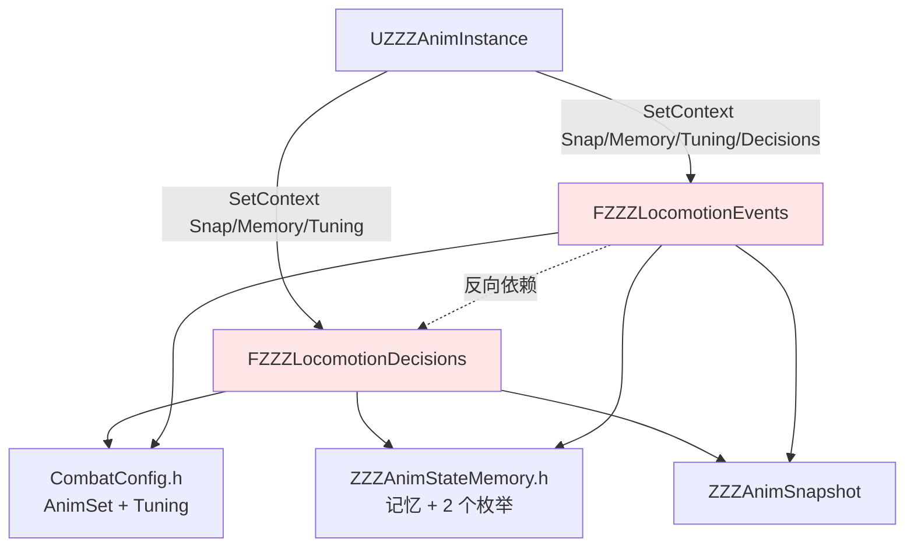
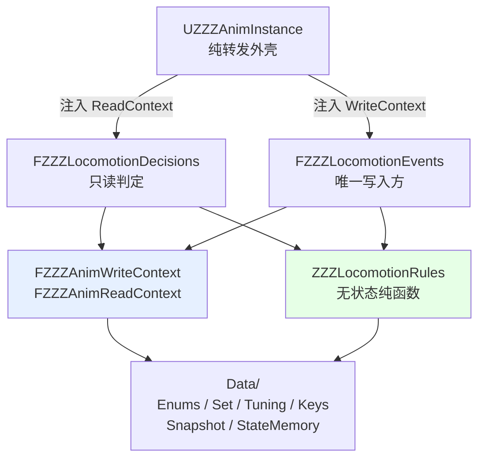
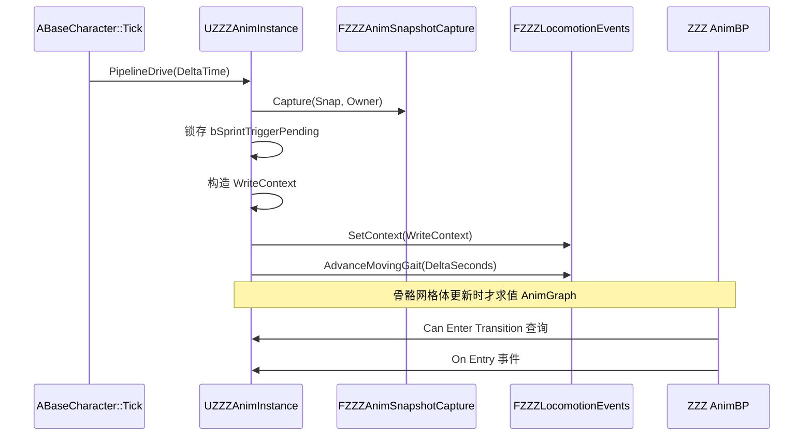

# Design Document

## Overview

本设计对 ZZZ 动画层（`Source/GGYGO/{Public,Private}/Animation/zzzAnim/`）做一次**纯结构重构**，不新增、不删除、不修改任何游戏行为。

重构解决三类问题：

| 问题 | 现状 | 处置 |
|------|------|------|
| 命名与内容不符 | `CombatConfig.h` / `CombatDecisions/` / `CombatEvents/` 内全是 Locomotion 代码，无战斗逻辑 | 按职责重组为 `Data/` `Capture/` `Locomotion/` |
| 单文件目录 | `CombatDecisions/` 与 `CombatEvents/` 各仅 1 个文件 | 合并进 `Locomotion/` |
| 依赖方向倒置 | `FZZZLocomotionEvents` 持有 `FZZZLocomotionDecisions` 指针 | 抽出无状态 `ZZZLocomotionRules`，双方各自依赖它 |

同时消除两处真实隐患：

1. **重复的规则实现**：Walk→Run 阈值的容错规则在 `FZZZLocomotionDecisions::Moving_Walk_To_Run_ByHold()` 与 `FZZZLocomotionEvents::ResolveWalkToRunThreshold()` 中各写了一遍，语义变更时容易只改一处。
2. **重复的日志类别定义**：`ZZZAnimInstance.cpp` 与 `ZZZLocomotionEvents.cpp` 各有一份 `DEFINE_LOG_CATEGORY_STATIC(LogZZZAnim, Log, All)`，两个翻译单元各持一份，无法统一控制 verbosity。

### 不在范围内

- 不修改 `Content` 下任何 `.uasset`、AnimBP 或动画资源
- 不修改 `FIntentPipeline`、`FRuntimeData`、`FAnimRuntimeData` 的字段或公开接口
- 不改变 `FZZZAnimSnapshotCapture` 的数据来源映射
- 不重命名顶层目录 `zzzAnim`（保持既有 spec 与 steering 的路径描述可用）
- 不新增 `UPROPERTY` / `UFUNCTION`，不改动任何反射签名
- 不执行编译、测试或构建（由用户本地验证）

### 设计取向

重构分**两个可独立验证的阶段**。阶段一只搬文件、改 include、清注释，不碰任何一行逻辑；阶段二才引入新类型与规则抽取。这样一旦本地编译报错，可以立刻判断问题属于"路径没接上"还是"逻辑改错了"。

---

## Architecture

### 重构前的依赖关系



问题在虚线关系上：`Events → Decisions` 的反向依赖，让 `RefreshDecisionContext` 中的注入顺序变成隐式约束（必须先给 Decisions 注入上下文，再把 Decisions 交给 Events）。

### 重构后的依赖关系



依赖变成单向：`Data ← Rules ← {Decisions, Events}`。Events 与 Decisions 互不相识，注入顺序不再有隐含要求。

### 目标目录结构

```
Animation/zzzAnim/
├── ZZZAnimInstance.h/.cpp          蓝图外壳，只做转发
├── ZZZAnimLog.h                    日志类别声明（新增）
├── ZZZAnimLog.cpp                  日志类别定义（新增）
├── Data/
│   ├── ZZZAnimEnums.h              两个 UENUM（从 StateMemory 拆出）
│   ├── ZZZAnimSet.h                FZZZAnimSet（从 CombatConfig 拆出）
│   ├── ZZZAnimTuning.h             FZZZAnimTuning（从 CombatConfig 拆出）
│   ├── ZZZAnimKeys.h               BlendSpace key 常量
│   ├── ZZZAnimSnapshot.h           每帧快照
│   ├── ZZZAnimStateMemory.h        跨帧记忆
│   └── ZZZAnimContext.h            上下文聚合（新增）
├── Capture/
│   └── ZZZAnimSnapshotCapture.h/.cpp
└── Locomotion/
    ├── ZZZLocomotionRules.h/.cpp   无状态纯规则（新增）
    ├── ZZZLocomotionDecisions.h/.cpp
    └── ZZZLocomotionEvents.h/.cpp
```

`Public/` 与 `Private/` 各自保持这套子目录形状：头文件在 `Public/Animation/zzzAnim/...`，实现在 `Private/Animation/zzzAnim/...`。

### 文件映射表

| 重构前 | 重构后 | 性质 |
|--------|--------|------|
| `zzzAnim/CombatConfig.h` | `zzzAnim/Data/ZZZAnimSet.h`<br/>`zzzAnim/Data/ZZZAnimTuning.h` | 拆分为两个文件 |
| `zzzAnim/ZZZAnimKeys.h` | `zzzAnim/Data/ZZZAnimKeys.h` | 移动 |
| `zzzAnim/ZZZAnimSnapshot.h` | `zzzAnim/Data/ZZZAnimSnapshot.h` | 移动 + 修注释 |
| `zzzAnim/ZZZAnimStateMemory.h` | `zzzAnim/Data/ZZZAnimStateMemory.h`<br/>`zzzAnim/Data/ZZZAnimEnums.h` | 移动 + 拆出枚举 |
| `zzzAnim/ZZZAnimSnapshotCapture.h` | `zzzAnim/Capture/ZZZAnimSnapshotCapture.h` | 移动 |
| `zzzAnim/ZZZAnimSnapshotCapture.cpp` | `zzzAnim/Capture/ZZZAnimSnapshotCapture.cpp` | 移动 |
| `zzzAnim/CombatDecisions/ZZZLocomotionDecisions.h` | `zzzAnim/Locomotion/ZZZLocomotionDecisions.h` | 移动 |
| `zzzAnim/CombatDecisions/ZZZLocomotionDecisions.cpp` | `zzzAnim/Locomotion/ZZZLocomotionDecisions.cpp` | 移动 |
| `zzzAnim/CombatEvents/ZZZLocomotionEvents.h` | `zzzAnim/Locomotion/ZZZLocomotionEvents.h` | 移动 |
| `zzzAnim/CombatEvents/ZZZLocomotionEvents.cpp` | `zzzAnim/Locomotion/ZZZLocomotionEvents.cpp` | 移动 |
| `zzzAnim/ZZZAnimInstance.h/.cpp` | 原位不变 | 仅改 include |
| — | `zzzAnim/ZZZAnimLog.h` / `.cpp` | 新增 |
| — | `zzzAnim/Data/ZZZAnimContext.h` | 新增 |
| — | `zzzAnim/Locomotion/ZZZLocomotionRules.h/.cpp` | 新增 |

重构后需删除的空目录：`Public/Animation/zzzAnim/CombatDecisions/`、`Public/Animation/zzzAnim/CombatEvents/`、`Private/Animation/zzzAnim/CombatDecisions/`、`Private/Animation/zzzAnim/CombatEvents/`，以及 NTE 删除后残留的 `Public/Animation/Decisions/`、`Private/Animation/Decisions/`。

### 每帧时序（保持不变）



`RefreshDecisionContext` 早于 AnimGraph 求值，因此同帧顺序恒为「快照抓取与每帧推进 → 状态机过渡判定与 On Entry」。重构不改变这一顺序。

### UHT 反射注意事项

拆分含反射类型的头文件时，每个新头文件必须 include 自己的 `.generated.h`，且必须是最后一个 include：

| 新文件 | 反射类型 | 需要的 generated.h |
|--------|----------|--------------------|
| `Data/ZZZAnimEnums.h` | `EZZZAnimLocomotionState`、`EZZZAnimMovingSubState` | `ZZZAnimEnums.generated.h` |
| `Data/ZZZAnimSet.h` | `FZZZAnimSet` | `ZZZAnimSet.generated.h` |
| `Data/ZZZAnimTuning.h` | `FZZZAnimTuning` | `ZZZAnimTuning.generated.h` |
| `Data/ZZZAnimStateMemory.h` | `FZZZAnimStateMemory` | `ZZZAnimStateMemory.generated.h` |

`ZZZAnimSnapshot`（纯 C++ struct，无 `GENERATED_BODY`）、`ZZZAnimContext`、`ZZZAnimKeys`、`ZZZLocomotionRules` 不参与反射，不需要 `.generated.h`。

反射类型的**名称必须保持不变**——`USTRUCT` / `UENUM` 的标识符是蓝图序列化的依据，改文件名不影响，改类型名会断掉 AnimBP 与已保存的资产数据。

---

## Components and Interfaces

### `ZZZLocomotionRules`（新增，无状态规则层）

判定规则与配置解析的唯一实现处。纯函数，不持有上下文，输入输出都是值或只读指针。

```cpp
/**
 * @file ZZZLocomotionRules.h
 * @brief ZZZ Locomotion 的无状态纯规则
 *
 * 判定条件与配置解析的唯一实现处。Decisions 与 Events 都调用本命名空间，
 * 彼此不再互相依赖。所有函数无副作用，不写任何字段。
 */
#pragma once

#include "CoreMinimal.h"
#include "StateMachine/CharacterStateType.h"  // EMovementGait

struct FZZZAnimTuning;

namespace ZZZLocomotionRules
{
    /** Walk 升 Run 阈值默认值（秒） */
    constexpr float DefaultWalkToRunHoldSeconds = 5.0f;

    /** Walk 升 Run 阈值上限（秒） */
    constexpr float MaxWalkToRunHoldSeconds = 60.0f;

    /** GaitBlendY 插值速率默认值（1/秒） */
    constexpr float DefaultGaitBlendInterpSpeed = 6.0f;

    /** GaitBlendY 插值速率上限（1/秒） */
    constexpr float MaxGaitBlendInterpSpeed = 50.0f;

    /** WalkHoldSeconds 取值域上界（秒） */
    constexpr float MaxWalkHoldSeconds = 3600.0f;

    /** 单帧推进的帧间隔上界（秒） */
    constexpr float MaxClampedDelta = 0.1f;

    /** GaitBlendY 吸附目标的容差 */
    constexpr float GaitBlendSnapTolerance = 0.001f;

    /**
     * 解析生效的 Walk 升 Run 阈值。
     * Tuning 为空、配置非有限或 <= 0 → 默认 5.0；否则上钳 60.0。
     * 不改写配置存储值。
     */
    float ResolveWalkToRunThreshold(const FZZZAnimTuning* InTuning);

    /**
     * 解析生效的 GaitBlendY 插值速率。
     * Tuning 为空 → 默认 6.0；配置非有限或 <= 0 → 返回 0（语义为「直接置目标」）；
     * 否则上钳 50.0。不改写配置存储值。
     */
    float ResolveGaitBlendInterpSpeed(const FZZZAnimTuning* InTuning);

    /**
     * Walk 是否达到升 Run 条件。
     * 纯值判定：步态为 Walk 且累计时长不小于生效阈值。
     * 上下文空值检查由调用方负责。
     */
    bool ShouldWalkUpgradeToRun(EMovementGait InMovingGait, float InWalkHoldSeconds, float InEffectiveThreshold);

    /** MovingGait 是否落在合法取值域 {Walk, Run} 内 */
    bool IsValidMovingGait(EMovementGait InMovingGait);

    /** 由 MovingGait 推导 GaitBlendY 目标值：Run → 1.0，其余 → 0.0 */
    float ResolveGaitBlendTarget(EMovementGait InMovingGait);
}
```

**关键差异保持**：重构前 `Decisions::Moving_Walk_To_Run_ByHold()` 在 `Tuning == nullptr` 时整个函数返回 `false`，而 `Events::ResolveWalkToRunThreshold()` 在同样情况下返回 `5.0`。抽取后这两处差异必须保留——空值检查留在各自调用点，`Rules` 只负责阈值解析本身。

### `FZZZLocomotionDecisions`（改造）

```cpp
class FZZZLocomotionDecisions
{
public:
    /** 注入只读上下文 */
    void SetContext(const FZZZAnimReadContext& InContext);

    bool NotMoving_To_Conduit() const;
    bool Conduit_To_EnterMove() const;
    bool Conduit_To_Moving_Sprint() const;
    bool Moving_Walk_To_Run_ByHold() const;

private:
    FZZZAnimReadContext Context;
};
```

四个判定函数的名称、`const` 修饰、返回类型全部不变。函数体内 `Snap->` 改为 `Context.Snap->`，`Moving_Walk_To_Run_ByHold()` 的阈值解析改为调用 `ZZZLocomotionRules::ResolveWalkToRunThreshold(Context.Tuning)` 与 `ZZZLocomotionRules::ShouldWalkUpgradeToRun(...)`。

各函数的空值检查集合保持重构前原样：

| 函数 | 检查的指针 |
|------|-----------|
| `NotMoving_To_Conduit` | 仅 `Snap` |
| `Conduit_To_EnterMove` | 仅 `Memory` |
| `Conduit_To_Moving_Sprint` | 仅 `Memory` |
| `Moving_Walk_To_Run_ByHold` | `Snap`、`Memory`、`Tuning` 三者 |

不统一改成 `Context.IsValid()`，否则前三个函数在部分指针为空时的返回值会变化。

### `FZZZLocomotionEvents`（改造）

```cpp
class FZZZLocomotionEvents
{
public:
    /** 注入可写上下文；不再接收 Decisions 指针 */
    void SetContext(const FZZZAnimWriteContext& InContext);

    void MarkStateEntered(EZZZAnimLocomotionState EnteringState);
    void EnterMoving();
    void MarkMovingSubStateEntered(EZZZAnimMovingSubState EnteringSubState);
    void ConsumeSprintTrigger();
    void AdvanceMovingGait(float DeltaSeconds);

private:
    void SanitizeMovingGait();
    void AdvanceGaitBlendY(float ClampedDelta);

    FZZZAnimWriteContext Context;

    EZZZAnimLocomotionState LastEnteredState = EZZZAnimLocomotionState::None;
    EZZZAnimMovingSubState  CurrentSubState  = EZZZAnimMovingSubState::None;
    bool bInvalidDeltaReported = false;
};
```

三处变化：

1. 删除 `const FZZZLocomotionDecisions* Decisions` 成员与 `SetContext` 的对应参数
2. 删除私有的 `ResolveWalkToRunThreshold()` 与 `ResolveGaitBlendInterpSpeed()`，改调 `ZZZLocomotionRules`
3. `AdvanceMovingGait` 中原本的 `if (Decisions && Decisions->Moving_Walk_To_Run_ByHold())` 改为直接调用规则：

```cpp
// 重构前
if (Decisions && Decisions->Moving_Walk_To_Run_ByHold())
{
    Memory->MovingGait = EMovementGait::Run;
    Memory->WalkHoldSeconds = 0.0f;
}

// 重构后
const float Threshold = ZZZLocomotionRules::ResolveWalkToRunThreshold(Context.Tuning);
if (ZZZLocomotionRules::ShouldWalkUpgradeToRun(
        Context.Memory->MovingGait, Context.Memory->WalkHoldSeconds, Threshold))
{
    Context.Memory->MovingGait = EMovementGait::Run;
    Context.Memory->WalkHoldSeconds = 0.0f;
}
```

`AdvanceMovingGait` 的执行顺序保持不变：

```
上下文校验（Snap/Memory 两指针）
→ 顶层状态门控（非 Moving 清零并复位）
→ SanitizeMovingGait
→ 帧间隔校验（非有限 / 负值分支，含 Warning 节流）
→ ClampedDelta = Clamp(Delta, 0, 0.1)
→ WalkHoldSeconds 推进 / 重置
→ 跨阈升级
→ AdvanceGaitBlendY
```

### `ZZZAnimLog`（新增）

```cpp
// ZZZAnimLog.h
#pragma once
#include "CoreMinimal.h"

/** ZZZ 动画层统一日志类别 */
DECLARE_LOG_CATEGORY_EXTERN(LogZZZAnim, Log, All);
```

```cpp
// ZZZAnimLog.cpp
#include "Animation/zzzAnim/ZZZAnimLog.h"

DEFINE_LOG_CATEGORY(LogZZZAnim);
```

`ZZZAnimInstance.cpp` 与 `ZZZLocomotionEvents.cpp` 各自删掉 `DEFINE_LOG_CATEGORY_STATIC`，改为 include `ZZZAnimLog.h`。所有 `UE_LOG(LogZZZAnim, ...)` 调用点的类别名与消息文本不变。

### `UZZZAnimInstance`（改造）

`RefreshDecisionContext` 构造一份上下文并分发，注入顺序不再有隐含约束：

```cpp
void UZZZAnimInstance::RefreshDecisionContext(float DeltaSeconds)
{
    // 固定顺序：抓取快照 → 锁存冲刺脉冲 → 注入上下文 → 推进事件层记忆
    SnapshotCapture.Capture(Snap, Owner.Get());

    if (Snap.bSprintTrigger)
    {
        StateMemory.bSprintTriggerPending = true;
    }

    FZZZAnimWriteContext WriteContext;
    WriteContext.Snap   = &Snap;
    WriteContext.Tuning = &Tuning;
    WriteContext.Memory = &StateMemory;

    LocomotionDecisions.SetContext(WriteContext.ToRead());
    LocomotionEvents.SetContext(WriteContext);
    LocomotionEvents.AdvanceMovingGait(DeltaSeconds);
}
```

`bSprintTriggerPending` 的置真仍是唯一实现处。`PipelineDrive(float)` 签名与 `NativeUpdateAnimation` 的调用关系不变。十个 `UFUNCTION` 与四个 `UPROPERTY` 完全不动。

### `FZZZAnimSnapshotCapture`（仅移动）

签名与函数体逐字不变，只更新对 `ZZZAnimSnapshot.h` 的 include 路径。数据来源映射保持：从 `AnimData` 读 `Gait`、`bShouldMove`、`bSprintTrigger`、`CurrentState`、`VelocityLength`，从 `ABaseCharacter` 读 `IsGrounded()`，`bBlockMove` 恒 `false`。

---

## Data Models

### 上下文聚合（新增）

用两个类型区分读写权限，让 const 正确性由类型系统保证，而不是靠约定。

```cpp
/**
 * @file ZZZAnimContext.h
 * @brief ZZZ 动画层的上下文聚合
 *
 * 把散落的三个上下文指针收进结构体：
 *   Snap    每帧快照，恒只读
 *   Tuning  运行期配置，恒只读
 *   Memory  跨帧记忆，Decisions 只读、Events 可写
 *
 * 读写权限用两个类型区分，而非注释约定。
 * 均不拥有所指对象的生命周期。
 */
#pragma once

#include "CoreMinimal.h"

struct FZZZAnimSnapshot;
struct FZZZAnimTuning;
struct FZZZAnimStateMemory;

/** 只读上下文：供 FZZZLocomotionDecisions 使用 */
struct FZZZAnimReadContext
{
    const FZZZAnimSnapshot*    Snap   = nullptr;
    const FZZZAnimTuning*      Tuning = nullptr;
    const FZZZAnimStateMemory* Memory = nullptr;

    /** 三个指针全部非空才算可用 */
    bool IsValid() const
    {
        return Snap != nullptr && Tuning != nullptr && Memory != nullptr;
    }
};

/** 可写上下文：供 FZZZLocomotionEvents 使用 */
struct FZZZAnimWriteContext
{
    const FZZZAnimSnapshot* Snap   = nullptr;
    const FZZZAnimTuning*   Tuning = nullptr;
    FZZZAnimStateMemory*    Memory = nullptr;

    bool IsValid() const
    {
        return Snap != nullptr && Tuning != nullptr && Memory != nullptr;
    }

    /** 降级为只读视图，供调用只读判定时使用 */
    FZZZAnimReadContext ToRead() const
    {
        return FZZZAnimReadContext{ Snap, Tuning, Memory };
    }
};
```

**为什么用两个类型而不是一个**：如果只定义一个结构并让 Decisions 持有 `const FZZZAnimContext`，其 `FZZZAnimStateMemory*` 成员指向的对象仍然可写——`const` 只作用于指针本身，不作用于所指对象。Decisions 的只读约束就退化成注释保障。拆成两个类型后，编译器直接阻止 Decisions 写入记忆。

**IsValid 的使用边界**：`IsValid()` 要求三者全非空，与重构前 `Moving_Walk_To_Run_ByHold()` 的 `if (!Snap || !Memory || !Tuning) return false` 等价。但 `AdvanceMovingGait` 重构前只检查 `if (!Snap || !Memory)`（`Tuning` 为空时靠解析函数回退默认值），因此**该函数不能直接改用 `IsValid()`**，否则 `Tuning == nullptr` 时行为会从"用默认值继续推进"变成"直接返回"。设计上保留其原有的两指针检查。

### 数据类型拆分（仅移动，字段不变）

| 类型 | 新位置 | 反射 | 字段数 |
|------|--------|------|--------|
| `EZZZAnimLocomotionState` | `Data/ZZZAnimEnums.h` | `UENUM(BlueprintType)` | 5 个取值 |
| `EZZZAnimMovingSubState` | `Data/ZZZAnimEnums.h` | `UENUM(BlueprintType)` | 3 个取值 |
| `FZZZAnimSet` | `Data/ZZZAnimSet.h` | `USTRUCT(BlueprintType)` | 2 |
| `FZZZAnimTuning` | `Data/ZZZAnimTuning.h` | `USTRUCT(BlueprintType)` | 4 |
| `FZZZAnimStateMemory` | `Data/ZZZAnimStateMemory.h` | `USTRUCT(BlueprintType)` | 6 |
| `FZZZAnimSnapshot` | `Data/ZZZAnimSnapshot.h` | 纯 C++ | 7 |
| `FZZZAnimReadContext` | `Data/ZZZAnimContext.h` | 纯 C++（新增） | 3 |
| `FZZZAnimWriteContext` | `Data/ZZZAnimContext.h` | 纯 C++（新增） | 3 |

### 注释修正

`Data/ZZZAnimSnapshot.h` 两处过期描述：

| 位置 | 现状 | 修正为 |
|------|------|--------|
| 文件注释 | "捕获实现在 CombatSnapshotCapture.cpp 中" | "捕获实现在 Capture/ZZZAnimSnapshotCapture.cpp 中" |
| `Gait` 字段 | `← AnimRuntimeData.NTE.Gait` | `← AnimRuntimeData.Gait` |

第二处是 NTE 动画层删除后的残留引用，`FZZZAnimSnapshotCapture::Capture` 实际读的就是 `AnimData.Gait`。

---

## Correctness Properties

以下属性是本次重构的正确性判据。由于用户要求不执行编译与测试，属性 1 的验证方式为可选的本地运行测试，属性 2 至 6 通过静态检查完成。

**Property 1：记忆字段逐帧等价**
给定相同的快照序列、配置取值与帧间隔序列，重构前后 `MovingGait`、`WalkHoldSeconds`、`GaitBlendY`、`bSprintTriggerPending` 的逐帧取值完全一致。唯一允许的例外是 `Tuning == nullptr` 时的跨阈升级差异（见 Error Handling 一节）。

**Property 2：反射签名不变**
十个 `UFUNCTION` 的函数名、参数、返回类型、说明符、`Category` 与 `const` 修饰，四个 `UPROPERTY` 的字段名、类型、默认值、说明符、`Category`，以及三个反射结构体的全部字段，与重构前逐项相同。

**Property 3：规则唯一实现**
七个数值常量（`5.0`、`60.0`、`6.0`、`50.0`、`3600.0`、`0.1`、`0.001`）与三条容错规则在 ZZZ 动画层中各只有一处定义，位于 `Locomotion/ZZZLocomotionRules.h`。

**Property 4：依赖单向**
`ZZZLocomotionEvents` 不引用 `FZZZLocomotionDecisions`；`ZZZLocomotionRules` 不引用 Decisions、Events 或 AnimInstance。依赖图为 `Data ← Rules ← {Decisions, Events} ← AnimInstance`，无环。

**Property 5：const 正确性**
`FZZZLocomotionDecisions` 无法通过其上下文成员写入 `FZZZAnimStateMemory`，该约束由类型系统而非注释保证。

**Property 6：数值区间不变式**
`WalkHoldSeconds` 恒落在 `[0.0, 3600.0]`，`GaitBlendY` 恒落在 `[0.0, 1.0]`，钳制后帧间隔恒落在 `[0.0, 0.1]`，且 `GaitBlendY` 单帧变化量不超过生效插值速率与钳制后帧间隔之积。

**Property 7：空值检查集合保持**
每个函数实际检查的指针集合与重构前一致：三个 Conduit/NotMoving 判定各检查一个指针，`Moving_Walk_To_Run_ByHold` 检查三个，`AdvanceMovingGait` 检查两个。

---

## Error Handling

### 上下文指针为空

| 函数 | 空值情形 | 处置 | 与重构前一致 |
|------|----------|------|--------------|
| `NotMoving_To_Conduit` | `Snap` 为空 | 返回 `false` | 是 |
| `Conduit_To_EnterMove` | `Memory` 为空 | 返回 `false` | 是 |
| `Conduit_To_Moving_Sprint` | `Memory` 为空 | 返回 `false` | 是 |
| `Moving_Walk_To_Run_ByHold` | 三者任一为空 | 返回 `false` | 是 |
| `EnterMoving` / `MarkMovingSubStateEntered` | `Memory` 为空 | 直接返回，不写任何字段 | 是 |
| `AdvanceMovingGait` | `Snap` 或 `Memory` 为空 | 直接返回，不写任何字段 | 是 |
| `AdvanceMovingGait` | 仅 `Tuning` 为空 | 继续推进，解析函数回退默认值 | 见下方差异说明 |

### 配置容错

`ZZZLocomotionRules` 集中处理三类非法配置：

- `WalkToRunHoldSeconds` 为 `NaN`、`±Inf` 或 `<= 0` → 使用 `5.0`
- `WalkToRunHoldSeconds > 60.0` → 钳制到 `60.0`
- `GaitBlendInterpSpeed` 为 `NaN`、`±Inf` 或 `<= 0` → 返回 `0.0`，语义为「直接置目标值」
- `GaitBlendInterpSpeed > 50.0` → 钳制到 `50.0`

解析结果只用于本次计算，不改写 `FZZZAnimTuning` 的存储取值。

### 退化帧间隔

| 帧间隔 | 处置 | 诊断 |
|--------|------|------|
| 非有限（`NaN` / `±Inf`） | 不推进计时，`GaitBlendY` 置为目标值 | 输出 Warning，按 `Moving` 驻留节流 |
| 负值 | 不推进计时，`GaitBlendY` 保持不变 | 输出 Warning，按 `Moving` 驻留节流 |
| `> 0.1` | 钳制到 `0.1` 后正常推进 | 无 |

节流标记 `bInvalidDeltaReported` 在离开 `Moving` 时复位。

### 步态取值域越界

`MovingGait` 落在 `{Walk, Run}` 之外时，`SanitizeMovingGait()` 纠正为 `Walk` 并输出 Warning。该纠正发生在帧间隔校验之前，确保后续目标值推导确定为 `0.0` 或 `1.0`。

### 资产 key 缺失

`Out_WalkRunBlendSpace` 查询失败时缓存空指针、输出指明 key 与缺失位置的 Warning、不切状态、不改记忆字段，且每次 `Moving` 驻留至多一次。重构保持这一行为。

### 被接受的行为差异

`Tuning == nullptr` 且 `AdvanceMovingGait` 执行跨阈升级判定时：

- **重构前**：`Decisions->Moving_Walk_To_Run_ByHold()` 因 `Tuning` 为空返回 `false`，升级不发生
- **重构后**：`ZZZLocomotionRules::ResolveWalkToRunThreshold(nullptr)` 回退到 `5.0`，升级可能发生

正常运行路径下 `UZZZAnimInstance` 始终注入 `&Tuning`（成员对象，地址恒非空），该路径不可达。设计上接受这一差异，理由是新行为与 `AdvanceMovingGait` 其余部分「配置缺失时用默认值」的容错原则内部一致。该决策记录在需求文档 Requirement 8.8。

### UHT 与环境诊断

编辑器索引未加载 Unreal 头文件时会报告 `CoreMinimal.h`、`UFUNCTION`、`UPROPERTY`、`TMap` 未解析。此类报告归类为环境与工具链诊断，不作为业务缺陷判据，需记录分类归属、缺失的 include path 上下文与源文件名。只有具备项目上下文的 Unreal 编译报错才算业务缺陷。

---

## Testing Strategy

用户明确要求编译由本地执行，因此本 spec 的所有验证均为**静态检查**，不运行 `Build.bat`、`UnrealBuildTool`、`UnrealEditor-Cmd` 或任何自动化测试。

### 静态检查项

| 验证项 | 方法 | 对应属性 |
|--------|------|----------|
| 残余旧路径引用 | 搜索 `CombatConfig.h`、`CombatDecisions/`、`CombatEvents/`，结果应为零 | — |
| 目录结构 | 核对 `Data/` 七个头文件、`Capture/` 与 `Locomotion/` 的文件构成 | — |
| 反射签名一致 | 按下方清单逐项比对函数名、参数、说明符、Category | Property 2 |
| 字段布局一致 | 按下方清单比对字段名、类型、默认值、meta | Property 2 |
| 规则唯一实现 | 搜索七个数值常量，应只出现在 `ZZZLocomotionRules.h` | Property 3 |
| 依赖方向 | 搜索 `ZZZLocomotionEvents` 中的 `Decisions` 引用，应为零 | Property 4 |
| 日志类别 | 搜索 `DEFINE_LOG_CATEGORY`，`LogZZZAnim` 应只在 `ZZZAnimLog.cpp` 出现一次 | — |
| 空值检查集合 | 逐函数核对实际检查的指针与重构前一致 | Property 7 |
| 执行顺序 | 核对 `AdvanceMovingGait` 八步顺序与设计描述一致 | Property 1 |
| 数值区间 | 核对钳制区间与吸附容差取值 | Property 6 |
| 资产未受影响 | 确认 `Content` 下无任何文件变更 | — |
| UHT 完备性 | 每个含 `USTRUCT`/`UENUM` 的新头文件都 include 了对应 `.generated.h` 且位于最后 | — |

### 两次检查点

阶段一完成后应当可以独立编译通过（无逻辑变化），此处设置第一个本地编译检查点。阶段二完成后设置第二个检查点。静态检查结论一律表述为「静态检查通过，编译待本地验证」，不表述为「通过」。

### 可选的等价性测试

Property 1 的完整验证需要运行时对比，属于可选任务。测试文件本身可以编写而不编译，但运行需由用户在本地执行。建议覆盖的边界输入：

- 帧间隔：`{负值, 0, NaN, +Inf, -Inf, 0.0001, 0.1, 0.5}`
- `GaitBlendY` 起始值：`{-1, 0, 0.0005, 0.5, 0.9995, 1, 2}`
- `WalkHoldSeconds` 起始值：`{0, 阈值-0.001, 阈值, 3599.99, 3600, 100000}`
- `WalkToRunHoldSeconds`：`{NaN, -1, 0, 0.05, 5, 60, 61}`
- `GaitBlendInterpSpeed`：`{NaN, -1, 0, 0.05, 6, 50, 51}`
- `MovingGait`：含 `None`、`Sprint` 与取值域外强转值

基于 `FRandomStream` 实现确定性生成器，迭代不少于 `100` 次，固定种子起步，失败信息中打印种子与该次输入以保证反例可复现。

---

## 反射签名保持清单

重构后必须逐项核对以下签名未发生任何变化。这份清单是静态验证的依据。

### `UZZZAnimInstance` 的 `UFUNCTION`

| 函数 | 反射标记 | Category |
|------|----------|----------|
| `bool Locomotion_NotMoving_To_Conduit() const` | `BlueprintPure` + `BlueprintThreadSafe` | `Cond\|Locomotion` |
| `bool Locomotion_Conduit_To_EnterMove() const` | `BlueprintPure` + `BlueprintThreadSafe` | `Cond\|Locomotion` |
| `bool Locomotion_Conduit_To_Moving_Sprint() const` | `BlueprintPure` + `BlueprintThreadSafe` | `Cond\|Locomotion` |
| `bool Locomotion_Moving_Walk_To_Run_ByHold() const` | `BlueprintPure` + `BlueprintThreadSafe` | `Cond\|Locomotion` |
| `void MarkLocomotionStateEntered(EZZZAnimLocomotionState)` | `BlueprintCallable` | `Event\|Locomotion` |
| `void ConsumeSprintTrigger()` | `BlueprintCallable` | `Event\|Locomotion` |
| `void Locomotion_OnEnter_Moving()` | `BlueprintCallable` | `Event\|Locomotion` |
| `void Locomotion_OnEnter_MovingSubState(EZZZAnimMovingSubState)` | `BlueprintCallable` | `Event\|Locomotion` |
| `UAnimSequence* GetSeqByKey(FName) const` | `BlueprintPure` + `BlueprintThreadSafe` | `Query\|AnimSet` |
| `UBlendSpace* GetBlendSpaceByKey(FName) const` | `BlueprintPure` + `BlueprintThreadSafe` | `Query\|AnimSet` |

### `UZZZAnimInstance` 的 `UPROPERTY`

| 属性 | 类型 | 标记 | Category |
|------|------|------|----------|
| `Out_WalkRunBlendSpace` | `TObjectPtr<UBlendSpace>` | `BlueprintReadOnly` | `Out` |
| `AnimSet` | `FZZZAnimSet` | `EditAnywhere` + `BlueprintReadOnly` | `配置\|AnimSet` |
| `Tuning` | `FZZZAnimTuning` | `EditAnywhere` + `BlueprintReadOnly` | `配置\|Tuning` |
| `StateMemory` | `FZZZAnimStateMemory` | `BlueprintReadOnly` | `State\|Locomotion` |

### `FZZZAnimStateMemory` 字段

| 字段 | 类型 | 默认值 |
|------|------|--------|
| `PreviousState` | `EZZZAnimLocomotionState` | `None` |
| `EnteredGait` | `EMovementGait` | `None` |
| `bSprintTriggerPending` | `bool` | `false` |
| `MovingGait` | `EMovementGait` | `Walk` |
| `WalkHoldSeconds` | `float` | `0.f` |
| `GaitBlendY` | `float` | `0.f` |

全部 `BlueprintReadOnly` + `Category = "Locomotion"`。

### `FZZZAnimTuning` 字段

| 字段 | 默认值 | Category | meta |
|------|--------|----------|------|
| `LoopBlendIn` | `0.1f` | `Blend` | — |
| `OneShotBlendOut` | `0.15f` | `Blend` | — |
| `WalkToRunHoldSeconds` | `5.f` | `Gait` | `ClampMin=0.1, ClampMax=60.0` |
| `GaitBlendInterpSpeed` | `6.f` | `Gait` | `ClampMin=0.1, ClampMax=50.0` |

### `FZZZAnimSet` 字段

`Sequences`（`TMap<FName, TObjectPtr<UAnimSequence>>`）与 `BlendSpaces`（`TMap<FName, TObjectPtr<UBlendSpace>>`），均 `EditAnywhere` + `BlueprintReadOnly` + `Category = "Locomotion"`。

### 枚举取值

`EZZZAnimLocomotionState`：`None` / `NotMoving` / `Conduit` / `EnterMove` / `Moving`
`EZZZAnimMovingSubState`：`None` / `WalkRun` / `TurnBack`

取值顺序与 `UMETA(DisplayName)` 中文显示名均保持不变——顺序变化会改变底层整数值，破坏已序列化的蓝图数据。

---

## 外部调用点

`Source/GGYGO/Private/BaseCharacter.cpp` 是 ZZZ 动画层唯一的外部调用点：

```cpp
#include "Animation/zzzAnim/ZZZAnimInstance.h"   // 路径不变，保持
...
if (UZZZAnimInstance* ZAI = Cast<UZZZAnimInstance>(GetMesh()->GetAnimInstance()))
    ZAI->PipelineDrive(DeltaTime);               // 调用与时序不变
```

由于 `ZZZAnimInstance.h` 保持原位，该文件**预期无需任何修改**。若实际需要调整，只允许改 include 路径。

---

## 已知风险

| 风险 | 影响 | 缓解 |
|------|------|------|
| UHT 缓存残留旧 generated.h | 编译报重复定义或找不到类型 | 本地编译前清理 `Intermediate/Build`，NTE 删除后该目录已有陈旧产物 |
| `GGYGO.Build.cs` 的 include 路径配置 | 新子目录未被纳入 | 实施前确认 `PrivateIncludePaths` 是否需要补充；原 `Private/Tests` 条目在测试文件删除后已失效 |
| AnimBP 中已绑定的函数引用 | 蓝图编译报错 | 签名清单逐项核对；文件移动不影响蓝图绑定（绑定按类+函数名解析） |
| `Tuning == nullptr` 时的升级行为差异 | 理论行为变化 | 已在 Error Handling 与需求 8.8 记录，正常路径不可达 |
