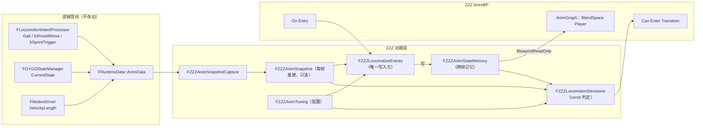
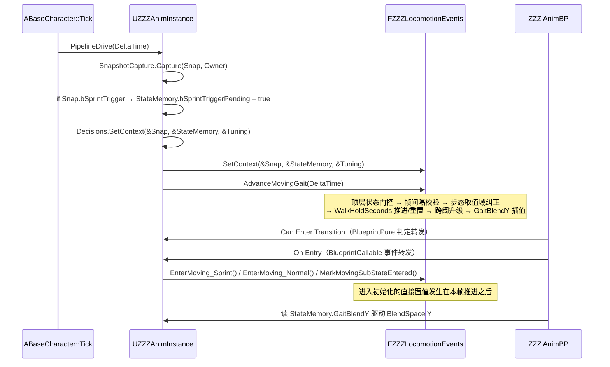
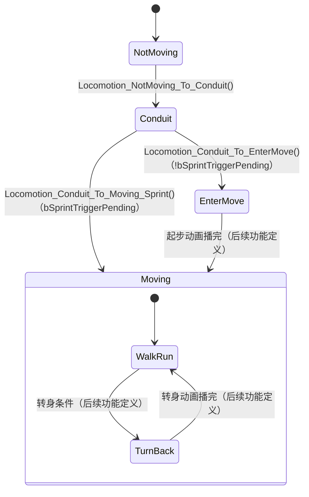
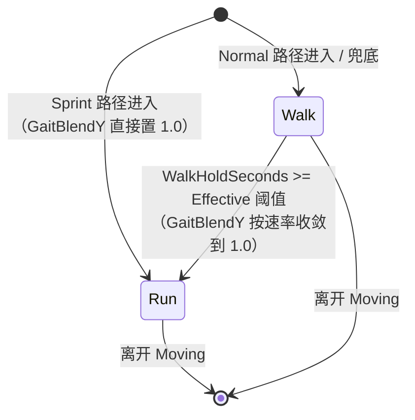

# Design Document

## Overview

本设计在新版 ZZZ 动画层内固定 `Moving` 子状态机的 Walk/Run 步态机制，并把冲刺触发开关的消费边界收紧到 `Conduit → Moving` 一条路径。

四个核心机制的落点：

| 机制 | 落点 |
|------|------|
| `Moving` 内只有 `WalkRun` / `TurnBack` 两个状态 | ZZZ AnimBP 拓扑（`Moving_SubStateMachine`），C++ 侧不引入 Walk/Run 过渡判定函数 |
| Walk 与 Run 共用一个 BlendSpace，由 Y 参数插值 | `FZZZAnimStateMemory::GaitBlendY` 驱动 AnimGraph 的 BlendSpace Player Y 轴 |
| Run 只有两个触发来源 | `FZZZLocomotionEvents` 内两处置值：Sprint 进入初始化、Walk 跨阈升级 |
| 冲刺开关只在 `Conduit → Moving` 消费 | `FZZZLocomotionEvents::ConsumeSprintTrigger()` 只被 Sprint 进入事件调用 |

设计遵循既有分层：**拓扑在蓝图，决策在 C++，求值在 AnimGraph**。本功能不新增数据源、不改动 `FIntentPipeline` 公开接口、不触碰旧 NTE 动画层（`UNTEAnimInstance` 与 `Animation/Decisions/`）。

关键设计取向：把每帧推进逻辑（计时、升级、插值）实现为一个**只依赖注入上下文的纯推进函数** `FZZZLocomotionEvents::AdvanceMovingGait(DeltaSeconds)`。该函数不接触 `UObject`、不接触 Actor，因此可以在 UE Automation 测试中脱离 AnimInstance 直接驱动，为属性测试提供落点。

### 研究结论

在动手设计前确认了三件事，直接影响下面的方案：

1. **`Moving` 驻留第 1 帧的 TurnBack 抑制（Requirement 1.7）不需要 C++ 状态。** UE 的 `FAnimNode_StateMachine` 提供 `Skip First Update Transition`（`bSkipFirstUpdateTransition`，默认开启），语义正好是"状态机首次更新时不从入口状态发起过渡"。因此该验收标准由状态机节点的原生开关满足，避免为它新增一个记忆字段（否则会与 Requirement 12.2 "仅覆盖四项写入"冲突）。

2. **`RefreshDecisionContext` 早于 AnimBP 图求值。** `ABaseCharacter::Tick` 末尾调用 `UZZZAnimInstance::PipelineDrive()`，而 AnimGraph（含状态机 `On Entry`）在骨骼网格体组件更新时才求值。所以同一帧内顺序恒为：**快照抓取与每帧推进 → 状态机过渡判定与 `On Entry`**。这一顺序让 Requirement 4.2（Sprint 进入后"第一帧读取到的 `GaitBlendY` 即为 `1.0`"）自然成立：进入事件的直接置值发生在推进之后，不会被同帧推进覆盖。

3. **项目已有属性测试脚手架。** `Source/GGYGO/Private/Tests/` 下有 `AnimSmokeTest.cpp`（UE Automation）与 `AnimTestGenerators.h`（基于 `FRandomStream` 的确定性生成器，注释明示为"后续属性测试的基线"），`GGYGO.Build.cs` 已把 `Private/Tests` 加入 `PrivateIncludePaths`。本功能沿用该组合实现属性测试，不引入第三方库。

## Architecture

### 数据流

沿用既有单向链路，本功能只在动画层内部增加"跨帧记忆推进"这一段，不新增数据源。



### 每帧时序



### AnimBP 状态机拓扑



### 两条进入路径的区分

`Moving` 需要按来路做不同初始化，但 UE 的 `On Entry` 绑在**状态**上而不是过渡上，同一个 `Moving` 状态无法为两条入边各绑一个事件。

**方案：`Moving` 的 `On Entry` 只调用统一入口 `Locomotion_OnEnter_Moving()`，由 C++ 依据 `PreviousState` 判定来路。**

- `PreviousState == Conduit` → 走 Sprint 路径初始化（`Conduit → Moving` 是 Sprint 专用边，`Conduit → EnterMove` 与它互补，所以"上一个状态是 `Conduit`"唯一对应 Sprint 路径）
- `PreviousState == EnterMove` → 走 Normal 路径初始化
- 其他 → 兜底按 Normal 路径结果初始化（Requirement 3.7）

来路判定所需的 `PreviousState` 由既有 `MarkLocomotionStateEntered()` 维护，因此 `Moving` 的 `On Entry` 上的调用顺序固定为：先 `MarkLocomotionStateEntered(Moving)`，再 `Locomotion_OnEnter_Moving()`。这个顺序是拓扑约定，写入 AnimBP 落地清单。

设计决策与理由：**用 `PreviousState` 推导来路，而不是新增"进入路径"记忆字段。** 前者复用既有字段，不增加存储位置（Requirement 12.10）；后者要新增第 5 个记忆字段并新增写入点，与 Requirement 12.2 冲突。

`Moving` 子状态机内 `WalkRun_State` 与 `TurnBack_State` 的 `On Entry` 各绑一次 `MarkMovingSubStateEntered(...)`，用于告知事件层当前子状态（计时是否暂停要用到）。

## Components and Interfaces

### 组件职责表

| 组件 | 本功能新增内容 | 约束 |
|------|---------------|------|
| `FZZZAnimStateMemory` | 3 个跨帧字段 + 1 个子状态枚举 | `BlueprintReadOnly`，只由 Events 写 |
| `FZZZAnimTuning` | 2 个配置字段 | `EditAnywhere`，运行期只读 |
| `FZZZLocomotionDecisions` | 上下文扩展 + 1 个 `const` 判定 | 只读，不写任何字段 |
| `FZZZLocomotionEvents` | 上下文扩展 + 3 个事件 + 1 个推进函数 | 三个新字段的唯一写入方 |
| `UZZZAnimInstance` | 4 个 `UFUNCTION` 转发 + 1 个输出变量 + `PipelineDrive` 传入帧间隔 | 只转发与调度 |
| `ABaseCharacter` | `PipelineDrive(DeltaTime)` 调用点补参数 | 只调度时序 |
| ZZZ AnimBP | `Moving_SubStateMachine` 拓扑与事件绑定 | 拓扑约束 |

### `FZZZAnimStateMemory`（`Public/Animation/zzzAnim/ZZZAnimStateMemory.h`）

新增子状态枚举与三个字段：

```cpp
/** Moving 内部子状态（不并入 EZZZAnimLocomotionState，见 Requirement 1.6） */
UENUM(BlueprintType)
enum class EZZZAnimMovingSubState : uint8
{
    None      UMETA(DisplayName = "未进入"),
    WalkRun   UMETA(DisplayName = "走跑"),
    TurnBack  UMETA(DisplayName = "转身"),
};

// FZZZAnimStateMemory 内新增：

/** Moving 内部有效步态，取值域只有 Walk 与 Run；与每帧变化的 Snap.Gait 解耦 */
UPROPERTY(BlueprintReadOnly, Category = "Locomotion")
EMovementGait MovingGait = EMovementGait::Walk;

/** MovingGait 为 Walk 期间累计的连续行走时长（秒），恒落在 [0, 3600] */
UPROPERTY(BlueprintReadOnly, Category = "Locomotion")
float WalkHoldSeconds = 0.f;

/** WalkRun BlendSpace 的 Y 轴输入，0=纯 Walk，1=纯 Run，恒落在 [0, 1] */
UPROPERTY(BlueprintReadOnly, Category = "Locomotion")
float GaitBlendY = 0.f;
```

`EZZZAnimMovingSubState` 的**当前取值不进 `FZZZAnimStateMemory`**，与既有 `LastEnteredState` 同样存放在 `FZZZLocomotionEvents` 私有成员中。理由：Requirement 12.2 限定新增的记忆写入仅覆盖四项字段；子状态追踪是事件层内部簿记，不是对外记忆，也不需要 Decisions 读取（跨阈升级判定按 Requirement 5.7 与子状态无关）。

### `FZZZAnimTuning`（`Public/Animation/zzzAnim/CombatConfig.h`）

```cpp
/** Walk 自动升 Run 的时长阈值（秒） */
UPROPERTY(EditAnywhere, Category = "Gait", meta = (ClampMin = "0.1", ClampMax = "60.0"))
float WalkToRunHoldSeconds = 5.f;

/** GaitBlendY 向目标值收敛的速率（1/秒） */
UPROPERTY(EditAnywhere, Category = "Gait", meta = (ClampMin = "0.1", ClampMax = "50.0"))
float GaitBlendInterpSpeed = 6.f;
```

`ClampMin`/`ClampMax` 只约束细节面板输入；运行期仍按 Error Handling 一节的规则做容错解析，因为配置可能被蓝图逻辑或热改绕过面板钳制。

### `FZZZLocomotionDecisions`

```cpp
/** 上下文注入扩展：新增只读 Tuning 指针 */
void SetContext(const FZZZAnimSnapshot* InSnap,
                const FZZZAnimStateMemory* InMemory,
                const FZZZAnimTuning* InTuning);

/** Moving 内 Walk 持续时长达阈值：MovingGait==Walk && WalkHoldSeconds >= Effective 阈值 */
bool Moving_Walk_To_Run_ByHold() const;
```

`SetContext` 增加 `Tuning` 是 Requirement 5.4 的直接后果——该判定必须读 `WalkToRunHoldSeconds`。Requirement 12.1 的"只读"实质约束仍成立：三个入参都是 `const` 指针，判定函数为 `const`，不读 Actor 与 `FRuntimeData`，不写任何字段。

既有 `NotMoving_To_Conduit()` / `Conduit_To_EnterMove()` / `Conduit_To_Moving_Sprint()` 三个判定的实现**保持原样不动**（Requirement 4.4、9.2、9.5 都是"保持现状"型约束）。

`Moving_Walk_To_Run_ByHold()` 只做判定不做置值。真正的升级动作在 `AdvanceMovingGait` 内调用该判定后执行，保证判定条件在代码库中恰有一处实现（Requirement 12.10）。

### `FZZZLocomotionEvents`

```cpp
/** 上下文注入扩展：新增只读 Tuning 指针 */
void SetContext(FZZZAnimSnapshot* InSnap,
                FZZZAnimStateMemory* InMemory,
                const FZZZAnimTuning* InTuning);

// ---- 既有 ----
void MarkStateEntered(EZZZAnimLocomotionState EnteringState);
void ConsumeSprintTrigger();

// ---- 新增：状态事件 ----

/** Moving 的 On Entry：按 PreviousState 推导来路并初始化步态、计时与混合值 */
void EnterMoving();

/** WalkRun / TurnBack 的 On Entry：记录当前 Moving 子状态 */
void MarkMovingSubStateEntered(EZZZAnimMovingSubState EnteringSubState);

// ---- 新增：每帧推进（由 Context_Refresh 调用） ----

/** 推进 WalkHoldSeconds、执行跨阈升级、推进 GaitBlendY */
void AdvanceMovingGait(float DeltaSeconds);

private:
    /** 生效的 Walk 升 Run 阈值（秒）：非有限或 <=0 取 5.0，否则钳到 [.., 60] */
    float ResolveWalkToRunThreshold() const;

    /** 生效的插值速率（1/秒）：非有限或 <=0 返回 <=0 表示"直接置目标"，否则钳到 [.., 50] */
    float ResolveGaitBlendInterpSpeed() const;

    /** 把 MovingGait 纠正回取值域（Walk / Run） */
    void SanitizeMovingGait();

    /** 按目标值推进 GaitBlendY 一帧 */
    void AdvanceGaitBlendY(float ClampedDelta);

    EZZZAnimLocomotionState LastEnteredState = EZZZAnimLocomotionState::None;  // 既有
    EZZZAnimMovingSubState  CurrentSubState  = EZZZAnimMovingSubState::None;   // 新增
    bool bInvalidDeltaReported = false;   // 无效帧间隔诊断节流（每次 Moving 驻留一次）
```

`EnterMoving()` 的分支：

| `Memory->PreviousState` | `MovingGait` | `GaitBlendY` | `WalkHoldSeconds` | `bSprintTriggerPending` |
|------------------------|--------------|--------------|-------------------|------------------------|
| `Conduit`（Sprint 路径） | `Run` | `1.0` | `0.0` | 调 `ConsumeSprintTrigger()` 置假 |
| `EnterMove`（Normal 路径） | `Walk` | `0.0` | `0.0` | 不写 |
| 其他（兜底） | `Walk` | `0.0` | `0.0` | 不写 |

`GaitBlendY` 在 Sprint 路径**直接置 `1.0`**（不走插值），Normal 路径直接置 `0.0`。置假 `Pending` 只通过调用既有 `ConsumeSprintTrigger()` 完成，保持"消费步骤恰有一处实现"（Requirement 12.11）。

`AdvanceMovingGait(DeltaSeconds)` 的执行序（顺序即语义，不可交换）：

```
1. 上下文校验：Memory 为空 → 直接返回（Requirement 12.12）
2. 顶层状态门控：LastEnteredState != Moving
     → WalkHoldSeconds = 0；GaitBlendY = 0；CurrentSubState = None；
       bInvalidDeltaReported = false；返回（Requirement 6.6 / 7.9 / 1.8）
3. 步态取值域纠正：SanitizeMovingGait()（Requirement 3.8）
4. 帧间隔校验：
     !IsFinite(DeltaSeconds)  → 诊断（节流）；不推进计时；GaitBlendY = 钳制后目标值；返回
     DeltaSeconds < 0         → 诊断（节流）；不推进计时；GaitBlendY 保持不变；返回
5. ClampedDelta = Clamp(DeltaSeconds, 0, 0.1)
6. WalkHoldSeconds 推进/重置：
     !Snap->bShouldMove              → 0
     MovingGait == Run               → 0
     CurrentSubState == WalkRun      → += ClampedDelta，上钳 3600
     CurrentSubState == TurnBack     → 保持（暂停累加）
7. 跨阈升级：MovingGait == Walk && Decisions 判定成立
     → MovingGait = Run；WalkHoldSeconds = 0（GaitBlendY 不在此帧跳变）
8. GaitBlendY 插值：AdvanceGaitBlendY(ClampedDelta)
```

第 6 步与第 7 步的先后顺序由 Requirement 5.1 明确要求（"在完成推进之后"判定），这保证 `WalkToRunHoldSeconds = 5.0` 且每帧 `0.1` 秒时，第 50 帧推进后即达阈并在同帧升级，跨阈时延不超过 `0.1` 秒（Requirement 6.9）。

第 7 步不动 `GaitBlendY`，让第 8 步以本帧起始值为起点向新目标 `1.0` 收敛，满足 Requirement 5.3"不在变更帧直接跳变"。

`AdvanceGaitBlendY(ClampedDelta)`：

```
Target = (MovingGait == Run) ? 1.0 : 0.0        // Requirement 7.1
Current = Clamp(GaitBlendY, 0, 1)               // Requirement 7.4
Speed = ResolveGaitBlendInterpSpeed()

若 Speed <= 0（含非有限被归一为 <=0）        → GaitBlendY = Target；返回   // R7.8 / 7.11 / 11.7
若 ClampedDelta <= 0                          → GaitBlendY = Current；返回  // R7.10
若 |Target - Current| <= 0.001                → GaitBlendY = Target；返回   // R7.5
否则 GaitBlendY = Clamp(FInterpConstantTo(Current, Target, ClampedDelta, Speed), 0, 1)
若 |Target - GaitBlendY| <= 0.001             → GaitBlendY = Target        // 吸附
```

设计决策：**用 `FMath::FInterpConstantTo` 而非 `FInterpTo`。** 恒速插值让"单帧变化量恰为 `Speed × Delta`（接近目标时取差值）"成为可直接断言的上界（Requirement 2.7），且天然不越过目标、天然单调（Requirement 7.3、7.6）；指数插值的步长随剩余距离衰减，收敛判定要靠吸附阈值兜底，验证起来更绕。

`Speed <= 0` 优先于 `ClampedDelta <= 0`：Requirement 7.8 的"直接置目标值"不属于"按 `Frame_Delta_Seconds` 的推进"，因此不受 Requirement 7.10 的"不执行任何推进"约束。这两条在 `delta == 0 && Speed <= 0` 时同时成立，本设计取 7.8。

### `UZZZAnimInstance`

```cpp
// 生命周期：帧间隔透传
void PipelineDrive(float DeltaSeconds);                 // 签名变更（原为无参）
void RefreshDecisionContext(float DeltaSeconds);        // 签名变更（原为无参）

// ---- 判定转发（BlueprintPure + BlueprintThreadSafe + Cond|Locomotion） ----

UFUNCTION(BlueprintPure, Category = "Cond|Locomotion", meta = (BlueprintThreadSafe))
bool Locomotion_Moving_Walk_To_Run_ByHold() const;

// ---- 事件转发（BlueprintCallable + Event|Locomotion，无 ThreadSafe） ----

UFUNCTION(BlueprintCallable, Category = "Event|Locomotion")
void Locomotion_OnEnter_Moving();

UFUNCTION(BlueprintCallable, Category = "Event|Locomotion")
void Locomotion_OnEnter_MovingSubState(EZZZAnimMovingSubState EnteringSubState);

// ---- 输出变量（AnimGraph 的 BlendSpace Player 绑定） ----

UPROPERTY(BlueprintReadOnly, Category = "Out")
TObjectPtr<UBlendSpace> Out_WalkRunBlendSpace;
```

每个转发函数体只有一行委托，不含判定分支与记忆赋值（Requirement 12.3）。

`Locomotion_OnEnter_MovingSubState()` 除转发外还承担 WalkRun BlendSpace 的解析：当 `EnteringSubState == WalkRun` 时执行一次 `GetBlendSpaceByKey(ZZZAnimKeys::WalkRunBlendSpace)` 并缓存到 `Out_WalkRunBlendSpace`。这是既有的"配表查询"职责（`Query|AnimSet`），不属于本功能的判定或记忆写入，因此不与 Requirement 12.3 冲突。缓存让 Requirement 2.6"进入 WalkRun 时查询一次并在驻留期间沿用同一引用"字面成立，同时避免每帧查表。

`Locomotion_Moving_Walk_To_Run_ByHold()` 供 AnimBP 备用（例如调试面板或后续功能读取）。升级动作本身在 `AdvanceMovingGait` 内完成，不依赖 AnimBP 调用该函数——过渡条件是纯函数，求值次数与时机都不受保证，不能承载副作用。

BlendSpace key 常量：

```cpp
// Public/Animation/zzzAnim/ZZZAnimKeys.h（新增）
namespace ZZZAnimKeys
{
    /** WalkRun 共用 BlendSpace 在 FZZZAnimSet::BlendSpaces 中的固定 key */
    inline const FName WalkRunBlendSpace = FName(TEXT("WalkRun"));
}
```

单一编译期常量，不随 `MovingGait`、`GaitBlendY`、`Snapshot_Gait` 或子状态变化（Requirement 2.2）。

### `ABaseCharacter`

唯一改动是调用点补参数，仍只做时序调度：

```cpp
if (UZZZAnimInstance* ZAI = Cast<UZZZAnimInstance>(GetMesh()->GetAnimInstance())) ZAI->PipelineDrive(DeltaTime);
```

`UNTEAnimInstance::PipelineDrive()` 的调用保持不变（Requirement 12.9）。

### ZZZ AnimBP 落地清单

| 项 | 配置 |
|----|------|
| `Moving` 状态内部 | 新建 `Moving_SubStateMachine`，Entry → `WalkRun_State` |
| 子状态机节点 | `Skip First Update Transition` 保持开启（Requirement 1.7） |
| `TurnBack_State` | 仅 `WalkRun_State ↔ TurnBack_State` 两条边，进入/退出条件由后续功能定义 |
| `Moving` 的 `On Entry` | 依次调用 `MarkLocomotionStateEntered(Moving)` → `Locomotion_OnEnter_Moving()` |
| `WalkRun_State` 的 `On Entry` | `Locomotion_OnEnter_MovingSubState(WalkRun)` |
| `TurnBack_State` 的 `On Entry` | `Locomotion_OnEnter_MovingSubState(TurnBack)` |
| `WalkRun_State` 的 AnimGraph | 单个 BlendSpace Player：资产绑 `Out_WalkRunBlendSpace`，Y 绑 `StateMemory.GaitBlendY` |
| `AnimSet.BlendSpaces` | 增加 key `WalkRun` → 走跑混合资产（如 `BS_Miyabi_Move`） |
| 不新增 | 不为 walk ↔ run 增加过渡状态、过渡动画或通知（Requirement 2.5） |

## Data Models

### 字段所有权

| 字段 | 存储位置 | 唯一写入方 | 读取方 |
|------|---------|-----------|--------|
| `Gait` / `bShouldMove` / `bSprintTrigger` | `FRuntimeData::AnimData` | `FLocomotionIntentProcessor` | `FZZZAnimSnapshotCapture` |
| `CurrentState` | `FRuntimeData::AnimData` | `FGYGOStateManager` | `FZZZAnimSnapshotCapture` |
| `VelocityLength` | `FRuntimeData::AnimData` | `FMotionDriver` | `FZZZAnimSnapshotCapture` |
| `MovingGait` | `FZZZAnimStateMemory` | `FZZZLocomotionEvents` | Decisions（只读）、AnimGraph |
| `WalkHoldSeconds` | `FZZZAnimStateMemory` | `FZZZLocomotionEvents` | Decisions（只读） |
| `GaitBlendY` | `FZZZAnimStateMemory` | `FZZZLocomotionEvents` | AnimGraph（只读） |
| `bSprintTriggerPending` | `FZZZAnimStateMemory` | 锁存：`RefreshDecisionContext`；消费：`FZZZLocomotionEvents::ConsumeSprintTrigger` | Decisions（只读） |
| `CurrentSubState` | `FZZZLocomotionEvents` 私有 | `FZZZLocomotionEvents` | 同类内部 |
| `WalkToRunHoldSeconds` / `GaitBlendInterpSpeed` | `FZZZAnimTuning` | 编辑器 / 细节面板 | Decisions、Events（只读） |

本功能新增代码不向表中前五个 `AnimData` 字段写入任何取值（Requirement 12.6）。

### 取值域与不变式

| 量 | 取值域 | 不变式 |
|----|--------|--------|
| `MovingGait` | `{Walk, Run}` | 同一次 `Moving` 驻留内至多一次 `Walk → Run`，不回落 |
| `WalkHoldSeconds` | `[0.0, 3600.0]` | `MovingGait == Run` 时恒为 `0.0`；非 `Moving` 时恒为 `0.0` |
| `GaitBlendY` | `[0.0, 1.0]` | 目标只由 `MovingGait` 决定；非 `Moving` 时恒为 `0.0` |
| `Frame_Delta_Seconds` | 计算前钳到 `[0.0, 0.1]` | 负值/非有限值不参与计时推进 |
| `Effective_WalkToRunThreshold` | `(0.0, 60.0]` | 配置非法时取默认 `5.0` |
| 生效插值速率 | `<= 0` 表示直接置目标，否则 `(0.0, 50.0]` | 配置存储值不被改写 |

### 步态状态机（Moving 内部有效步态）



`Run → Walk` 在同一次驻留内不存在。回到 `Walk` 只能通过"离开 `Moving` 后重新进入"。

## Correctness Properties

*属性是应当在系统所有合法执行中都成立的特征或行为——本质上是关于系统应该做什么的形式化陈述。属性是人类可读规格与机器可验证正确性保证之间的桥梁。*

推导路径：预分析把 100 余条验收标准分成 PROPERTY / EXAMPLE / EDGE_CASE / SMOKE 四类，随后做冗余合并（例如 Requirement 4 的 8 条进入初始化标准合并成 1 条属性；`GaitBlendY` 分散在 Requirement 1、2、5、7、10 的 9 条插值标准合并成 1 条不变式属性）。拓扑类标准（状态数、入边出边、`Skip First Update Transition`）与结构类标准（`const` 修饰、反射标记、写入点唯一性）不构成"对任意输入成立"的可执行陈述，归入 SMOKE，由代码检查与 AnimBP 检查覆盖。

### Property 1: 进入 Moving 的初始化结果只由来路决定

*For any* 起始 `FZZZAnimStateMemory`、任意 `FZZZAnimSnapshot`（含 `bShouldMove` 为真与为假）与任意 `FZZZAnimTuning`，调用 `Moving` 的进入事件后：`PreviousState == Conduit` 时得到 `MovingGait == Run`、`|GaitBlendY - 1.0| <= 0.001`、`WalkHoldSeconds == 0.0` 且 `bSprintTriggerPending == false`；`PreviousState` 为其他取值时得到 `MovingGait == Walk`、`|GaitBlendY - 0.0| <= 0.001`、`WalkHoldSeconds == 0.0` 且 `bSprintTriggerPending` 与调用前相等；重复调用同一进入事件的结果与调用一次相同。

**Validates: Requirements 1.8, 3.5, 3.7, 4.1, 4.2, 4.3, 4.5, 4.6, 4.7, 4.8, 6.5, 8.6, 9.1, 9.3, 9.4, 10.5**

### Property 2: 两个 Conduit 判定互补且只依赖冲刺开关

*For any* `FZZZAnimSnapshot`（任意 `Gait`、`VelocityLength`、`bShouldMove`、`CurrentState`）与任意 `FZZZAnimStateMemory`，`Conduit_To_Moving_Sprint()` 恒等于 `bSprintTriggerPending`，`Conduit_To_EnterMove()` 恒等于其取反，两者不同时为真；且调用任意新增判定函数前后 `FZZZAnimStateMemory` 逐字段相等。

**Validates: Requirements 4.4, 8.7, 9.2, 9.5, 12.1**

### Property 3: 冲刺开关只被 Sprint 进入路径置假

*For any* 由脉冲、帧间隔与非 Sprint 事件（`Normal` 路径进入、子状态进入、任意帧数推进）构成的随机序列，`bSprintTriggerPending` 一旦被锁存为真就保持为真直到 Sprint 路径进入事件被调用；锁存操作幂等；序列中不存在其他使该字段由真变假的调用。

**Validates: Requirements 8.3, 8.4, 8.5, 8.8, 8.9, 9.6, 9.7, 10.3**

### Property 4: WalkHoldSeconds 的门控推进与区间不变式

*For any* 由 `bShouldMove`、`Moving` 子状态、`MovingGait` 与帧间隔构成的随机帧序列，每次推进后 `WalkHoldSeconds` 落在 `[0.0, 3600.0]`；且满足：`bShouldMove` 为假时为 `0.0`；`MovingGait == Run` 时为 `0.0`；子状态为 `WalkRun` 且 `MovingGait == Walk` 且 `bShouldMove` 为真时本帧增量恰为 `Clamp(帧间隔, 0.0, 0.1)`；子状态为 `TurnBack` 且 `bShouldMove` 为真时取值与上一帧相等。

**Validates: Requirements 5.5, 5.8, 6.1, 6.2, 6.3, 6.4, 6.7, 10.1, 10.2, 10.7**

### Property 5: 非 Moving 顶层状态下计时与混合值归零

*For any* `FZZZAnimStateMemory`（含任意非零 `WalkHoldSeconds` 与任意 `GaitBlendY`）与任意帧间隔，当事件层记录的顶层动画状态为 `NotMoving`、`Conduit` 或 `EnterMove` 时，推进一帧后 `WalkHoldSeconds == 0.0` 且 `GaitBlendY == 0.0`。

**Validates: Requirements 6.6, 7.9**

### Property 6: Walk 持续达阈值后单向升 Run

*For any* `bShouldMove` 恒为真、每帧帧间隔落在 `(0.0, 0.1]` 的帧序列与任意 `Moving` 子状态序列，`MovingGait` 在累计推进量首次达到 `Effective_WalkToRunThreshold` 之前恒为 `Walk`，在首次达阈后 `0.1` 秒内变为 `Run`，此后在该次驻留内保持 `Run` 不回落，且变为 `Run` 的同帧 `WalkHoldSeconds` 被置为 `0.0`；整个序列中 `MovingGait` 的变化次数不超过 `1`。

**Validates: Requirements 2.4, 3.2, 3.4, 5.1, 5.2, 5.6, 5.7, 6.9, 10.8**

### Property 7: 有效步态与实时输入步态、速度解耦

*For any* `Snapshot_Gait ∈ {Run, Sprint}`、任意 `VelocityLength`（含负值与极大值）、`MovingGait == Walk` 且 `WalkHoldSeconds` 小于 `Effective_WalkToRunThreshold` 的帧序列，每帧推进后 `MovingGait == Walk` 且 `|GaitBlendY - 0.0| <= 0.001`；固定 `MovingGait` 时改变任意速度类字段不改变 `GaitBlendY` 的逐帧轨迹。

**Validates: Requirements 3.3, 5.6, 7.1, 7.2**

### Property 8: GaitBlendY 插值有界、不越目标、单调、可收敛

*For any* 起始 `GaitBlendY`（含 `[0,1]` 外取值）、任意 `MovingGait`、任意落在 `(0.0, 50.0]` 的生效速率与任意帧间隔序列，每帧推进后 `GaitBlendY` 落在 `[0.0, 1.0]`；单帧变化量的绝对值不超过 `生效速率 × Clamp(帧间隔, 0.0, 0.1)`，也不超过 `|目标值 − 本帧起始值|`；推进不越过目标值；目标值不变期间相邻帧变化量符号一致或为零；当 `|目标值 − GaitBlendY| <= 0.001` 时结果恰等于目标值。

**Validates: Requirements 1.5, 2.1, 2.7, 5.3, 7.3, 7.4, 7.5, 7.6, 10.4, 10.6**

### Property 9: MovingGait 取值域自纠正

*For any* 被置为 `Walk` 与 `Run` 之外取值的 `MovingGait`（含 `None`、`Sprint` 与取值域外的强转值），推进一帧后 `MovingGait == Walk`，且本帧后续判定按 `Walk` 执行；推进过程中不会向该字段写入取值域外的值。

**Validates: Requirements 3.1, 3.8**

### Property 10: 配置解析容错且不改写配置存储值

*For any* `WalkToRunHoldSeconds` 与 `GaitBlendInterpSpeed` 取值（含 `NaN`、`±Inf`、负值、`0`、超上限值），生效阈值满足：配置非有限或小于等于 `0.0` 时等于 `5.0`，否则等于 `Min(配置值, 60.0)`；生效速率满足：配置非有限或小于等于 `0.0` 时使 `GaitBlendY` 单帧到达目标值，否则等于 `Min(配置值, 50.0)`；推进前后 `FZZZAnimTuning` 的两个字段存储值逐位相等；配置在帧序列中途被修改时，下一帧起使用新值且 `MovingGait`、`WalkHoldSeconds`、`GaitBlendY` 不被重置。

**Validates: Requirements 11.3, 11.6, 11.7, 11.8, 7.8**

### Property 11: 退化帧间隔不破坏记忆一致性

*For any* 非有限帧间隔（`NaN`、`±Inf`）或负帧间隔与任意 `FZZZAnimStateMemory`，推进后 `WalkHoldSeconds` 与推进前相等；帧间隔非有限时 `GaitBlendY` 等于钳制后的目标值，帧间隔为负或为零时 `GaitBlendY` 与推进前相等；两种情形下结果均落在 `[0.0, 1.0]`。

**Validates: Requirements 6.8, 7.10, 7.11**

### Property 12: 上下文不可用时安全降级

*For any* `FZZZAnimStateMemory` 取值，在未注入上下文（快照或记忆指针为空）的情况下调用本功能的任意新增判定函数返回假、调用任意新增事件函数与推进函数后记忆的全部字段取值不变。

**Validates: Requirements 12.12**

### Property 13: BlendSpace 单 key 只读查询与缺失容错

*For any* `FZZZAnimSet::BlendSpaces` 内容、任意 `MovingGait` 与任意 `GaitBlendY`，查询结果恒等于按固定 key 取得的资产，查询前后 `BlendSpaces` 的条目集合与取值不变；当该 key 缺失时查询返回空指针，且 `MovingGait`、`WalkHoldSeconds`、`bSprintTriggerPending` 取值不变、`GaitBlendY` 仍按 Property 8 的规则推进并落在 `[0.0, 1.0]`。

**Validates: Requirements 2.2, 2.3, 2.6**

### Property 14: 冲刺脉冲为上升沿单帧脉冲（既有行为回归）

*For any* 逐帧解析步态序列，`bSprintTrigger` 为真当且仅当本帧解析步态为 `Sprint` 且上一帧不为 `Sprint`；连续 `Sprint` 区间内只有第 1 帧为真。

**Validates: Requirements 8.1, 8.2**

## Error Handling

| 情形 | 处理 | 诊断 |
|------|------|------|
| `Snap` 或 `Memory` 上下文为空 | 判定返回假；事件与推进直接返回，不写任何字段 | 无（正常降级路径，例如编辑器预览首帧） |
| `Tuning` 上下文为空 | 阈值取默认 `5.0`，速率取默认 `6.0` | 无 |
| 帧间隔为负或非有限 | 不推进 `WalkHoldSeconds`；`GaitBlendY` 按 Property 11 处理 | `LogZZZAnim` Warning，注明取值；每次 `Moving` 驻留至多一次 |
| `WalkToRunHoldSeconds` 非法（`<= 0` 或非有限） | 取默认 `5.0`；不改写配置存储值 | 无（配置容错属常态，避免刷屏） |
| `WalkToRunHoldSeconds > 60` / `GaitBlendInterpSpeed > 50` | 钳到上限作为本次计算取值；不改写存储值 | 无 |
| `GaitBlendInterpSpeed <= 0` 或非有限 | `GaitBlendY` 直接置钳制后目标值 | 无 |
| `MovingGait` 落在取值域外 | 纠正为 `Walk` 并按 `Walk` 参与后续判定 | `LogZZZAnim` Warning，节流同帧间隔诊断 |
| `AnimSet.BlendSpaces` 缺少 `WalkRun` key | 返回空指针；不切状态；三个记忆字段不变；`GaitBlendY` 仍推进 | `LogZZZAnim` Warning，注明 key 名与缺失位置；每次 `Moving` 驻留至多一次 |
| `Owner` 为空（抓取失败） | `FZZZAnimSnapshot` 保持默认值（`bShouldMove == false`），推进按"无移动输入"处理 | 无（既有行为） |

诊断节流统一以"一次 `Moving` 驻留"为窗口：离开 `Moving` 时（`AdvanceMovingGait` 的顶层状态门控分支）复位节流标记。

`GaitBlendY` 与 `WalkHoldSeconds` 的所有写入都以钳制收尾，因此即使上游给出非有限数值，记忆字段也不会被污染成 `NaN`——这是 AnimGraph 直接读取这两个值的前提。

## Testing Strategy

### 分工

- **属性测试**：覆盖上面 14 条属性。`FZZZLocomotionEvents` 与 `FZZZLocomotionDecisions` 都只依赖注入的三个指针，可以在测试里直接构造 `FZZZAnimSnapshot` / `FZZZAnimStateMemory` / `FZZZAnimTuning` 并驱动 `AdvanceMovingGait`，不需要 `UZZZAnimInstance`、不需要 Actor、不需要 World。
- **示例测试**：Requirement 13.4–13.7 的四组验收用例（两条进入路径初值、`4.9` 秒 / `5.0` 秒计时、开关消费边界、速度解耦观察窗口），以及默认值断言（`MovingGait == Walk`、`GaitBlendY == 0`、`WalkHoldSeconds == 0`、`WalkToRunHoldSeconds == 5.0`、`GaitBlendInterpSpeed == 6.0`、`LoopBlendIn == 0.1`、`OneShotBlendOut == 0.15`）。
- **冒烟检查（人工/编辑器）**：AnimBP 拓扑类标准（子状态机状态数为 2、`TurnBack` 入出边、Entry 指向 `WalkRun`、`Skip First Update Transition` 开启、无新增走跑过渡资产）与代码结构类标准（反射标记、`const` 修饰、写入点唯一性、`FIntentPipeline` 接口 diff 为空、未改动 `UNTEAnimInstance` 与 `Animation/Decisions`）。
- **编译验证**：按 Requirement 13.1–13.3、13.9 区分环境诊断与业务缺陷。编辑器里 `CoreMinimal.h`、`UFUNCTION`、`UPROPERTY`、`TMap` 未解析属于 include path 未加载，归类为环境与工具链诊断；只有具备项目上下文的 Unreal 编译报错才算业务缺陷，改动文件错误数须为 `0`。无法执行项目编译时结论标记为"未验证"而非"通过"。

### 属性测试实现约定

- 框架：UE Automation（`IMPLEMENT_SIMPLE_AUTOMATION_TEST` + `FAutomationTestBase`），随机源用 `FRandomStream`，沿用 `Source/GGYGO/Private/Tests/` 既有脚手架。**不自行实现属性测试框架**，也不引入第三方库——UE C++ 环境下 `FRandomStream` + Automation 是项目已确立的组合，`GGYGO.Build.cs` 的 `PrivateIncludePaths` 已就位。
- 生成器：新增 `Private/Tests/ZZZAnimTestGenerators.h`，提供 `RandZZZSnapshot`、`RandZZZStateMemory`、`RandZZZTuning`（含 `NaN` / `Inf` / 负值 / 超上限）、`RandDeltaSeconds`（含 `0`、负值、`NaN`、`Inf`、`> 0.1`）、`RandMovingSubState`、`RandOutOfDomainGait`、`RandFrameSequence`。既有 `AnimTestGenerators.h` 依赖旧 NTE 快照类型，不修改、不复用。
- 每条属性用**一个**属性测试实现，迭代次数不少于 `100`。
- 每个测试以注释标注来源，格式：`// Feature: zzz-moving-walkrun-gait, Property {编号}: {属性文本}`。
- 测试用固定种子起步并在断言失败信息中打印种子与该次迭代的输入，保证反例可复现。
- 属性测试文件：`Private/Tests/ZZZMovingWalkRunGaitPropertyTest.cpp`；示例测试文件：`Private/Tests/ZZZMovingWalkRunGaitExampleTest.cpp`。

### 边界覆盖清单

生成器须覆盖这些值，让边界由属性测试而非额外用例承担：帧间隔 `{负值, 0, NaN, +Inf, -Inf, 0.0001, 0.1, 0.5}`；`GaitBlendY` 起始值 `{-1, 0, 0.0005, 0.5, 0.9995, 1, 2}`；`WalkHoldSeconds` 起始值 `{0, 阈值-0.001, 阈值, 3599.99, 3600, 100000}`；`WalkToRunHoldSeconds` `{NaN, -1, 0, 0.05, 5, 60, 61, 1e9}`；`GaitBlendInterpSpeed` `{NaN, -1, 0, 0.05, 6, 50, 51}`；`MovingGait` 含 `None` / `Sprint` 与取值域外强转值；`Snapshot_Gait` 全取值；`Moving` 子状态全取值含 `None`。
