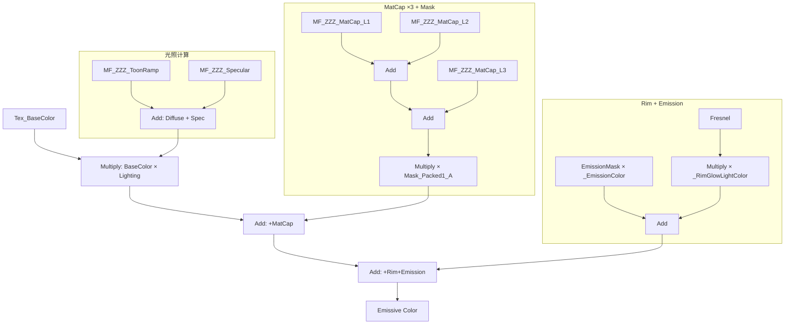

# Pyrios ZZZ材质 → UE5 重建规范 (v2.0)

> 数据来源：AnimeStudio 导出的 Shader Properties + **3Dmigoto 反编译 HLSL 代码**
> 目标：在 UE5 中创建等价于 ZZZ 原版的角色材质

***

## 一、执行摘要

| 项                      | 值                                                            |
| ---------------------- | ------------------------------------------------------------ |
| 需创建的 Master Material   | 1 个（`M_Character_NapAvatar`）                                 |
| 需创建的 Material Instance | 3 个（Body\_1 / Body\_2 / Weapon01）                            |
| 需创建的 Material Function | 3 个（`MF_ZZZ_MatCap` / `MF_ZZZ_ToonRamp` / `MF_ZZZ_Specular`） |
| 数据可信度                  | **高** — 基于反编译 HLSL，非推测                                       |

### 1.1 源文件路径

| 文件               | 路径                                                                                    | 大小      | 用途                               |
| ---------------- | ------------------------------------------------------------------------------------- | ------- | -------------------------------- |
| **主 Shader**     | `F:\AnimeStudio\Exports\Shader\miHoYo_Character_NapAvatarStandard.shader`             | \~73MB  | 身体/武器材质（5 Pass, 4026 SubProgram） |
| **能量 Shader**    | `F:\AnimeStudio\Exports\Shader\miHoYo_Character_NapAvatarStandardEnergy.shader`       | \~3MB   | 能量特效材质                           |
| **能量流 Shader**   | `F:\AnimeStudio\Exports\Shader\miHoYo_Character_NapAvatarStandardEnergyFlow.shader`   | —       | 能量流动特效                           |
| **能量头 Shader**   | `F:\AnimeStudio\Exports\Shader\miHoYo_Character_NapAvatarStandardEnergyHead.shader`   | —       | 头部能量特效                           |
| **能量不透明 Shader** | `F:\AnimeStudio\Exports\Shader\miHoYo_Character_NapAvatarStandardEnergyOpaque.shader` | —       | 不透明能量特效                          |
| **眼睛 Shader**    | `F:\AnimeStudio\Exports\Shader\miHoYo_Character_NapAvatarStandardEye.shader`          | \~6MB   | 眼睛材质                             |
| **脸 Shader**     | `F:\AnimeStudio\Exports\Shader\miHoYo_Character_NapAvatarStandardFace.shader`         | —       | 脸部材质                             |
| **枪眼 Shader**    | `F:\AnimeStudio\Exports\Shader\miHoYo_Character_NapAvatarStandardGunEye.shader`       | —       | 枪械瞄准镜                            |
| **半透明 Shader**   | `F:\AnimeStudio\Exports\Shader\miHoYo_Character_NapAvatarStandardTransparent.shader`  | —       | 半透明材质                            |
| **注释版文档**        | `f:\ue_project\GGYGO\AAADocs\ZZZ_Shader_Annotated.hlsl`                               | \~1100行 | 反编译 HLSL 中文注释学习版                 |
| **模型导出**         | `F:\AnimeStudio\Exports\Animator\Avatar_Male_Size03_Pyrois_Model\`                    | —       | Pyrios FBX + 贴图 + 材质 JSON        |

***

## 二、贴图槽位对应（已更正）

> **重要**：以下内容已根据反编译 HLSL 代码验证。上一版的通道语义有严重错误。

所有贴图在 `f:\ue_project\GGYGO\Content\Characters\Player\Pyrios\Materials\Texture\`

每个材质有 4 张贴图，命名规则：`{部位}_{类型}.uasset`

### 2.1 贴图参数与通道语义

| ZZZ 参数           | 贴图后缀 | 寄存器 | 用途                | 通道语义（HLSL 验证）                                                   |
| ---------------- | ---- | --- | ----------------- | --------------------------------------------------------------- |
| `_MainTex`       | `_D` | t3  | Albedo 颜色         | **RGB = Base Color**                                            |
| `_LightTex`      | `_N` | t4  | 法线 + Diffuse Bias | **RG = Tangent Normal**, **B = Diffuse Bias**                   |
| `_OtherDataTex`  | `_M` | t5  | 打包数据贴图1           | **R = Material ID**, **G = Metallic**, **B = Specular Mask**    |
| `_OtherDataTex2` | `_A` | t6  | 打包数据贴图2           | **R = Transparency**, **G = Smoothness**, **B = Emission Mask** |

### 2.2 与上一版的关键差异

| 贴图                 | 上一版（错误）        | 当前版（HLSL 验证）                                                        |
| ------------------ | -------------- | ------------------------------------------------------------------- |
| `_OtherDataTex.R`  | ~~Metallic~~   | **Material ID**（5 档：0.0-1.0 → 选择 ShallowColor/ShadowColor 组）        |
| `_OtherDataTex.G`  | ~~Smoothness~~ | **Metallic**（0-1，控制 F0 = lerp(0.04, BaseColor, Metallic)）           |
| `_OtherDataTex.B`  | ~~AO~~         | **Specular Mask**（反转为 Roughness：`roughness = 1 - SpecMask × param`） |
| `_OtherDataTex.A`  | 未提及            | **MatCap Mask**（需 `_UseMatCapMask=1` 时启用）                           |
| `_OtherDataTex2.R` | Transparency   | **Transparency**（Alpha Clip 参考）                                     |
| `_OtherDataTex2.G` | Smoothness 备用  | **Smoothness**（GGX Roughness 来源之一）                                  |
| `_OtherDataTex2.B` | Emission Mask  | **Emission Mask**（**确认**）                                           |
| `_LightTex.B`      | Diffuse Bias   | **Diffuse Bias**（\[-1,1]，控制半 Lambert 阴影偏移）                          |

***

## 三、Shader 架构总览

### 3.1 Pass 结构

ZZZ 的 NapAvatarStandard shader 共 5 个 Pass：

| Pass | 行号      | 名称                          | 用途                                   |
| ---- | ------- | --------------------------- | ------------------------------------ |
| 1    | 430     | `ShadowCaster`              | 阴影投射                                 |
| 2    | 3624    | `CharacterOutlineDeferred`  | 描边渲染                                 |
| 3    | 19316   | **`CharacterToonDeferred`** | **主渲染 Pass**（包含全部光照/MatCap/Specular） |
| 4    | 2380124 | `CharDepthOnly`             | 深度预 Pass                             |
| 5    | 2381792 | `RTXMeta`                   | RTX 元数据                              |

### 3.2 CharacterToonDeferred Pass 的 FP 纹理绑定

```
t0 = Shadow Cascades (Texture2DArray, SampleCmpLevelZero)
t1 = Light Probe Data (StructuredBuffer)
t2 = Overlay/Detail Texture
t3 = _MainTex         (Albedo)
t4 = _LightTex        (Normal + Diffuse Bias)
t5 = _OtherDataTex    (MatID + Metallic + SpecMask)
t6 = _OtherDataTex2   (Transparency + Smoothness + EmissionMask)
t7 = MatCap2DArray 或 _CharacterRampTex（取决于变体）
```

### 3.3 Constant Buffer 关键映射

| 寄存器 | 大小         | 用途                |
| --- | ---------- | ----------------- |
| cb0 | 209×float4 | 全局常量（时间、相机、光照方向等） |
| cb1 | 29×float4  | 对象变换矩阵            |
| cb2 | 27×float4  | 灯光相关              |
| cb3 | 41×float4  | 全局光照参数            |
| cb4 | 170×float4 | **材质参数**（主角）      |

### 3.4 cb4 材质参数索引速查表

| cb4 索引        | 参数名称                                 | 通道                                             | 用途             |
| ------------- | ------------------------------------ | ---------------------------------------------- | -------------- |
| cb4\[58]      | Color Tint                           | .xyz=色调, .w=全局强度                               | 基础色修正          |
| cb4\[75-79]   | `_SpecularColor[1-5]`                | .xyz                                           | 5 组高光颜色        |
| cb4\[80-84]   | `_RimGlowLightColor[1-5]`            | .xyz                                           | 5 组边缘光颜色（光照面）  |
| cb4\[135]     | Material ID 匹配                       | .y=目标 MatID                                    | 当前材质分组的 MatID  |
| cb4\[136]     | `_RampTexParams0`                    | .x=最小值, .y=UV缩放, .z=阴影混合, .w=ShallowColor1     | Ramp 行为控制      |
| cb4\[137]     | ShallowColor/ShadowColor 级联          | .xyzw=4 级颜色                                    | 基于 MatID 的颜色查表 |
| cb4\[138]     | 阴影偏移                                 | .x=法线偏移缩放, .z=Emission 启用                      | 阴影/Emission    |
| cb4\[140]     | 表面属性                                 | .xx=UV缩放, .yy=`_BumpScale`, .z=金属度缩放, .w=粗糙度乘数 | <br />         |
| cb4\[141-142] | `_SpecIntensity` per tier            | —                                              | 5 档高光强度        |
| cb4\[143-144] | `_SpecularRange` per tier            | —                                              | 5 档高光范围        |
| cb4\[144-146] | `_ToonSpecular` / `_HighlightShape`  | —                                              | Toon 高光形状参数    |
| cb4\[147]     | Rim Glow 开关                          | .x=开关                                          | <br />         |
| cb4\[151-152] | `_VertexStretch` / `_HighlightShape` | —                                              | VP 阶段各向异性位移    |
| cb4\[163-164] | Shiny Spec Socket                    | —                                              | VP 各向异性高光参数    |
| cb4\[165-166] | ShadowIntensity per tier             | —                                              | 5 档阴影强度        |
| cb4\[168-169] | SpecIntensity 额外缩放                   | —                                              | 5 档额外强度        |

***

## 四、核心渲染管线（基于 HLSL 还原）

### 4.1 法线重建（\_LightTex）

```hlsl
// HLSL 原文（反编译）
r3.xyz = t4.SampleBias(s0_s, uv, lod).xyz;         // 采样 _LightTex
r3.xyz = saturate(r3.xyz);                           // 钳制 [0,1]
r3.xyz = r3.xyz * 2 + float3(-1.004, -1.004, -1);  // 解压 RG→[-1,1], B→[-1,1]
r3.xy  = _BumpScale * r3.xy;                        // BumpScale 仅影响 XY
// Z 分量重建: z = sqrt(1 - x² - y²)
```

**UE5 实现**：

- 使用 `FlattenNormal` 或手动：`Normal = normalize(float3(Tex_Normal.rg * 2 - 1, sqrt(saturate(1 - dot(...)))) )`
- `_BumpScale` = ScalarParameter (默认 1.0, 范围 -5\~5)
- `_LightTex.B`（Diffuse Bias）直接传给 Ramp 计算，**不参与法线**

### 4.2 Diffuse / Ramp 卡通光照系统

> **这是 ZZZ 的核心卡通渲染方式**，上一版完全遗漏了。

#### 4.2.1 算法流程

```
1. 计算 NdotL（世界法线 · 主光源方向）
2. 应用 Half-Lambert 风格变换: rampVal = (NdotL + 1) * heightCompensation - 1
3. 加上 Diffuse Bias: rampVal = _LightTex.B * 2 + rampVal
4. 解析三区域 Ramp: rampVal * 3 被分为浅/中/深三个区域
5. 每个区域使用 _RampTexParams0.y 调整 UV 坐标
6. 三个区域分别贡献颜色 -> sum = 最终 diffuse
```

#### 4.2.2 Material ID → ShallowColor/ShadowColor 选择

```hlsl
// 5 档 Material ID 阈值: 0.2, 0.4, 0.6, 0.8
mask = cmp(MaterialID < float4(0.2, 0.4, 0.6, 0.8));
color = mask.w ? ShadowColor5 : ShallowColor1;  // >= 0.8
color = mask.z ? ShadowColor3 : color;           // >= 0.6
color = mask.y ? ShadowColor2 : color;           // >= 0.4
color = mask.x ? ShadowColor1 : color;           // < 0.2
```

#### 4.2.3 UE5 实现方案

1. 从 `T_Packed1.R` 读取 Material ID
2. 用 `MF_ZZZ_ToonRamp` Material Function 封装：
   - 输入：NdotL, DiffuseBias, ShadowIntensity
   - 内部：Half-Lambert + 三区域解析
   - 输出：DiffuseColor

> **注意**：ZZZ 不是用 Ramp Texture Lookup，而是**解析式计算**三区域 Ramp。这意味着 UE5 中也不需要准备 Ramp 贴图，纯数学节点即可。

### 4.3 Specular 高光系统

#### 4.3.1 Toon Specular 路径

```hlsl
// Toon Specular = 基于 NdotH 的硬边高光
NdotH = dot(worldNormal, normalize(lightDir * NdotL + viewDir));
fresnel = 1 - (NdotH * _ShapeSoftness)^2;
specMask = saturate((fresnel - _HighlightShape) / _SpecularRange);
specFinal = specMask * _SpecIntensity * _SpecularColor * F0;
```

参数：

- `_HighlightShape`（cb4\[152].x）：高光形状
- `_ShapeSoftness`（cb4\[164].y）：形状柔化度
- `_SpecularRange`（cb4\[143-144]）：高光范围
- `_SpecIntensity`（cb4\[141-142]）：高光强度
- `_SpecularColor`（cb4\[75-79]）：高光颜色

#### 4.3.2 PBR GGX Specular 路径（非 Toon 材质）

```hlsl
// 标准 GGX BRDF
roughness2 = (1 - SpecMask * cb4[140].w)^2
k = roughness2 * 4 + 2
// D 项: GGX 分布
denom = NdotH^2 * (roughness2^2 - 1) + 1
specGGX = roughness2^2 / (PI * denom^2 * k)
// V 项: Smith G
specFinal = specGGX * G_smith / roughness2
```

#### 4.3.3 UE5 实现

- `MF_ZZZ_Specular` Material Function：
  - 输入：WorldNormal, LightDir, ViewDir, SpecMask, Metallic, Params...
  - 内部：NdotH 计算 → Toon/PBR 双分支
  - 输出：SpecularColor

### 4.4 MatCap 系统（已修正）

#### 4.4.1 MatCap UV 计算（HLSL 验证）

```hlsl
// 视图空间法线 → MatCap UV
r2.xy = MV[0].xy * normal.y;       // ModelView 矩阵行 0
r2.xy = MV[1].xy * normal.x + r2.xy;  // + 行 1
r2.xy = MV[2].xy * normal.z + r2.xy;  // + 行 2
r2.xy = r2.xy * 0.5 + 0.5;          // [-1,1] → [0,1]
// 最终 UV = r2.xy + UV 动画偏移
```

**UE5 等价**：`TransformVector(WorldNormal, View)` 取 XY → `* 0.5 + 0.5`

#### 4.4.2 MatCap 参数结构（每层）

```hlsl
// 每层 MatCap 在 cb4 中的偏移为 r4.w（层索引 × 步长）
cb4[layer+0].xy   = Refract UV Offset
cb4[layer+5].xyz  = ColorTint (颜色色调)
cb4[layer+10].x   = Texture Array Index (_MatCapTexID)
cb4[layer+10].y   = Color Burst (颜色爆发)
cb4[layer+10].z   = Alpha Burst (Alpha 爆发)
cb4[layer+10].w   = U Speed (MatCap 贴图 U 滚动速度)
cb4[layer+15].x   = V Speed (V 滚动速度)
cb4[layer+15].y   = Blend Mode (0=AlphaBlended, 1=Add, 2+=Overlay)
cb4[layer+15].z   = Refract Enable
cb4[layer+15].w   = Refract Depth
```

#### 4.4.3 MatCap 混合模式

| BlendMode 值 | 名称           | 公式                                     |
| ----------- | ------------ | -------------------------------------- |
| 0           | AlphaBlended | `lerp(BaseColor, TintedMatCap, mask)`  |
| 1           | Add          | `BaseColor + TintedMatCap × intensity` |
| 2           | Overlay      | `Overlay(BaseColor, TintedMatCap)`     |

#### 4.4.4 MatCap 遮罩（已修正）

> **修正**：MatCap 遮罩来自 `_OtherDataTex.A`（当 `_UseMatCapMask=1`），**不是** `_OtherDataTex.R`（Metallic）。

```hlsl
// 当 _UseMatCapMask = 1 时
matCapMask = _OtherDataTex.a;  // t5 的 Alpha 通道
// MatCap 最终 = MatCap × matCapMask
```

#### 4.4.5 MatCapFX（特效 MatCap）

独立于 5 层 MatCap 系统，有自己的贴图（\_MatCapTexFx）和法线贴图（\_MatCapBumpMapFx），支持凹凸扭曲。

#### 4.4.6 MatCap 贴图数组

ZZZ 使用 `Texture2DArray`（\_MatCap2DArray），通过 `_MatCapTexID` 索引不同层级。UE5 中没有直接的 Texture2DArray 编辑器支持，替代方案：

- **方案 A**：为每层创建独立的 TextureObjectParameter
- **方案 B**：在材质蓝图中用 StaticSwitch 分支选择

**当前文档采用方案 A**（独立 TextureObjectParameter），已在 MF\_ZZZ\_MatCap 中实现。

### 4.5 Rim Glow 边缘光

```hlsl
// NdotV 反向 → fresnel
fresnel = saturate(-NdotV * 0.5 + 0.5);
// 多次 smoothstep 幂乘产生锐利边缘
rimMask = smoothstep(smoothstep(fresnel))^5;
// 区分光照面/阴影面
rimColor = isLitFace ? _RimGlowLightColor : _RimGlowShadowColor;
// 最终
finalRim = rimMask * rimColor * BaseColor * shadowMask;
```

**UE5 实现**：

- 使用 `Fresnel` 节点 + `Power`（指数约 5-20）
- `_RimGlowLightColor` / `_RimGlowShadowColor` = VectorParameter
- 混合模式：Add（叠加到 Emissive 或直接加到最终颜色）

### 4.6 Emission 自发光

```hlsl
emissionMask = _OtherDataTex2.B;          // B 通道 = Emission Mask
emissionMask = max(0, (emissionMask - 0.2) * 1.25);  // 阈值重映射
emissionFinal = emissionMask * _EmissionColor;  // × 自发光颜色
```

**UE5 实现**：

- `T_Packed2.B` → `Multiply` → `_EmissionColor` → 材质主节点 **Emissive Color**
- `_Emission` = StaticBool 开关（材质实例可覆盖）

### 4.7 Anisotropy 各向异性高光

```hlsl
// HLSL 中的各向异性在 Vertex Shader 阶段计算
// 通过 sincos 构建旋转矩阵，将高光方向旋转到各向异性切线方向
_Anisotropy = 0.5  // Pyrios 默认值
```

**UE5 实现**：

- 材质主节点 **Anisotropy** 引脚 = ScalarParameter (默认 0.5)
- **Tangent** 引脚 = `(1, 0, 0)`（高光沿 X 方向拉丝）

### 4.8 Outline 描边

ZZZ 通过独立的 `CharacterOutlineDeferred` Pass 实现，不是 Post Process：

- 顶点着色器：沿法线方向外扩顶点
- 参数：`_OutlineWidth`（宽度）、`_OutlineColor`（颜色）、`_MaxOutlineZOffset`
- `_OtherDataTex2.R`（Transparency）可能用于控制描边粗细

**UE5 实现**：在材质中使用 **Two Sided** + **World Position Offset** 或使用独立的 Mesh Duplicate 方法。

***

## 五、Step-by-Step 操作详解（修正版）

> **重要**：所有操作在 Content Browser 里 `Content/Characters/Player/Pyrios/Materials/` 目录下进行

***

### 第一部分：创建 Material Function

#### 1.1 MF\_ZZZ\_MatCap

> **这是什么**：封装 MatCap 光泽球 UV 计算 + 纹理采样 + 混合。
> **创建方式**：Content Browser 右键 → Material Function，命名 `MF_ZZZ_MatCap`。

***

##### 1.1.1 创建 Function Input 节点（7 个）

在 MF\_ZZZ\_MatCap 编辑器中，创建以下 `FunctionInput` 节点：

| #  | 节点类型            | 显示名                | 类型         | 默认值     | Sort Priority |
| -- | --------------- | ------------------ | ---------- | ------- | ------------- |
| I1 | `FunctionInput` | `NormalWS`         | Vector3    | (0,0,1) | 0             |
| I2 | `FunctionInput` | `MatCapTex`        | Texture2D  | —       | 1             |
| I3 | `FunctionInput` | `Tint`             | Vector3    | (1,1,1) | 2             |
| I4 | `FunctionInput` | `Intensity`        | Scalar     | 1.0     | 3             |
| I5 | `FunctionInput` | `BlendMode`        | Scalar     | 0       | 4             |
| I6 | `FunctionInput` | `Mask`             | Scalar     | 1.0     | 5             |
| I7 | `FunctionInput` | `MatCapMaskEnable` | StaticBool | false   | 6             |

***

##### 1.1.2 内部节点创建（按连线顺序）

**Step A — MatCap UV 计算**

| #  | 节点类型            | 显示名                          | 输入/设置                                       | 输出连到                |
| -- | --------------- | ---------------------------- | ------------------------------------------- | ------------------- |
| T1 | `Transform`     | `Transform_NormalWS_to_View` | Source=Tangent, Dest=View, Input=`NormalWS` | → ComponentMask 的输入 |
| C1 | `ComponentMask` | `Mask_RG`                    | 输入=`Transform_NormalWS_to_View`, 勾选 ✅R ✅G   | → Multiply(M1) 的 A  |
| S1 | `Constant`      | `UV_Half`                    | 值=0.5                                       | → Multiply(M1) 的 B  |
| M1 | `Multiply`      | `Multiply_UVScale`           | A=`Mask_RG`, B=`UV_Half`                    | → Add(A1) 的 A       |
| A1 | `Add`           | `Add_UVBias`                 | A=`Multiply_UVScale`, B=`UV_Half`           | → MatCapTex 采样的 UV  |

> **说明**：`Transform(NormalWS, Tangent→View)` 然后取 RG 通道，做 `×0.5+0.5`，得到 \[0,1] 范围的 MatCap UV。等价于 HLSL 中的 `MV · Normal * 0.5 + 0.5`。

**Step B — 纹理采样**

| #  | 节点类型            | 显示名             | 输入/设置                             | 输出连到               |
| -- | --------------- | --------------- | --------------------------------- | ------------------ |
| T2 | `TextureSample` | `Sample_MatCap` | Tex=`MatCapTex`, UVs=`Add_UVBias` | → Multiply(M2) 的 A |

**Step C — Tint × Intensity × Mask**

| #  | 节点类型       | 显示名                  | 输入 A                 | 输入 B                                 | 输出连到                  |
| -- | ---------- | -------------------- | -------------------- | ------------------------------------ | --------------------- |
| M2 | `Multiply` | `Multiply_Tint`      | `Sample_MatCap` RGB  | `Tint`                               | → Multiply(M3) 的 A    |
| M3 | `Multiply` | `Multiply_Intensity` | `Multiply_Tint`      | `Intensity`                          | → Multiply(M4) 的 A    |
| M4 | `Multiply` | `Multiply_Mask`      | `Multiply_Intensity` | `Mask`（如果 MatCapMaskEnable=true 则生效） | → StaticSwitch 的 True |

> **注意**：`Mask` 输入只有在 `MatCapMaskEnable = true` 时才应参与计算。用 StaticSwitch 控制。

**Step D — MatCapMaskEnable 分支**

| #   | 节点类型           | 显示名                 | 输入/设置                                                                      | 输出连到             |
| --- | -------------- | ------------------- | -------------------------------------------------------------------------- | ---------------- |
| SW1 | `StaticSwitch` | `Switch_MaskEnable` | True=`Multiply_Mask`, False=`Multiply_Intensity`, Value=`MatCapMaskEnable` | → FunctionOutput |

***

##### 1.1.3 创建 Function Output 节点

| #  | 节点类型             | 显示名      | 输入                     |
| -- | ---------------- | -------- | ---------------------- |
| O1 | `FunctionOutput` | `Output` | `Switch_MaskEnable` 输出 |

***

##### 1.1.4 MF\_ZZZ\_MatCap 节点汇总

| 步骤     | 节点类型             | 显示名                                                                           | 数量         |
| ------ | ---------------- | ----------------------------------------------------------------------------- | ---------- |
| Input  | `FunctionInput`  | NormalWS / MatCapTex / Tint / Intensity / BlendMode / Mask / MatCapMaskEnable | 7          |
| UV     | `Transform`      | Transform\_NormalWS\_to\_View                                                 | 1          |
| UV     | `ComponentMask`  | Mask\_RG                                                                      | 1          |
| UV     | `Constant`       | UV\_Half                                                                      | 1          |
| UV     | `Multiply`       | Multiply\_UVScale                                                             | 1          |
| UV     | `Add`            | Add\_UVBias                                                                   | 1          |
| Sample | `TextureSample`  | Sample\_MatCap                                                                | 1          |
| Color  | `Multiply`       | Multiply\_Tint / Multiply\_Intensity / Multiply\_Mask                         | 3          |
| Branch | `StaticSwitch`   | Switch\_MaskEnable                                                            | 1          |
| Output | `FunctionOutput` | Output                                                                        | 1          |
| —      | **总计**           | <br />                                                                        | **18 个节点** |

#### 1.2 MF\_ZZZ\_ToonRamp（新增！）

> **这是什么**：ZZZ 的核心卡通光照计算（Half-Lambert + 三区域解析）。
> **创建方式**：Content Browser 右键 → Material Function，命名 `MF_ZZZ_ToonRamp`。

***

##### 1.2.1 创建 Function Input 节点（5 个）

| #  | 节点类型            | 显示名           | 类型      | 默认值          | Sort Priority |
| -- | --------------- | ------------- | ------- | ------------ | ------------- |
| I1 | `FunctionInput` | `NdotL`       | Scalar  | 0.0          | 0             |
| I2 | `FunctionInput` | `DiffuseBias` | Scalar  | 0.0          | 1             |
| I3 | `FunctionInput` | `MaterialID`  | Scalar  | 0.0          | 2             |
| I4 | `FunctionInput` | `ShadowMask`  | Scalar  | 1.0          | 3             |
| I5 | `FunctionInput` | `RampParams0` | Vector4 | (0, 0, 0, 0) | 4             |

> **RampParams0 通道含义**：X=最小值, Y=UV缩放, Z=阴影混合, W=ShallowColor1（Tier5 基础色）

***

##### 1.2.2 内部节点创建（按连线顺序）

**Step A0 — RampParams0 通道拆解（把这个 Vector4 的 4 个通道拆出来单独用）**

| #     | 节点类型            | 显示名                 | 输入            | 勾选通道 | 输出用途                                  |
| ----- | --------------- | ------------------- | ------------- | ---- | ------------------------------------- |
| C\_RX | `ComponentMask` | `Mask_RampParams_X` | `RampParams0` | ✅R   | 最小值（暂未用）                              |
| C\_RY | `ComponentMask` | `Mask_RampParams_Y` | `RampParams0` | ✅G   | UV 缩放 → Multiply\_RampUV 的 B          |
| C\_RZ | `ComponentMask` | `Mask_RampParams_Z` | `RampParams0` | ✅B   | 阴影混合 → OneMinus\_RampZ / Lerp\_Shadow |
| C\_RW | `ComponentMask` | `Mask_RampParams_W` | `RampParams0` | ✅A   | ShallowColor1 基础色 → BaseColor\_FromW  |

> 这 4 个 `ComponentMask` 节点是必须的，因为 `RampParams0` 是一个 Vector4，你需要把它的每个通道单独取出来才能连到后续节点的 Scalar 输入上。后面所有提到 `ComponentMask(RampParams0.X)` 的地方，指的就是对应的 `Mask_RampParams_X` 节点。

**Step A — Half-Lambert 计算**

| #  | 节点类型       | 显示名                    | 输入/设置                                      | 输出连到          |
| -- | ---------- | ---------------------- | ------------------------------------------ | ------------- |
| M1 | `Multiply` | `Multiply_HalfLambert` | A=`NdotL`, B=`Constant`=0.5                | → Add(A1) 的 A |
| A1 | `Add`      | `Add_HalfLambert`      | A=`Multiply_HalfLambert`, B=`Constant`=0.5 | → Add(A2) 的 A |

> `halfLambert = NdotL * 0.5 + 0.5`

**Step B — Diffuse Boost**

| #  | 节点类型       | 显示名                    | 输入/设置                                         | 输出连到          |
| -- | ---------- | ---------------------- | --------------------------------------------- | ------------- |
| M2 | `Multiply` | `Multiply_DiffuseBias` | A=`DiffuseBias`, B=`Constant`=2.0             | → Add(A2) 的 B |
| A2 | `Add`      | `Add_RampVal`          | A=`Add_HalfLambert`, B=`Multiply_DiffuseBias` | 后续作三区域解析      |

> `rampVal = halfLambert + DiffuseBias * 2`

**Step C — 三区域解析（Shallow / Mid / Deep）**

| #   | 节点类型       | 显示名              | 输入/设置                                | 输出连到               |
| --- | ---------- | ---------------- | ------------------------------------ | ------------------ |
| M3  | `Multiply` | `Multiply_Ramp3` | A=`Add_RampVal`, B=`Constant`=3.0    | → 三路并行处理           |
| FL1 | `Floor`    | `Floor_Region`   | 输入=`Multiply_Ramp3`                  | → Subtract(S1) 的 B |
| S1  | `Subtract` | `Subtract_Frac`  | A=`Multiply_Ramp3`, B=`Floor_Region` | → Multiply(M4) 的 A |

> 将 `rampVal * 3` 拆分成 `floor(整数部分)` + `frac(小数部分)`，整数部分决定区域（0=Deep, 1=Mid, 2=Shallow），小数部分用于域内插值。

| #  | 节点类型       | 显示名               | 输入/设置                                    | 输出连到      |
| -- | ---------- | ----------------- | ---------------------------------------- | --------- |
| M4 | `Multiply` | `Multiply_RampUV` | A=`Subtract_Frac`, B=`Mask_RampParams_Y` | → 三区域颜色插值 |

> 用 `RampParams0.Y`（UV 缩放）调整各区域内的采样点。`Floor_Region` 输出 0/1/2 决定 Deep/Mid/Shallow 三个区域，`Multiply_RampUV` 输出小数部分用于域内颜色插值。

**三区域颜色查表（完整 5 级 Material ID 驱动）**

> **原理**：`MaterialID`（Packed1.R，范围 0\~1）按 5 个阈值分为 5 档。每档在 Deep/Mid/Shallow 三个区域有独立的颜色倍率。用掩码 + 乘法实现无分支选择。

**Step C0 — 5 级阈值掩码**

创建 4 个 `If` 节点，并行比较 MaterialID 与阈值，生成掩码（1=满足, 0=不满足）：

| #      | 节点类型 | 显示名          | A            | B              | A ≥ B 输出       | A < B 输出       |
| ------ | ---- | ------------ | ------------ | -------------- | -------------- | -------------- |
| IF\_M8 | `If` | `Mask_GE_08` | `MaterialID` | `Constant`=0.8 | `Constant`=1.0 | `Constant`=0.0 |
| IF\_M6 | `If` | `Mask_GE_06` | `MaterialID` | `Constant`=0.6 | `Constant`=1.0 | `Constant`=0.0 |
| IF\_M4 | `If` | `Mask_GE_04` | `MaterialID` | `Constant`=0.4 | `Constant`=1.0 | `Constant`=0.0 |
| IF\_M2 | `If` | `Mask_GE_02` | `MaterialID` | `Constant`=0.2 | `Constant`=1.0 | `Constant`=0.0 |

```
Mask_GE_08 = MaterialID >= 0.8 ? 1 : 0
Mask_GE_06 = MaterialID >= 0.6 ? 1 : 0
Mask_GE_04 = MaterialID >= 0.4 ? 1 : 0
Mask_GE_02 = MaterialID >= 0.2 ? 1 : 0
```

**Step C0b — 反转掩码（"小于阈值"条件）**

| #      | 节点类型       | 显示名          | 输入                 | 输出                 |
| ------ | ---------- | ------------ | ------------------ | ------------------ |
| O\_LT8 | `OneMinus` | `Mask_LT_08` | `Mask_GE_08` 的 A≥B | = MaterialID < 0.8 |
| O\_LT6 | `OneMinus` | `Mask_LT_06` | `Mask_GE_06` 的 A≥B | = MaterialID < 0.6 |
| O\_LT4 | `OneMinus` | `Mask_LT_04` | `Mask_GE_04` 的 A≥B | = MaterialID < 0.4 |
| O\_LT2 | `OneMinus` | `Mask_LT_02` | `Mask_GE_02` 的 A≥B | = MaterialID < 0.2 |

**Step C0c — 精确 Tier 掩码（唯一 Tier 为 1，其余为 0）**

| #     | 节点类型       | 显示名        | A                  | B            | 含义           | 输出      |
| ----- | ---------- | ---------- | ------------------ | ------------ | ------------ | ------- |
| M\_T5 | `Multiply` | `Is_Tier5` | `Mask_GE_08` 的 A≥B | —            | >= 0.8       | T5 选择掩码 |
| M\_T4 | `Multiply` | `Is_Tier4` | `Mask_GE_06` 的 A≥B | `Mask_LT_08` | >=0.6 且 <0.8 | T4 选择掩码 |
| M\_T3 | `Multiply` | `Is_Tier3` | `Mask_GE_04` 的 A≥B | `Mask_LT_06` | >=0.4 且 <0.6 | T3 选择掩码 |
| M\_T2 | `Multiply` | `Is_Tier2` | `Mask_GE_02` 的 A≥B | `Mask_LT_04` | >=0.2 且 <0.4 | T2 选择掩码 |

`Is_Tier1` 就是 `Mask_LT_02`（因为 MaterialID < 0.2 唯一对应 Tier1），不需要额外 Multiply。

***

**Step C1 — 5 级 × 3 区域颜色参数（15 个 ScalarParameter）**

| #      | 节点类型              | 显示名             | 默认值  | 含义       |
| ------ | ----------------- | --------------- | ---- | -------- |
| P\_T1D | `ScalarParameter` | `Tier1_Deep`    | 0.3  | Tier1 暗面 |
| P\_T1M | `ScalarParameter` | `Tier1_Mid`     | 0.5  | Tier1 过渡 |
| P\_T1S | `ScalarParameter` | `Tier1_Shallow` | 0.8  | Tier1 亮面 |
| P\_T2D | `ScalarParameter` | `Tier2_Deep`    | 0.35 | Tier2 暗面 |
| P\_T2M | `ScalarParameter` | `Tier2_Mid`     | 0.55 | Tier2 过渡 |
| P\_T2S | `ScalarParameter` | `Tier2_Shallow` | 0.85 | Tier2 亮面 |
| P\_T3D | `ScalarParameter` | `Tier3_Deep`    | 0.4  | Tier3 暗面 |
| P\_T3M | `ScalarParameter` | `Tier3_Mid`     | 0.6  | Tier3 过渡 |
| P\_T3S | `ScalarParameter` | `Tier3_Shallow` | 0.9  | Tier3 亮面 |
| P\_T4D | `ScalarParameter` | `Tier4_Deep`    | 0.45 | Tier4 暗面 |
| P\_T4M | `ScalarParameter` | `Tier4_Mid`     | 0.65 | Tier4 过渡 |
| P\_T4S | `ScalarParameter` | `Tier4_Shallow` | 0.95 | Tier4 亮面 |
| P\_T5D | `ScalarParameter` | `Tier5_Deep`    | 0.5  | Tier5 暗面 |
| P\_T5M | `ScalarParameter` | `Tier5_Mid`     | 0.7  | Tier5 过渡 |
| P\_T5S | `ScalarParameter` | `Tier5_Shallow` | 1.0  | Tier5 亮面 |

全暴露到 Material Instance，不同部位可独立调色。

***

**Step C2 — 每个 Tier 内按 Region + Frac 做平滑过渡（不再硬切）**

`Floor_Region`（0/1/2）决定分段，`Multiply_RampUV`（小数部分）决定段内 lerp 比例：

```
Region=0: lerp(Deep,    Mid,     Multiply_RampUV)
Region=1: lerp(Mid,     Shallow, Multiply_RampUV)
Region=2: Shallow（最亮处，直接取 Shallow 不插值）
```

为每个 Tier 创建 2 个 If + 2 个 Lerp：

| Tier | If 1（Region=0?→DeepLerp : 继续）                                          | Lerp1（Deep→Mid）                                                        | If 2（Region=1?→MidLerp : Shallow）                                           | Lerp2（Mid→Shallow）                                                       |
| ---- | ---------------------------------------------------------------------- | ---------------------------------------------------------------------- | --------------------------------------------------------------------------- | ------------------------------------------------------------------------ |
| T1   | `If_T1_R`: A=`Floor_Region`, B=0.0, A=B→`Lerp_T1_Deep`, A≠B→`If_T1_R2` | `Lerp_T1_Deep`: A=`Tier1_Deep`, B=`Tier1_Mid`, Alpha=`Multiply_RampUV` | `If_T1_R2`: A=`Floor_Region`, B=1.0, A=B→`Lerp_T1_Mid`, A≠B→`Tier1_Shallow` | `Lerp_T1_Mid`: A=`Tier1_Mid`, B=`Tier1_Shallow`, Alpha=`Multiply_RampUV` |
| T2   | `If_T2_R`: A=`Floor_Region`, B=0.0, A=B→`Lerp_T2_Deep`, A≠B→`If_T2_R2` | `Lerp_T2_Deep`: A=`Tier2_Deep`, B=`Tier2_Mid`, Alpha=`Multiply_RampUV` | `If_T2_R2`: A=`Floor_Region`, B=1.0, A=B→`Lerp_T2_Mid`, A≠B→`Tier2_Shallow` | `Lerp_T2_Mid`: A=`Tier2_Mid`, B=`Tier2_Shallow`, Alpha=`Multiply_RampUV` |
| T3   | `If_T3_R`: A=`Floor_Region`, B=0.0, A=B→`Lerp_T3_Deep`, A≠B→`If_T3_R2` | `Lerp_T3_Deep`: A=`Tier3_Deep`, B=`Tier3_Mid`, Alpha=`Multiply_RampUV` | `If_T3_R2`: A=`Floor_Region`, B=1.0, A=B→`Lerp_T3_Mid`, A≠B→`Tier3_Shallow` | `Lerp_T3_Mid`: A=`Tier3_Mid`, B=`Tier3_Shallow`, Alpha=`Multiply_RampUV` |
| T4   | `If_T4_R`: A=`Floor_Region`, B=0.0, A=B→`Lerp_T4_Deep`, A≠B→`If_T4_R2` | `Lerp_T4_Deep`: A=`Tier4_Deep`, B=`Tier4_Mid`, Alpha=`Multiply_RampUV` | `If_T4_R2`: A=`Floor_Region`, B=1.0, A=B→`Lerp_T4_Mid`, A≠B→`Tier4_Shallow` | `Lerp_T4_Mid`: A=`Tier4_Mid`, B=`Tier4_Shallow`, Alpha=`Multiply_RampUV` |
| T5   | `If_T5_R`: A=`Floor_Region`, B=0.0, A=B→`Lerp_T5_Deep`, A≠B→`If_T5_R2` | `Lerp_T5_Deep`: A=`Tier5_Deep`, B=`Tier5_Mid`, Alpha=`Multiply_RampUV` | `If_T5_R2`: A=`Floor_Region`, B=1.0, A=B→`Lerp_T5_Mid`, A≠B→`Tier5_Shallow` | `Lerp_T5_Mid`: A=`Tier5_Mid`, B=`Tier5_Shallow`, Alpha=`Multiply_RampUV` |

每个 Lerp 输出 → 被对应的 If 选中；`If_T*_R2` 的 A≠B 输出 = 该 Tier 经过 lerp 平滑的最终区域颜色（Scalar）。

***

**Step C3 — 掩码加权求和（无分支选择最终颜色）**

`Is_Tier5` \~ `Is_Tier1` 是互斥的（有且仅有一个为 1.0），所以可直接用乘法 + 加法代替 if-else：

| #  | 节点类型       | 显示名    | A                          | B                | 输出     |
| -- | ---------- | ------ | -------------------------- | ---------------- | ------ |
| M1 | `Multiply` | `W_T1` | `Is_Tier1`（即 `Mask_LT_02`） | `If_T1_R2` 的 A≠B | T1 加权色 |
| M2 | `Multiply` | `W_T2` | `Is_Tier2`                 | `If_T2_R2` 的 A≠B | T2 加权色 |
| M3 | `Multiply` | `W_T3` | `Is_Tier3`                 | `If_T3_R2` 的 A≠B | T3 加权色 |
| M4 | `Multiply` | `W_T4` | `Is_Tier4`                 | `If_T4_R2` 的 A≠B | T4 加权色 |
| M5 | `Multiply` | `W_T5` | `Is_Tier5`                 | `If_T5_R2` 的 A≠B | T5 加权色 |

| #  | 节点类型  | 显示名         | 输入                   | 输出                |
| -- | ----- | ----------- | -------------------- | ----------------- |
| A1 | `Add` | `Sum_T12`   | `W_T1` + `W_T2`      | ×                 |
| A2 | `Add` | `Sum_T123`  | `Sum_T12` + `W_T3`   | ×                 |
| A3 | `Add` | `Sum_T1234` | `Sum_T123` + `W_T4`  | ×                 |
| A4 | `Add` | `Sum_All`   | `Sum_T1234` + `W_T5` | → 最终区域颜色值（Scalar） |

> **互斥保证**：`Is_Tier1` \~ `Is_Tier5` 中只有一个 = 1.0，其余 = 0.0，所以 `Sum_All` 精确等于被选中的那个 Tier 的区域颜色，不需要分支。

**Step C4 — 乘到基础色上**

| #     | 节点类型           | 显示名                    | 输入/设置                                        | 输出连到                     |
| ----- | -------------- | ---------------------- | -------------------------------------------- | ------------------------ |
| APP1  | `AppendVector` | `Append_BC_2`          | A=`Mask_RampParams_W`, B=`Mask_RampParams_W` | → Append\_BC\_3 的 A      |
| APP2  | `AppendVector` | `Append_BC_3`          | A=`Append_BC_2`, B=`Mask_RampParams_W`       | → Multiply(M\_BC) 的 B    |
| M\_BC | `Multiply`     | `Multiply_RegionColor` | A=`Sum_All`, B=`Append_BC_3`                 | → Multiply(M\_Final) 的 A |

> `RampParams0.W`（Scalar）通过两次 `AppendVector` 展开成 (W, W, W)，然后乘上区域颜色倍率。

***

##### 备选方案：Custom 节点（推荐，1 节点替代 C0\~C4）

> 上面的 If 节点方案连线量大，可作为**完整参考实现**。如果追求图面干净，用 `Custom` 节点直接写 HLSL 一行替代所有查表逻辑。

**Step C\_Alt — Custom 节点替代 C0\~C4**

右键搜索 `Custom`，Details 面板设置：

| 设置项             | 值                        |
| --------------- | ------------------------ |
| **Description** | `MaterialID_Tier_Lookup` |
| **Output Type** | `CMOT Float 1`           |

添加 18 个 Inputs（点 `+`）：

| #  | Input Name        | Description               | 连接来源                              |
| -- | ----------------- | ------------------------- | --------------------------------- |
| 0  | `MaterialID`      | 来自 Packed1.R              | `MaterialID` FunctionInput        |
| 1  | `FloorRegion`     | 来自 Step C 的 Floor\_Region | `Floor_Region` 输出                 |
| 2  | `Multiply_RampUV` | frac 部分，用于 lerp 平滑        | `Multiply_RampUV` 输出              |
| 3  | `Tier1_Deep`      | —                         | `ScalarParameter` `Tier1_Deep`    |
| 4  | `Tier1_Mid`       | —                         | `ScalarParameter` `Tier1_Mid`     |
| 5  | `Tier1_Shallow`   | —                         | `ScalarParameter` `Tier1_Shallow` |
| 6  | `Tier2_Deep`      | —                         | `ScalarParameter` `Tier2_Deep`    |
| 7  | `Tier2_Mid`       | —                         | `ScalarParameter` `Tier2_Mid`     |
| 8  | `Tier2_Shallow`   | —                         | `ScalarParameter` `Tier2_Shallow` |
| 9  | `Tier3_Deep`      | —                         | `ScalarParameter` `Tier3_Deep`    |
| 10 | `Tier3_Mid`       | —                         | `ScalarParameter` `Tier3_Mid`     |
| 11 | `Tier3_Shallow`   | —                         | `ScalarParameter` `Tier3_Shallow` |
| 12 | `Tier4_Deep`      | —                         | `ScalarParameter` `Tier4_Deep`    |
| 13 | `Tier4_Mid`       | —                         | `ScalarParameter` `Tier4_Mid`     |
| 14 | `Tier4_Shallow`   | —                         | `ScalarParameter` `Tier4_Shallow` |
| 15 | `Tier5_Deep`      | —                         | `ScalarParameter` `Tier5_Deep`    |
| 16 | `Tier5_Mid`       | —                         | `ScalarParameter` `Tier5_Mid`     |
| 17 | `Tier5_Shallow`   | —                         | `ScalarParameter` `Tier5_Shallow` |

**Code**（贴入 Details 面板的 Code 框）：

```hlsl
// ── Tier 分档 ──
int tier;
if (MaterialID >= 0.8)
    tier = 4;
else if (MaterialID >= 0.6)
    tier = 3;
else if (MaterialID >= 0.4)
    tier = 2;
else if (MaterialID >= 0.2)
    tier = 1;
else
    tier = 0;

// ── Region 选择 ──
int region = (int)floor(FloorRegion);
region = clamp(region, 0, 2);

// ── 分档取 Deep/Mid/Shallow 三色 ──
float deep, mid, shallow;
if (tier == 4)       { deep = Tier5_Deep; mid = Tier5_Mid; shallow = Tier5_Shallow; }
else if (tier == 3)  { deep = Tier4_Deep; mid = Tier4_Mid; shallow = Tier4_Shallow; }
else if (tier == 2)  { deep = Tier3_Deep; mid = Tier3_Mid; shallow = Tier3_Shallow; }
else if (tier == 1)  { deep = Tier2_Deep; mid = Tier2_Mid; shallow = Tier2_Shallow; }
else                 { deep = Tier1_Deep; mid = Tier1_Mid; shallow = Tier1_Shallow; }

// ── 查表 + Multiply_RampUV (frac) 做 lerp 平滑过渡 ──
float color;
if (region == 0)
    color = lerp(deep, mid, Multiply_RampUV);
else if (region == 1)
    color = lerp(mid, shallow, Multiply_RampUV);
else
    color = shallow;

return color;
```

**Custom 输出 → Multiply\_RegionColor 的 A**，代替原来 `Sum_All` 的位置。

**节省的节点**：Custom 方案只需要 **15 个 ScalarParameter + 1 个 Custom = 16 个节点**，替代了原来 C0\~C4 的 50+ 个 If/Multiply/Add/OneMinus，图面干净很多。15 个 ScalarParameter 仍然暴露到 Material Instance，可独立调色。

***

**Step D — 阴影混合**

三区域颜色确定后，通过 `lerp` 混合阴影强度，再与区域颜色相乘得到最终 Diffuse：

| #        | 节点类型       | 显示名                     | 输入/设置                                                         | 输出连到                     |
| -------- | ---------- | ----------------------- | ------------------------------------------------------------- | ------------------------ |
| O1       | `OneMinus` | `OneMinus_RampZ`        | 输入=`Mask_RampParams_Z`                                        | → Lerp(L1) 的 A           |
| L1       | `Lerp`     | `Lerp_Shadow`           | A=`OneMinus_RampZ`, B=`ShadowMask`, Alpha=`Mask_RampParams_Z` | → Multiply(M\_Final) 的 B |
| M\_Final | `Multiply` | `Multiply_FinalDiffuse` | A=`Multiply_RegionColor`, B=`Lerp_Shadow`                     | → FunctionOutput         |

> `shadowFactor = lerp(1 - RampP0.z, ShadowMask, RampP0.z)`\
> `DiffuseColor = RegionColor × shadowFactor`

***

##### 1.2.3 创建 Function Output 节点

| #  | 节点类型             | 显示名            | 输入                         |
| -- | ---------------- | -------------- | -------------------------- |
| O2 | `FunctionOutput` | `DiffuseColor` | `Multiply_FinalDiffuse` 输出 |

***

##### 1.2.4 MF\_ZZZ\_ToonRamp 节点汇总

| 步骤     | 节点类型                              | 显示名                                                                     | 数量         |
| ------ | --------------------------------- | ----------------------------------------------------------------------- | ---------- |
| Input  | `FunctionInput`                   | NdotL / DiffuseBias / MaterialID / ShadowMask / RampParams0             | 5          |
| A0     | `ComponentMask`                   | Mask\_RampParams\_X / Y / Z / W                                         | 4          |
| A      | `Multiply` / `Add`                | Multiply\_HalfLambert / Add\_HalfLambert                                | 2          |
| A      | `Constant`                        | (0.5 ×2, 2.0 ×1)                                                        | 3          |
| B      | `Multiply` / `Add`                | Multiply\_DiffuseBias / Add\_RampVal                                    | 2          |
| C      | `Multiply` / `Floor` / `Subtract` | Multiply\_Ramp3 / Floor\_Region / Subtract\_Frac                        | 3          |
| C      | `Multiply`                        | Multiply\_RampUV                                                        | 1          |
| C0     | `If`                              | Mask\_GE\_08 / 06 / 04 / 02                                             | 4          |
| C0b    | `OneMinus`                        | Mask\_LT\_08 / 06 / 04 / 02                                             | 4          |
| C0c    | `Multiply`                        | Is\_Tier5 / 4 / 3 / 2                                                   | 4          |
| C1     | `ScalarParameter`                 | Tier1\~5 \_Deep / \_Mid / \_Shallow                                     | 15         |
| C2     | `If` / `Lerp`                     | If\_T1\~T5\_R / If\_T1\~T5\_R2 / Lerp\_T1\~T5\_Deep / Lerp\_T1\~T5\_Mid | 20         |
| C3     | `Multiply`                        | W\_T1 \~ W\_T5                                                          | 5          |
| C3     | `Add`                             | Sum\_T12 / T123 / T1234 / All                                           | 4          |
| C4     | `AppendVector` / `Multiply`       | Append\_BC\_2 / Append\_BC\_3 / Multiply\_RegionColor                   | 3          |
| D      | `OneMinus` / `Lerp` / `Multiply`  | OneMinus\_RampZ / Lerp\_Shadow / Multiply\_FinalDiffuse                 | 3          |
| Output | `FunctionOutput`                  | DiffuseColor                                                            | 1          |
| —      | **总计**                            | <br />                                                                  | **83 个节点** |

***

#### 1.3 MF\_ZZZ\_Specular（新增！）

> **这是什么**：Toon Specular + GGX PBR 双分支高光。
> **创建方式**：Content Browser 右键 → Material Function，命名 `MF_ZZZ_Specular`。

***

##### 1.3.1 创建 Function Input 节点（8 个）

| #  | 节点类型            | 显示名           | 类型      | 默认值       | Sort Priority |
| -- | --------------- | ------------- | ------- | --------- | ------------- |
| I1 | `FunctionInput` | `WorldNormal` | Vector3 | (0,0,1)   | 0             |
| I2 | `FunctionInput` | `LightDir`    | Vector3 | (0,0,1)   | 1             |
| I3 | `FunctionInput` | `ViewDir`     | Vector3 | (0,0,1)   | 2             |
| I4 | `FunctionInput` | `SpecMask`    | Scalar  | 1.0       | 3             |
| I5 | `FunctionInput` | `Metallic`    | Scalar  | 0.0       | 4             |
| I6 | `FunctionInput` | `Smoothness`  | Scalar  | 0.5       | 5             |
| I7 | `FunctionInput` | `SpecParams`  | Vector4 | (0,0,0,0) | 6             |
| I8 | `FunctionInput` | `SpecColor`   | Vector3 | (1,1,1)   | 7             |

> **SpecParams 通道含义**：X=HighlightShape, Y=ShapeSoftness, Z=SpecularRange, W=SpecIntensity

***

##### 1.3.2 内部节点创建（按连线顺序）

**Step A0 — SpecParams 通道拆解**

| #     | 节点类型            | 显示名                 | 输入           | 勾选通道 | 输出用途                                    |
| ----- | --------------- | ------------------- | ------------ | ---- | --------------------------------------- |
| C\_SX | `ComponentMask` | `Mask_SpecParams_X` | `SpecParams` | ✅R   | HighlightShape → Subtract\_Shape 的 B    |
| C\_SY | `ComponentMask` | `Mask_SpecParams_Y` | `SpecParams` | ✅G   | ShapeSoftness → Multiply\_Softness 的 B  |
| C\_SZ | `ComponentMask` | `Mask_SpecParams_Z` | `SpecParams` | ✅B   | SpecularRange → Divide\_Range 的 B       |
| C\_SW | `ComponentMask` | `Mask_SpecParams_W` | `SpecParams` | ✅A   | SpecIntensity → Multiply\_Intensity 的 B |

**Step A — Half-Vector 计算**

| #  | 节点类型        | 显示名           | 输入/设置                     | 输出连到                |
| -- | ----------- | ------------- | ------------------------- | ------------------- |
| A1 | `Add`       | `Add_LV`      | A=`LightDir`, B=`ViewDir` | → Normalize(N1) 的输入 |
| N1 | `Normalize` | `Normalize_H` | 输入=`Add_LV`               | → Dot(D1) 的 B       |

> `H = normalize(LightDir + ViewDir)`

**Step B — NdotH 计算**

| #  | 节点类型  | 显示名         | 输入/设置                            | 输出连到                |
| -- | ----- | ----------- | -------------------------------- | ------------------- |
| D1 | `Dot` | `Dot_NdotH` | A=`WorldNormal`, B=`Normalize_H` | 后续 Toon / GGX 双分支共用 |

***

##### 1.3.3 Toon Specular 分支

**Step C1 — NdotH 变换**

| #     | 节点类型       | 显示名                 | 输入/设置                                     | 输出连到                  |
| ----- | ---------- | ------------------- | ----------------------------------------- | --------------------- |
| M\_T1 | `Multiply` | `Multiply_NdotH`    | A=`Dot_NdotH`, B=`Dot_NdotH`              | → Multiply(M\_T2) 的 A |
| M\_T2 | `Multiply` | `Multiply_Softness` | A=`Multiply_NdotH`, B=`Mask_SpecParams_Y` | → OneMinus(O\_T1) 的 A |
| O\_T1 | `OneMinus` | `OneMinus_Fresnel`  | 输入=`Multiply_Softness`                    | → Subtract(S\_T1) 的 B |

> `fresnel = 1 - (NdotH² * ShapeSoftness)`

**Step C2 — 高光形状 & 范围**

| #     | 节点类型       | 显示名                 | 输入/设置                                       | 输出连到                  |
| ----- | ---------- | ------------------- | ------------------------------------------- | --------------------- |
| S\_T1 | `Subtract` | `Subtract_Shape`    | A=`OneMinus_Fresnel`, B=`Mask_SpecParams_X` | → Divide(D\_T1) 的 A   |
| D\_T1 | `Divide`   | `Divide_Range`      | A=`Subtract_Shape`, B=`Mask_SpecParams_Z`   | → Saturate(SAT1) 的输入  |
| SAT1  | `Saturate` | `Saturate_SpecMask` | 输入=`Divide_Range`                           | → Multiply(M\_T3) 的 A |

> `specMask = saturate((fresnel - HighlightShape) / SpecularRange)`

**Step C3 — 最终 Toon Specular**

| #     | 节点类型       | 显示名                  | 输入/设置                                        | 输出连到                                         |
| ----- | ---------- | -------------------- | -------------------------------------------- | -------------------------------------------- |
| M\_T3 | `Multiply` | `Multiply_Intensity` | A=`Saturate_SpecMask`, B=`Mask_SpecParams_W` | → Multiply(M\_T4) 的 A                        |
| M\_T4 | `Multiply` | `Multiply_Color`     | A=`Multiply_Intensity`, B=`SpecColor`        | → Multiply(M\_T5) 的 A                        |
| M\_T5 | `Multiply` | `Multiply_SpecMask`  | A=`Multiply_Color`, B=`SpecMask`             | → FunctionOutput（或 → Switch\_ToonPBR 的 True） |

> `specToon = specMask * SpecIntensity * SpecColor * SpecMask`

***

##### 1.3.4 GGX PBR 分支（简化版）

**Step D1 — Roughness 计算**

| #     | 节点类型       | 显示名                   | 输入/设置           | 输出连到        |
| ----- | ---------- | --------------------- | --------------- | ----------- |
| O\_G1 | `OneMinus` | `OneMinus_Smoothness` | 输入=`Smoothness` | Roughness 值 |

> **说明**：GGX 完整计算较复杂，如果后续不需要 PBR 路径，可以只保留 Toon 分支。这里给出简化版供参考。

**Step D2 — F0 计算**

| #     | 节点类型   | 显示名       | 输入/设置                                              | 输出连到 |
| ----- | ------ | --------- | -------------------------------------------------- | ---- |
| L\_F0 | `Lerp` | `Lerp_F0` | A=`Constant`=0.04, B=`SpecColor`, Alpha=`Metallic` | F0 值 |

> `F0 = lerp(0.04, SpecColor, Metallic)`

***

##### 1.3.5 Toon / PBR 双分支切换（可选）

如果需要切换 Toon/PBR 路径，增加一个 `StaticBool` FunctionInput 和 `StaticSwitch`：

| #   | 节点类型           | 显示名              | 输入/设置                                                               | 输出连到             |
| --- | -------------- | ---------------- | ------------------------------------------------------------------- | ---------------- |
| SW1 | `StaticSwitch` | `Switch_ToonPBR` | True=`Multiply_T5`（Toon）, False=`GGX 输出`, Value=`UsePBR` StaticBool | → FunctionOutput |

***

##### 1.3.6 创建 Function Output 节点

| #  | 节点类型             | 显示名             | 输入                                      |
| -- | ---------------- | --------------- | --------------------------------------- |
| O3 | `FunctionOutput` | `SpecularColor` | `Multiply_T5` 输出（或 `Switch_ToonPBR` 输出） |

***

##### 1.3.7 MF\_ZZZ\_Specular 节点汇总

| 步骤     | 节点类型                               | 显示名                                                                                          | 数量                      |
| ------ | ---------------------------------- | -------------------------------------------------------------------------------------------- | ----------------------- |
| Input  | `FunctionInput`                    | WorldNormal / LightDir / ViewDir / SpecMask / Metallic / Smoothness / SpecParams / SpecColor | 8                       |
| A0     | `ComponentMask`                    | Mask\_SpecParams\_X / Y / Z / W                                                              | 4                       |
| A      | `Add` / `Normalize`                | Add\_LV / Normalize\_H                                                                       | 2                       |
| B      | `Dot`                              | Dot\_NdotH                                                                                   | 1                       |
| C1     | `Multiply` / `OneMinus`            | Multiply\_NdotH / Multiply\_Softness / OneMinus\_Fresnel                                     | 3                       |
| C2     | `Subtract` / `Divide` / `Saturate` | Subtract\_Shape / Divide\_Range / Saturate\_SpecMask                                         | 3                       |
| C3     | `Multiply`                         | Multiply\_Intensity / Multiply\_Color / Multiply\_SpecMask                                   | 3                       |
| D1     | `OneMinus`                         | OneMinus\_Smoothness                                                                         | 1                       |
| D2     | `Lerp` / `Constant`                | Lerp\_F0 / (0.04)                                                                            | 2                       |
| Output | `FunctionOutput`                   | SpecularColor                                                                                | 1                       |
| —      | **总计**                             | <br />                                                                                       | **28 个节点**（不含 GGX 完整分支） |

***

### 第二部分：创建 Master Material（M_Character_NapAvatar）

> **重大修正**：ZZZ 的 `CharacterToonDeferred` 是一套**完整自定义光照**，不走引擎 PBR。UE5 中必须用 **Unlit** 模式，全部颜色输出到 **Emissive Color**。之前用 Default Lit 导致颜色被引擎二次光照乘黑，已废弃。

---

#### 2.1 基础设置

| 设置项 | 值 |
|--------|-----|
| **Shading Model** | **Unlit** |
| **Blend Mode** | Opaque |
| **Two Sided** | 勾选 |
| **Usage** → Used with Skeletal Mesh | 勾选 |

---

#### 2.2 贴图参数节点（4 个）

| # | 节点类型 | 显示名 | 默认贴图 |
|---|---------|--------|---------|
| T1 | `TextureSampleParameter2D` | `Tex_BaseColor` | `Pyrois_Body_Map1_D` |
| T2 | `TextureSampleParameter2D` | `Tex_Normal` | `Pyrois_Body_Map1_N` |
| T3 | `TextureSampleParameter2D` | `Tex_Packed1` | `Pyrois_Body_Map1_M` |
| T4 | `TextureSampleParameter2D` | `Tex_Packed2` | `Pyrois_Body_Map1_A` |

---

#### 2.3 完整节点连线

**核心公式**（全部走 Emissive Color）：

```
Emissive = BaseColor × (ToonRamp_Diffuse + ToonSpec)
         + MatCap_RGB(含遮罩)
         + RimGlow
         + Emission_Simple
```

**数据流向图**：



---

##### 第一步：通道拆解（ComponentMask × 8）

| # | 节点类型 | 显示名 | 输入 | 勾选 | 用途 |
|---|---------|--------|------|------|------|
| C1 | `ComponentMask` | `Mask_Normal_RG` | `Tex_Normal` | R✅ G✅ | 法线 XY |
| C2 | `ComponentMask` | `Mask_Normal_B` | `Tex_Normal` | B✅ | Diffuse Bias |
| C3 | `ComponentMask` | `Mask_Packed1_R` | `Tex_Packed1` | R✅ | Material ID |
| C4 | `ComponentMask` | `Mask_Packed1_G` | `Tex_Packed1` | G✅ | Metallic（ToonRamp用） |
| C5 | `ComponentMask` | `Mask_Packed1_B` | `Tex_Packed1` | B✅ | Specular Mask |
| C6 | `ComponentMask` | `Mask_Packed1_A` | `Tex_Packed1` | A✅ | MatCap Mask |
| C7 | `ComponentMask` | `Mask_Packed2_G` | `Tex_Packed2` | G✅ | Smoothness（Specular用） |
| C8 | `ComponentMask` | `Mask_Packed2_B` | `Tex_Packed2` | B✅ | Emission Mask |

---

##### 第二步：法线处理

| # | 节点类型 | 显示名 | 输入 | 输出连到 |
|---|---------|--------|------|---------|
| AV1 | `AppendVector` | `Append_Normal_B` | A=`Mask_Normal_RG`, B=`Constant`=0.0 | → FlattenNormal |
| N1 | `FlattenNormal` | `FlattenNormal` | Normal=`Append_Normal_B` | → MF_ZZZ_Specular(WorldNormal)、MF_ZZZ_MatCap×3(NormalWS)、NdotL计算 |

---

##### 第三步：NdotL 计算

| # | 节点类型 | 显示名 | 说明 | 输出连到 |
|---|---------|--------|------|---------|
| PNW | `PixelNormalWS` | `PixelNormalWS` | 世界法线 | → Dot(A)、MF_ZZZ_MatCap×3(NormalWS) |
| LD | `Constant3Vector` | `LightDirection` | 值=(0,0,1)，后续 P1 接入光源方向 | → Dot(B) |
| DOT | `Dot` | `NdotL` | A=`PixelNormalWS`, B=`LightDirection` | → MF_ZZZ_ToonRamp(NdotL) |

---

##### 第四步：Material Function 调用（5 个）

| # | 节点类型 | 显示名 |
|---|---------|--------|
| F1 | `MaterialFunctionCall` | `MF_ZZZ_ToonRamp` |
| F2 | `MaterialFunctionCall` | `MF_ZZZ_Specular` |
| F3~F5 | `MaterialFunctionCall` | `MF_ZZZ_MatCap_Layer1`/`Layer2`/`Layer3` |

**MF_ZZZ_ToonRamp 连线**：

| 引脚 | 连接来源 |
|------|---------|
| NdotL | `Dot`(`NdotL`) 输出 |
| DiffuseBias | `Mask_Normal_B` |
| MaterialID | `Mask_Packed1_R` |
| ShadowMask | `Constant`=1.0 |
| RampParams0 | `VectorParameter` `_RampTexParams0` |

**MF_ZZZ_Specular 连线**：

| 引脚 | 连接来源 |
|------|---------|
| WorldNormal | `FlattenNormal` |
| LightDir | `Constant3Vector` `LightDirection` |
| ViewDir | `CameraVector` |
| SpecMask | `Mask_Packed1_B` |
| Metallic | `Mask_Packed1_G` |
| Smoothness | `Mask_Packed2_G` |
| SpecParams | `VectorParameter` `_SpecParams` |
| SpecColor | `VectorParameter` `_SpecularColor` |

**MF_ZZZ_MatCap（3层）连线**：

| 引脚 | 连接来源 |
|------|---------|
| NormalWS | `PixelNormalWS` |
| MatCapTex | `TextureObjectParameter` `MatCap_Tex_X` |
| Tint | `VectorParameter` `MatCap_Tint_X` |
| Intensity | `ScalarParameter` `MatCap_Intensity_X` |
| BlendMode | `ScalarParameter` `MatCap_BlendMode_X` |
| Mask | `Constant`=1.0 |
| MatCapMaskEnable | `StaticBoolParameter`=false |

---

##### 第五步：光照 + BaseColor → 主色

| # | 节点类型 | 显示名 | A | B | 输出连到 |
|---|---------|--------|---|---|---------|
| A_DS | `Add` | `Add_Diffuse_Spec` | `MF_ZZZ_ToonRamp` | `MF_ZZZ_Specular` | → Multiply(M_BC) 的 B |
| M_BC | `Multiply` | `Multiply_BaseColor_Light` | `Tex_BaseColor` RGB | `Add_Diffuse_Spec` | → Add_F1 的 A |

---

##### 第六步：MatCap 叠加 + 遮罩 → 加到主色

| # | 节点类型 | 显示名 | A | B | 输出连到 |
|---|---------|--------|---|---|---------|
| A_M12 | `Add` | `Add_MatCap_L1L2` | `MF_ZZZ_MatCap_L1` | `MF_ZZZ_MatCap_L2` | → A_M123 的 A |
| A_M123 | `Add` | `Add_MatCap_All` | `Add_MatCap_L1L2` | `MF_ZZZ_MatCap_L3` | → M_MM 的 A |
| M_MM | `Multiply` | `Multiply_MatCapMask` | `Add_MatCap_All` | `Mask_Packed1_A` | → Add_F1 的 B |
| A_F1 | `Add` | `Add_Main_MatCap` | `Multiply_BaseColor_Light` | `Multiply_MatCapMask` | → Add_F2 的 A |

---

##### 第七步：Rim Glow + Emission → 加到总输出

| # | 节点类型 | 显示名 | 输入 | 输出连到 |
|---|---------|--------|------|---------|
| FR1 | `Fresnel` | `Fresnel` | ExponentIn=`Constant`=5, BaseReflectFractionIn=0 | → Multiply(M_RIM) 的 A |
| P_RIM | `VectorParameter` | `_RimGlowLightColor` | 默认 (0.55,0.55,0.55) | → Multiply(M_RIM) 的 B |
| M_RIM | `Multiply` | `Multiply_RimGlow` | A=`Fresnel`, B=`_RimGlowLightColor` | → Add(A_RE) 的 A |
| P_EM | `VectorParameter` | `_EmissionColor` | 默认 (0,0,0) | → Multiply(M_EM) 的 B |
| M_EM | `Multiply` | `Multiply_Emission` | A=`Mask_Packed2_B`, B=`_EmissionColor` | → Add(A_RE) 的 B |
| A_RE | `Add` | `Add_Rim_Emission` | A=`Multiply_RimGlow`, B=`Multiply_Emission` | → Add_F2 的 B |
| A_F2 | `Add` | `Add_Final_All` | A=`Add_Main_MatCap`, B=`Add_Rim_Emission` | **材质主节点 Emissive Color** |

> Unlit 模式下只有 **Emissive Color** 引脚有效，其余引脚（Base Color、Normal 等）均被忽略，**不必连线**。

---

#### 2.4 需要创建的参数（仅保留有 HLSL 出处的）

| 参数名 | 类型 | 默认值 | HLSL 出处 |
|--------|------|--------|----------|
| `_RampTexParams0` | VectorParameter | (0,0,0,0) | cb4[136] |
| `_SpecParams` | VectorParameter | (0,0,0,0) | cb4[146]附近 |
| `_SpecularColor` | VectorParameter | (1,1,1) | cb4[75-79] |
| `_EmissionColor` | VectorParameter | (0,0,0) | cb4[138]附近 |
| `_RimGlowLightColor` | VectorParameter | (0.55,0.55,0.55) | cb4[80-84] |
| `MatCap_Tex_1/2/3` | TextureObjectParameter | — | t7 |
| `MatCap_Tint_1/2/3` | VectorParameter | (1,1,1) | cb4[layer].xyz |
| `MatCap_Intensity_1/2/3` | ScalarParameter | 1.0/1.0/0.0 | cb4[layer].y (ColorBurst) |
| `MatCap_BlendMode_1/2/3` | ScalarParameter | 0 | cb4[layer].y |
| `MatCapMaskEnable_1/2/3` | StaticBoolParameter | false | — |

---

#### 2.5 节点汇总

| 步骤 | 节点 | 数量 |
|------|------|------|
| 贴图 | `TextureSampleParameter2D` ×4 | 4 |
| 通道 | `ComponentMask` ×8 | 8 |
| 法线 | `AppendVector` + `FlattenNormal` + `Constant` | 3 |
| NdotL | `PixelNormalWS` + `Constant3Vector` + `Dot` | 3 |
| MF调用 | `MaterialFunctionCall` ×5 | 5 |
| 光照 | `Add` + `Multiply` | 2 |
| MatCap | `Add`×2 + `Multiply` | 3 |
| Rim+Emit | `Fresnel` + `Multiply`×2 + `Add` | 4 |
| 汇总 | `Add`×2 | 2 |
| 参数 | Vector/Scalar/TextureObject/StaticBool | ~25 |
| — | **总计** | **~59 个节点** |

***

### 第三部分：Material Instance 参数

#### 3.1 MI\_Pyrois\_Body\_1

| 分组             | 参数名                  | 值                    | 说明                                            |
| -------------- | -------------------- | -------------------- | --------------------------------------------- |
| **贴图**         | `Tex_BaseColor`      | `Pyrois_Body_Map1_D` | <br />                                        |
| <br />         | `Tex_Normal`         | `Pyrois_Body_Map1_N` | <br />                                        |
| <br />         | `Tex_Packed1`        | `Pyrois_Body_Map1_M` | R=MatID, G=Metallic, B=SpecMask, A=MatCapMask |
| <br />         | `Tex_Packed2`        | `Pyrois_Body_Map1_A` | G=Smoothness, B=EmissionMask                  |
| **MatCap1**    | `MatCap_Tex_1`       | `Eff_Matcap_125`     | <br />                                        |
| <br />         | `MatCap_Tint_1`      | (0.88, 0.96, 1.0)    | <br />                                        |
| <br />         | `MatCap_Intensity_1` | `2.0`                | ColorBurst                                    |
| <br />         | `MatCap_BlendMode_1` | `0`                  | AlphaBlended                                  |
| **MatCap2**    | `MatCap_Tex_2`       | `Eff_MatCap_075`     | <br />                                        |
| <br />         | `MatCap_Tint_2`      | (0.98, 0.87, 0.67)   | <br />                                        |
| <br />         | `MatCap_Intensity_2` | `1.0`                | <br />                                        |
| <br />         | `MatCap_BlendMode_2` | `0`                  | AlphaBlended                                  |
| **MatCap3**    | 不覆盖                  | —                    | <br />                                        |
| **Specular**   | `_SpecIntensity`     | 按原值                  | <br />                                        |
| <br />         | `_SpecularColor`     | (1,1,1)              | <br />                                        |
| **Emission**   | `_EmissionColor`     | (0, 1.13, 3.0)       | 蓝色能量光                                         |
| **Anisotropy** | Anisotropy           | `0.5`                | <br />                                        |

#### 3.2 MI\_Pyrois\_Body\_2

| 分组           | 参数名                  | 值                    |
| ------------ | -------------------- | -------------------- |
| **贴图**       | `Tex_BaseColor`      | `Pyrois_Body_Map2_D` |
| <br />       | `Tex_Normal`         | `Pyrois_Body_Map2_N` |
| <br />       | `Tex_Packed1`        | `Pyrois_Body_Map2_M` |
| <br />       | `Tex_Packed2`        | `Pyrois_Body_Map2_A` |
| **MatCap1**  | `MatCap_Tex_1`       | `Eff_Matcap_125`     |
| <br />       | `MatCap_Tint_1`      | (0.98, 1.0, 0.88)    |
| <br />       | `MatCap_Intensity_1` | `1.0`                |
| <br />       | `MatCap_BlendMode_1` | `1` (Add)            |
| **MatCap2**  | `MatCap_Tex_2`       | `Eff_MatCap_070`     |
| <br />       | `MatCap_Tint_2`      | (1, 1, 1)            |
| <br />       | `MatCap_Intensity_2` | `0.2`                |
| <br />       | `MatCap_BlendMode_2` | `1` (Add)            |
| **Emission** | `_EmissionColor`     | 不覆盖（无自发光）            |

#### 3.3 MI\_Pyrois\_Weapon01

| 分组          | 参数名                  | 值                 |
| ----------- | -------------------- | ----------------- |
| **贴图**      | `Tex_BaseColor`      | `Pyrois_Weapon_D` |
| <br />      | `Tex_Normal`         | `Pyrois_Weapon_N` |
| <br />      | `Tex_Packed1`        | `Pyrois_Weapon_M` |
| <br />      | `Tex_Packed2`        | `Pyrois_Weapon_A` |
| **MatCap1** | `MatCap_Tex_1`       | `Eff_Matcap_125`  |
| <br />      | `MatCap_Tint_1`      | (1, 1, 1)         |
| <br />      | `MatCap_Intensity_1` | `3.0`             |
| <br />      | `MatCap_BlendMode_1` | `1` (Add)         |
| **MatCap2** | `MatCap_Tex_2`       | `Eff_MatCap_019`  |
| <br />      | `MatCap_Tint_2`      | (1, 1, 1)         |
| <br />      | `MatCap_Intensity_2` | `0.45`            |
| <br />      | `MatCap_BlendMode_2` | `2` (Overlay)     |
| **MatCap3** | `MatCap_Tex_3`       | `Eff_MatCap_019`  |
| <br />      | `MatCap_Tint_3`      | (1, 1, 1)         |
| <br />      | `MatCap_Intensity_3` | `0.15`            |
| <br />      | `MatCap_BlendMode_3` | `1` (Add)         |

BlendMode: 0=AlphaBlended / 1=Add / 2=Overlay

***

## 六、MatCap 贴图

| 文件名                     | 用途      | 使用材质                       |
| ----------------------- | ------- | -------------------------- |
| `Eff_Matcap_125.uasset` | 蓝色金属光泽球 | Body\_1, Body\_2, Weapon01 |
| `Eff_MatCap_075.uasset` | 暖色柔和光泽球 | Body\_1                    |
| `Eff_MatCap_070.uasset` | 弱光泽球    | Body\_2                    |
| `Eff_MatCap_019.uasset` | 高对比度光泽球 | Weapon01（两次）               |

***

## 七、后续待办（按优先级排列）

### P1 — 核心效果（下一步实现）

| # | 模块                | Shader 参数                                                                                                  | 说明                                                                       | 实现难度 |
| - | ----------------- | ---------------------------------------------------------------------------------------------------------- | ------------------------------------------------------------------------ | ---- |
| 1 | **Shadow / Ramp** | `_RampTexParams0`, ShallowColor/ShadowColor 级联                                                             | 当前用 Half-Lambert 近似，需要完整的 5 级 Material ID 驱动 Ramp 系统                     | ⭐⭐⭐  |
| 2 | **Specular（完整）**  | `_ToonSpecular`, `_HighlightShape`, `_ShapeSoftness`, `_SpecularRange`, `_SpecIntensity`, `_SpecularColor` | MF\_ZZZ\_Specular 已规划但未创建，需要实现 Toon/GGX 双分支                              | ⭐⭐⭐  |
| 3 | **Rim Glow（完整）**  | `_RimGlowLightColor`, `_RimGlowShadowColor`                                                                | 当前用简单 Fresnel+Power 近似，缺少 smoothstep^5 和光照面/阴影面区分                        | ⭐⭐   |
| 4 | **Outline 描边**    | `_Outline`, `_OutlineColor`, `_OutlineWidth`, `_MaxOutlineZOffset`                                         | ZZZ 使用独立 `CharacterOutlineDeferred` Pass，UE5 中需要 Mesh Duplicate 或 WPO 方案 | ⭐⭐⭐⭐ |

### P2 — 增强效果

| # | 模块                     | Shader 参数                                                                          | 说明                                 | 实现难度 |
| - | ---------------------- | ---------------------------------------------------------------------------------- | ---------------------------------- | ---- |
| 5 | **MatCap 完整参数**        | `_MatCapColorBurst`, `_MatCapAlphaBurst`, `_MatCapUSpeed/VSpeed`, `_MatCapRefract` | 当前只用了 Tint + Intensity，缺少 UV 动画和折射 | ⭐⭐   |
| 6 | **MatCapFX**           | `_MatCapTexFx`, `_MatCapBumpMapFx`                                                 | 特效 MatCap，带凹凸扭曲                    | ⭐⭐⭐  |
| 7 | **Channel Mixer**      | `_UseChannelMixer`, `_ChannelMixTex`, 4 通道颜色映射                                     | 通道颜色替换系统                           | ⭐⭐   |
| 8 | **Secondary Emission** | `_SecondaryEmission`, `_SecondaryEmissionTex`, `_SecondaryEmissionColor`           | 二次自发光，带 UV 动画和旋转                   | ⭐⭐   |
| 9 | **Override 2 Tone**    | `_Override2Tone`, `_ColorA/B`, `_LightSource`, `_ShiftAngle`                       | 双色覆盖（Light/View/Point 三种光源模式）      | ⭐⭐⭐  |

### P3 — 特殊/情境效果

| #  | 模块                          | Shader 参数                                                                            | 说明                              | 实现难度 |
| -- | --------------------------- | ------------------------------------------------------------------------------------ | ------------------------------- | ---- |
| 10 | **Screen Image**            | `_ScreenImage`, `_ScreenTex`, `_ScreenColor`, `_Blink`                               | 屏幕空间纹理投射，支持闪烁和旋转                | ⭐⭐⭐  |
| 11 | **Special Weapon Emission** | `_SpecialWeaponEmission`, `_SpecialWeaponEmissionTex`, `_SpecialWeaponEmissionColor` | 武器特殊自发光，带 UV 对称和法线扭曲            | ⭐⭐⭐  |
| 12 | **Vertex Stretch**          | `_VertexStretch`, `_StretchDirection`, `_StretchMask`                                | 顶点拉伸（Uniform/Center/Point 三种模式） | ⭐⭐⭐  |
| 13 | **Glitch**                  | `_Glitch`, `_BlockMaskTex`, `_BlockColorA~D`, `_BlockMoveSpeed`                      | 故障艺术特效                          | ⭐⭐   |
| 14 | **Clip Plane**              | `_ClipPlane`, `_HardLight`, `_SoftLight`                                             | 裁剪平面 + 边缘光                      | ⭐⭐⭐  |
| 15 | **Dither Clip**             | `_DitherAlpha`, `_DitherAlpha2`                                                      | 像素抖动透明                          | ⭐    |
| 16 | **Transition**              | `_Transition`, `_TransitionTex`, `_TransitionColor`                                  | 材质过渡/溶解                         | ⭐⭐   |
| 17 | **Abnormal Property**       | `_AbnormalProperty`, `_PropertyType`, `_PropertyColor`, `_FresnelColor`              | 异常属性特效（电/火/冰）                   | ⭐⭐⭐⭐ |

### 独立模块（需要全新材质）

| #  | 模块                          | 说明                                       |
| -- | --------------------------- | ---------------------------------------- |
| 18 | **Body\_FX01**              | 角色溶解/粒子化材质，需要独立的 Shader 重建               |
| 19 | **NapAvatarStandardEnergy** | 能量特效独立 Shader，当前文档针对主体材质                 |
| 20 | **NapAvatarStandardEye**    | 眼睛独立 Shader，有 EyeColorMap 和 SDF 脸部阴影     |
| 21 | **NapAvatarStandardFace**   | 脸部独立 Shader，有 NoseLine 和 HeadMatrixWS2OS |

***

## 八、修订历史

| 版本   | 日期         | 变更内容                                                                                                                     |
| ---- | ---------- | ------------------------------------------------------------------------------------------------------------------------ |
| v2.0 | 2026-07-27 | 基于 3Dmigoto 反编译 HLSL 全面重写：修正贴图通道语义、新增 Ramp/Toon 光照系统、新增 Specular 系统、修正 MatCap 遮罩来源、新增 Rim Glow、Emission、Anisotropy 等完整细节 |
| v1.0 | 2026-07-20 | 初始版本（基于 Shader Properties 推测）                                                                                            |

